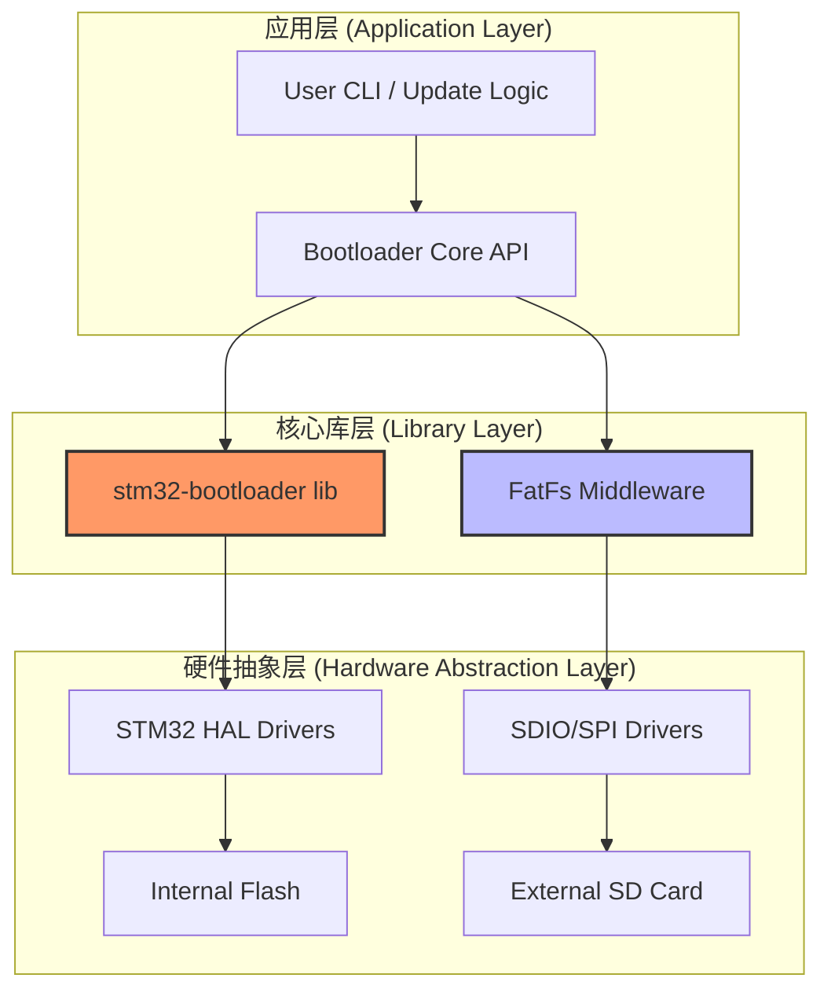
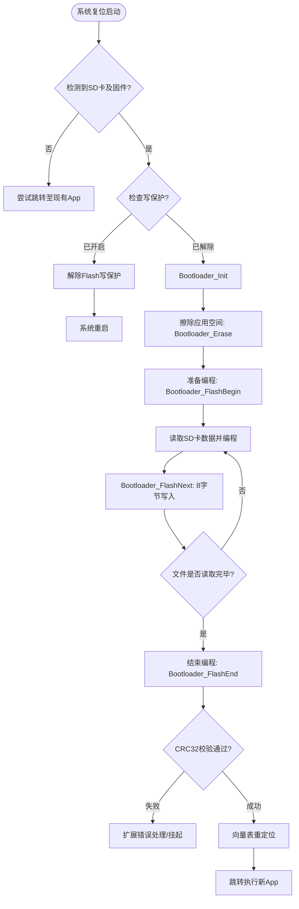
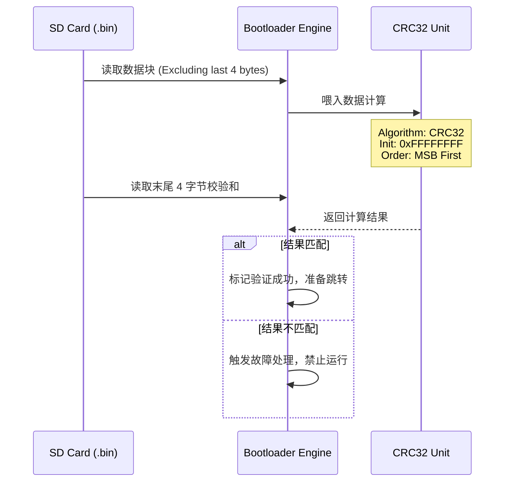

## 1. AI 推荐让我学习 stm32-bootloader
核心让我学习这几个文件：
==bootloader.c        // 主流程（核心）==
==flash.c             // Flash 驱动抽象==
==main.c              // Reset 后的逻辑==
==linker_script.ld    // 内存布局关键==
==system_stm32xx.c    // 启动相关==

# 2. 方案

作为一名深耕嵌入式系统多年的 Bootloader 设计专家，我将基于 **stm32-bootloader** 工程的核心架构与工业级标准，为你呈送这份详尽的技术设计方案。

本方案旨在构建一个**高可靠性、可定制且具备容错能力**的固件更新系统。

---

# STM32 工业级固件引导加载程序 (Bootloader) 技术设计方案

## 1. 项目背景与设计目标

本方案基于开源项目 `stm32-bootloader`，旨在为 STM32 微控制器提供一套完整的 **IAP (在应用编程)** 解决方案。系统核心逻辑是从具有 **FAT32 文件系统** 的外部 SD 卡中读取固件并安全地烧录至内部 Flash。

### 核心设计目标：

- **安全性**：强制性 CRC32 完整性校验，防止加载受损固件。
- **鲁棒性**：具备写保护管理与扩展错误处理的故障安全设计。
- **灵活性**：应用空间可配置，支持从软件直接跳转至系统内置 Bootloader 进行全片重写。
- **可观测性**：集成 SWO 串行跟踪，实现开发过程中的实时日志监控。

---

## 2. 系统架构设计 (System Architecture)

该工程采用模块化分层设计，确保了底层驱动与核心逻辑的解耦，便于向不同系列的 STM32 芯片（如 L4 或 F1）移植。

### 2.1 逻辑分层图

### 2.2 源码组织结构

- **`drivers/`**: 包含 CMSIS 标准接口及 ST 官方 HAL 驱动。
- **`lib/stm32-bootloader/`**: 存放引导加载程序的核心实现代码。
- **`lib/fatfs/`**: 第三方文件系统库，用于 SD 卡数据检索。
- **`projects/`**: 针对特定硬件（如 STM32L496G-Discovery）的示例工程。

---

## 3. 内存布局与存储规划 (Memory Mapping)

固件更新的核心在于对 Flash 地址空间的科学划分。系统将 Flash 分为 Bootloader 区和 Application 区。

|区域名称|起始地址 (示例)|说明|
|:--|:--|:--|
|**Bootloader**|`0x0800 0000`|存放本引导程序，体积小且只读|
|**Application**|`APP_ADDRESS`|存放用户业务固件，起始地址可调|
|**CRC Area**|`App_End - 4`|固件末尾 4 字节，存放 CRC32 校验值|

---

## 4. 固件更新业务流设计 (Data & Control Flow)

更新过程遵循严格的状态迁移序列，确保在任何阶段发生异常（如掉电）都不会导致设备彻底“变砖”。

### 4.1 固件更新主流程图

### 4.2 IAP 编程原子操作序列

为了保证编程可靠性，`stm32-bootloader` 库定义了以下标准 API 调用序列：

1. **`Bootloader_Init()`**: 清除所有 Flash 标志并准备控制器。
2. **`Bootloader_Erase()`**: 仅擦除定义的应用程序空间，保护引导程序自身。
3. **`Bootloader_FlashNext(uint64_t data)`**: 每次写入 **8 字节（双字）** 数据，地址自动递增。
4. **`Bootloader_FlashEnd()`**: 锁定 Flash 并进行编程后的最终检查。

---

## 5. 安全校验机制 (Security & Integrity)

该工程对固件完整性有严苛的要求，采用硬件加速或软件模拟的 **CRC32** 算法。

### 5.1 数据校验流图

---

## 6. 应用程序 (App) 适配指南

为使 App 能被 Bootloader 正确加载并运行，必须在 App 端进行以下配置：

1. **二进制转换**：固件必须以 `.bin` 格式存储。
2. **链接脚本修改**：修改 Linker Script 中的 Flash 起始地址，使其与 Bootloader 定义的 `APP_ADDRESS` 一致。
3. **中断向量表 (VTOR) 重定位**：
    - 启动代码中需手动设置 `SCB->VTOR`。
    - 或者配置 Bootloader 在跳转前自动完成此操作。
4. **校验和附加**：必须在 Bin 文件末尾计算并附加符合上述算法定义的 4 字节 CRC 值。

---

## 7. 进阶功能：故障恢复与维护

除了基本的 IAP 升级，本设计还包含了两项工业级特性：

- **SWO 实时日志**：通过 `Serial Tracing` 功能，工程师可以在不占用 UART 的情况下，通过调试器获取升级状态信息。
- **软件触发系统 Bootloader**：支持通过软件指令使 MCU 进入 ST 官方内置的 Bootloader（系统存储区），实现在不接触硬件引脚（BOOT pin）的情况下进行紧急全片恢复。

---

**专家总结：** 本设计方案不仅实现了固件的“从无到有”的搬运，更通过**状态机管理、8字节对齐编程 以及强制性 CRC 校验** 确保了过程的“稳健与安全”。其模块化设计使得该方案能迅速从示例硬件（如 STM32L4）迁移至目标平台（如 STM32F103）。

