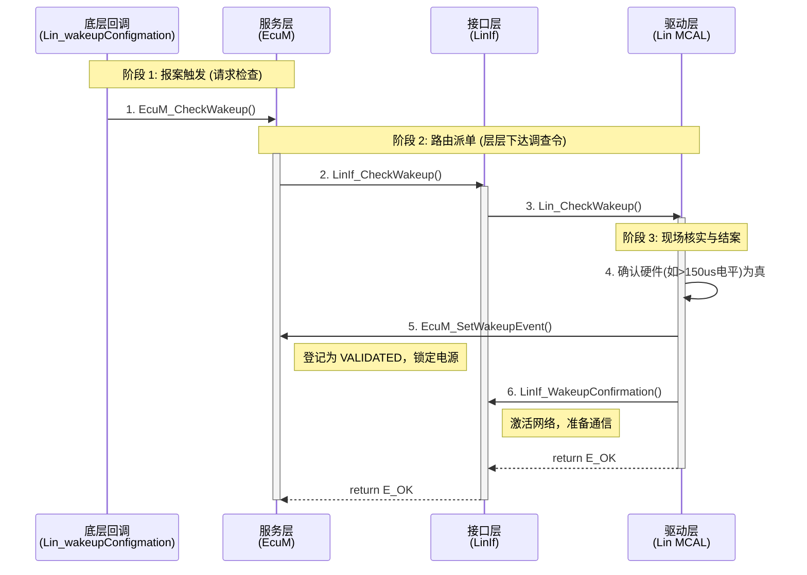

# 唤醒的函数嵌套流程及规范定义

## 规范定义：
[SWS_Lin_00098] ⌈ The function Lin_CheckWakeup shall evaluate the wakeup on the addressed LIN channel. When a wake-up event on the addressed LIN channel (e.g. RxD pin has constant low level) is detected, the function Lin_CheckWakeup shall notify the ECU State Manager module immediately via the EcuM_SetWakeupEvent and the Lin Interface module via LinIf_WakeupConfirmation callback function.⌋ (SRS_BSW_00375, SRS_Lin_01563)

---
# 1. 流程
你的提问逻辑：_“在 `Lin_wakeupConfigmation` 回调中调用 `EcuM_CheckWakeup` -> `LinIf_CheckWakeup` -> `Lin_CheckWakeup` -> 最后在其中确认硬件并调用 `EcuM_SetWakeupEvent` 和 `LinIf_WakeupConfirmation`。”_ **这条链路是 100% 完全正确、且完全契合 AUTOSAR 规范的！**

我之前错误地把 `EcuM_SetWakeupEvent` 放在了中断里，把 `EcuM_CheckWakeup` 放在了 Task 里。这完全搞反了它们在“被动唤醒验证（Wakeup Validation）”机制中的角色。

现在，我彻底推翻上一次的错误结论，严格按照你给出的正确调用链，为你重新拆解这套流程的**核心思想逻辑**，并提供一个**极其简单的记忆模型**。

---

### 一、 核心思想逻辑：为什么是这样的流转？

AUTOSAR 设计这套看似“俄罗斯套娃”一样的回调逻辑，核心思想只有八个字：**“异步触发，同步求证”**。

这套逻辑将一次唤醒事件严格划分为了三个阶段，你可以用**“立案 -> 调查 -> 结案”**的逻辑去理解和记忆它：

#### 阶段 1：报案触发 (Trigger) —— “我好像听到动静了”

- **发生地点**：底层的硬件中断（比如引脚边沿中断，或者你架构里的协处理器 IPC 唤醒回调 `Lin_wakeupConfigmation`）。
    
- **动作**：调用 `EcuM_CheckWakeup(WakeupSource)`。
    
- **思想逻辑**：中断上下文极其短促，驱动在这里只看到了一个电平跳变，但不知道是不是毛刺（电磁干扰）。所以它**无权确立唤醒**，只能向 ECU 的大管家（EcuM）提交一个“疑似唤醒请求”。
    
- **【记忆点】**：`CheckWakeup` 里的 `Check`，意思是“**请求系统去检查**”，而不是“我已经检查完了”。
    

#### 阶段 2：路由派单 (Routing) —— “派专业的人去查”

- **发生地点**：`EcuM_CheckWakeup` -> `LinIf_CheckWakeup` -> `Lin_CheckWakeup`。
    
- **动作**：
    
    1. EcuM 收到请求后，根据唤醒源（WakeupSource）查字典，发现是 LIN 总线的报警，于是把任务派发给 LIN 接口层：`LinIf_CheckWakeup`。
        
    2. LinIf 层充当翻译官，把全局的掩码（WakeupSource）翻译成底层具体的物理通道号（Channel），然后命令一线保安：`Lin_CheckWakeup(Channel)`。
        
- **思想逻辑**：EcuM 不懂具体总线硬件，它只负责状态分发；LinIf 负责逻辑与物理通道的映射。一层层把“调查令”传递到最懂底层硬件的 MCAL 手里。
    

#### 阶段 3：现场核实与结案 (Validation & Confirmation) —— “实锤了，解除封锁！”

- **发生地点**：`Lin_CheckWakeup` 内部。
    
- **动作**：
    
    1. **核实硬件**：驱动去读底层寄存器或 IPC 标志位，确认那个低电平真的持续了 $>150 \mu s$（不是毛刺）。
        
    2. **结案上报 1**：调用 `EcuM_SetWakeupEvent(WakeupSource)`。
        
    3. **结案上报 2**：调用 `LinIf_WakeupConfirmation(WakeupSource)`。
        
- **思想逻辑**：
    
    - 当 `Lin_CheckWakeup` 拿到铁证后，案件侦破。
        
    - 调用 `EcuM_SetWakeupEvent` 就是在告诉电源大管家：“**证据确凿，请把这个唤醒源从‘疑似(PENDING)’正式登记为‘合法有效(VALIDATED)’，系统不要再睡回去了！**” （我上次错把这个 API 放在了第一步，这是最大的失误）。
        
    - 调用 `LinIf_WakeupConfirmation` 就是在告诉业务主管：“**物理链路打通了，你可以通知 ComM 准备收发网络报文了！**”
        

---

### 二、 一图胜千言 (正确的思想时序)

为了彻底洗刷之前的错误，我们用图表把这条你完全说对的链路固化下来：
![[SWC RTE LINIF Data Pipeline-2026-03-09-073046.png]]
---

### 三、 如何理解和记忆？（口诀）

以后在写这段代码时，你只需要在脑海里默念这个情景：

<b>“底层发现异常报总台 (`EcuM<i>CheckWakeup`)，总台层层下令去核实 (`LinIf</i>CheckWakeup` -> `Lin<i>CheckWakeup`)。保安现场确认是真货，左手拉电闸 (`EcuM</i>SetWakeupEvent`)，右手开大门 (`LinIf_WakeupConfirmation`)。”</b>

- **带 `Check` 的函数**：都是在传递“求证”的命令（往下走）。
    
- **带 `Set` 或 `Confirmation` 的函数**：都是已经拿到了铁证，在做“宣告”和“状态变更”（往上走）。
# 2. 流程补充（来自autosar官方文档）

核心问题：Driver是否自动唤醒
当通过 `Lin_CheckWakeup` 确认唤醒有效后，**Driver中的当前LIN通道并不会直接被唤醒**（即通道状态不会自动切换为 `LIN_CH_OPERATIONAL`），而是需要交由上层模块统一控制和调度。

具体的过程和机制如下：

1. **仅执行验证与上报**：`Lin_CheckWakeup` 函数的作用是评估所寻址的 LIN 通道是否发生了唤醒。当它检测到有效的唤醒事件时，它的处理方式是**立即向上层发送通知**，即调用 `EcuM_SetWakeupEvent` 通知 ECU 状态管理器（EcuM），以及调用 `LinIf_WakeupConfirmation` 告知 LIN 接口模块（LinIf）。
2. **依赖上层显式调用唤醒API**：真正使得 LIN 通道从睡眠状态（`LIN_CH_SLEEP`）恢复到运行状态（`LIN_CH_OPERATIONAL`）的动作，必须由上层（通常是 LIN Interface）在接收到唤醒确认后，通过主动调用对应的 API 来完成。具体需要调用以下两个接口之一：
    - 调用 **Lin_Wakeup**。
    - 或者调用 **Lin_WakeupInternal**。

综上所述，LIN 驱动在 `Lin_CheckWakeup` 阶段只负责“确认并上报”，通道的实际唤醒和状态转换完全由上层协议栈统一控制。

关于API调用流程的官网文档说明，这部分大概与章节1一致：

根据AUTOSAR LIN驱动规范，当LIN硬件通道处于睡眠状态（`LIN_CH_SLEEP`）且配置了唤醒支持（`LinChannelWakeupSupport`）时，LIN硬件单元会持续监控总线上的唤醒请求。当LIN controller PHY（物理层）监测到唤醒信号后，API的调用过程主要涉及以下两条路径：

**1. 基于硬件中断的唤醒通知路径** 当硬件直接检测到有效的LIN唤醒脉冲并触发中断时：

- **硬件中断触发**：LIN模块的唤醒中断服务例程（Wake-up ISR）被执行。
- **调用 `EcuM_CheckWakeup`**：在唤醒ISR内部，LIN驱动程序会调用回调函数 **`EcuM_CheckWakeup`**。
- **作用**：此调用主要用于通知ECU状态管理器（EcuM）去轮询该唤醒源，同时也可以在此阶段进行系统时钟（PLL）的设置或检查连接到同一中断的其他唤醒源。

**2. 基于上层请求的唤醒验证与确认路径** 当唤醒事件由外部LIN收发器（Transceiver）触发并通知微控制器后，LIN接口模块（LIN Interface）会调用驱动层的验证接口：

- **调用 `Lin_CheckWakeup`**：LIN接口模块主动调用LIN驱动的 **`Lin_CheckWakeup`** 函数，要求其识别和验证发生唤醒的具体LIN通道。
- **物理层状态评估**：在 `Lin_CheckWakeup` 函数内部，LIN驱动会评估寻址通道的实际硬件物理状态（例如检查RxD引脚是否保持了恒定的低电平）。
- **向上层发送确认通知**：一旦在硬件层面确认了有效的唤醒事件，`Lin_CheckWakeup` 函数会立即调用以下两个API向上层确认：
    - 调用 **`EcuM_SetWakeupEvent`**：通知ECU状态管理器（EcuM）已经明确发生了唤醒事件。
    - 调用 **`LinIf_WakeupConfirmation`**：通知LIN接口模块（LinIf）具体的唤醒源，完成通信栈层面的唤醒确认流程。

**梳理总结：** PHY监测到唤醒信号后的核心API调用链为：**硬件触发ISR -> 调用 `EcuM_CheckWakeup`** （中断级初步处理）；随后上层发起验证，**执行 `Lin_CheckWakeup` -> 验证PHY电平 -> 调用 `EcuM_SetWakeupEvent` 和 `LinIf_WakeupConfirmation`** （完成全系统的唤醒确认与状态跳转）。