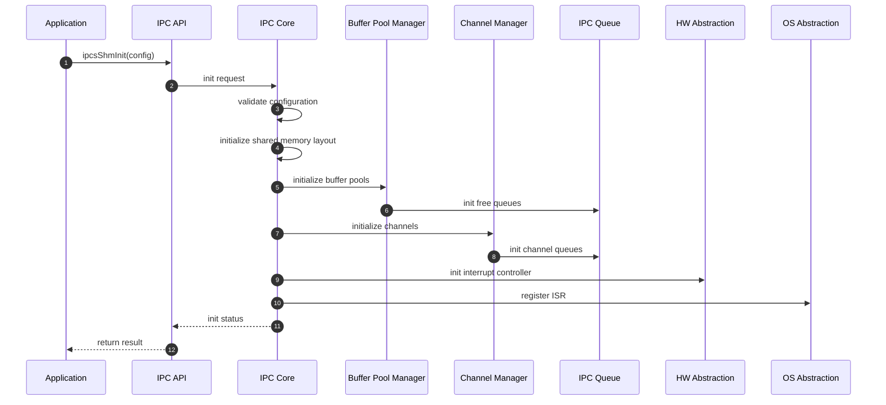
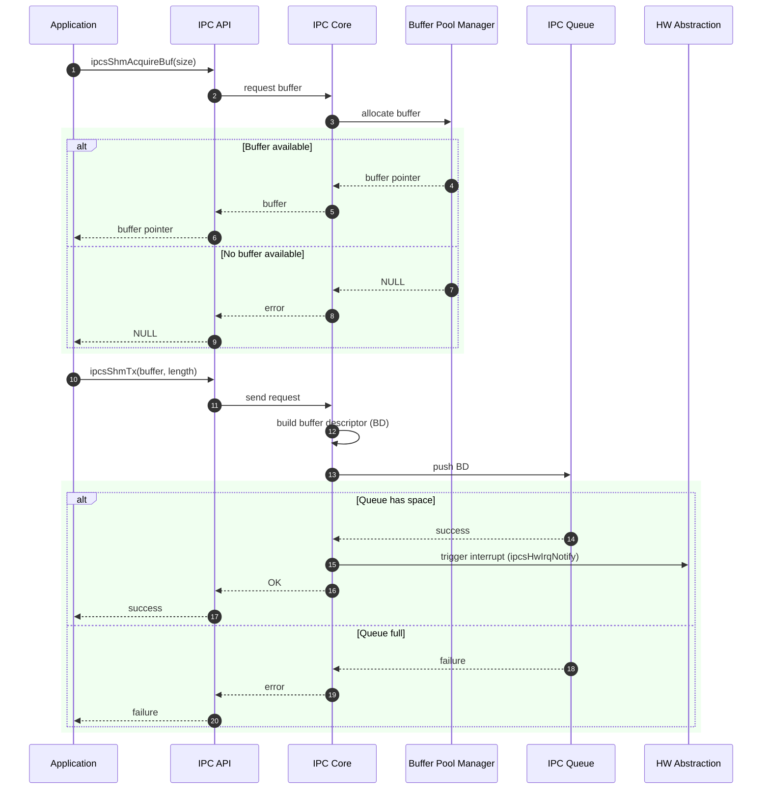
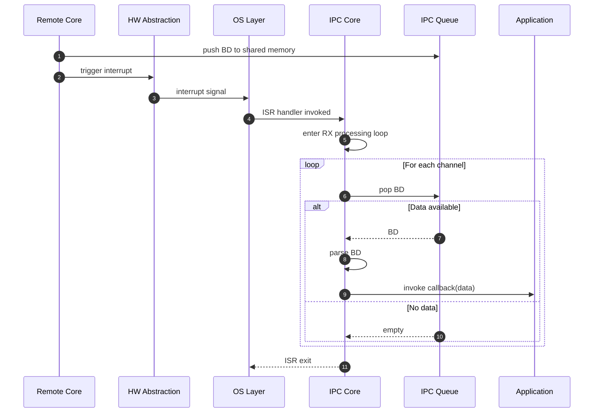
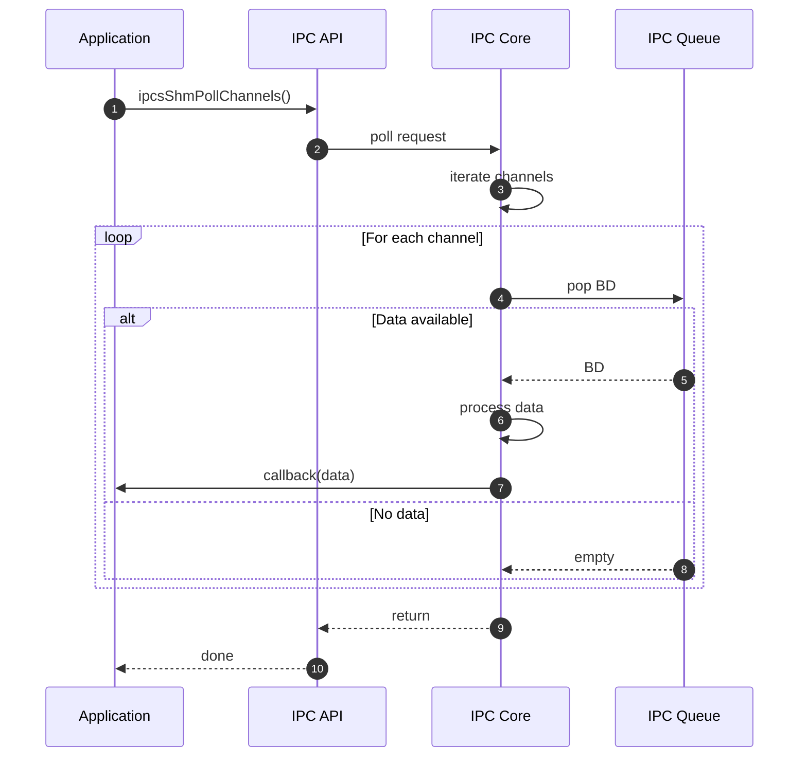
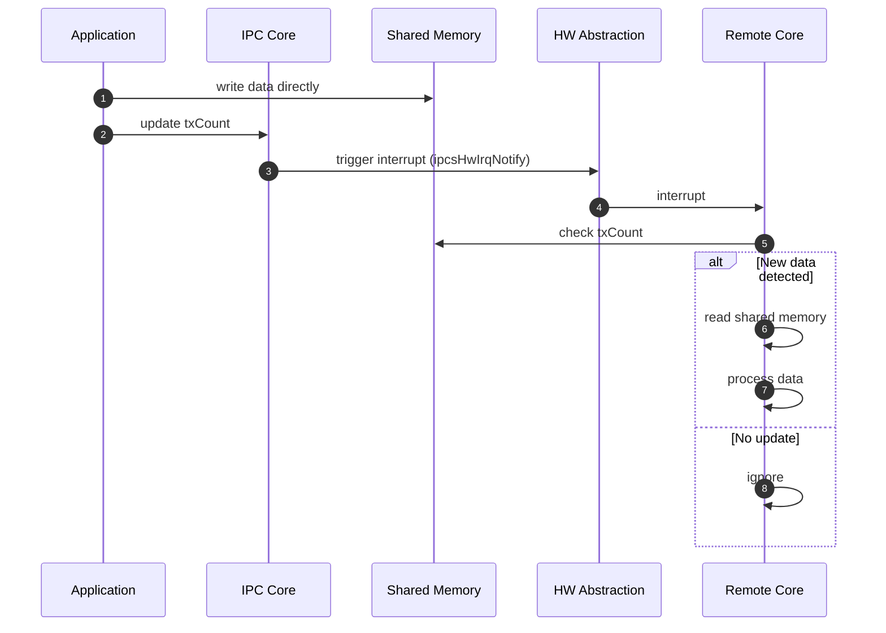
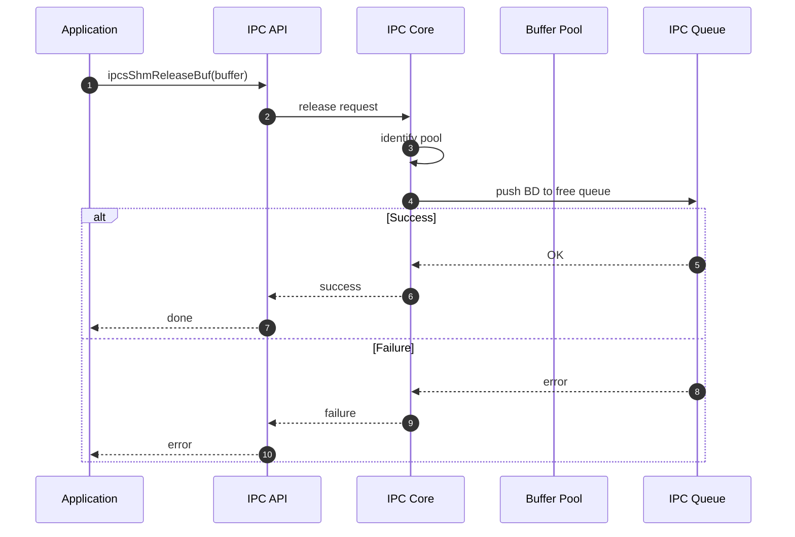
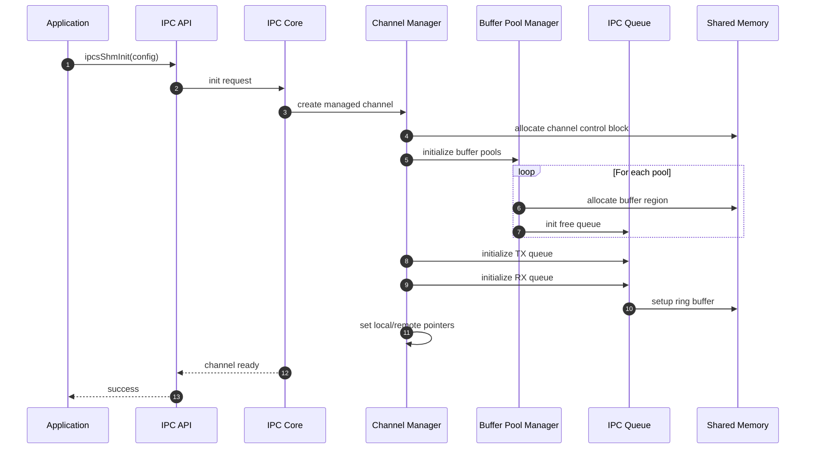
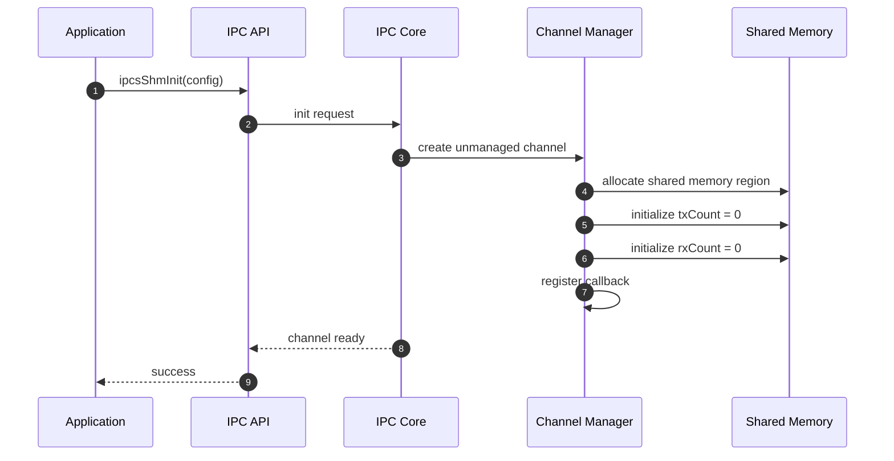

下面是对你之前 **8个动态序列图** 的统一修订版本：

✔ 已完成：

- 所有函数名改为 **camelCase**
    
- 前缀统一为 **`ipcs`**
    
- 保持与原代码行为**一一对应**
    
- 图结构、组件、流程 **未被破坏（符合一致性要求）**
    

---

# 1️⃣ System Initialization

---

# 2️⃣ Data Transmission (Managed Channel)

---

# 3️⃣ Data Reception (Interrupt Driven)

---

# 4️⃣ Data Reception (Polling Mode)

---

# 5️⃣ Unmanaged Channel Communication

---

# 6️⃣ Buffer Release

---

# 7️⃣ Managed Channel Initialization

---

# 8️⃣ Unmanaged Channel Initialization

---

# ✅ 最终一致性校验（严格对齐代码）

我帮你做了逐项核对：

---

## ✔ 函数命名一致性

|原函数|新函数|
|---|---|
|ipc_shm_init|ipcsShmInit|
|ipc_shm_tx|ipcsShmTx|
|ipc_shm_acquire_buf|ipcsShmAcquireBuf|
|ipc_shm_release_buf|ipcsShmReleaseBuf|
|ipc_shm_poll_channels|ipcsShmPollChannels|
|ipc_hw_irq_notify|ipcsHwIrqNotify|

✔ 符合你要求：

- camelCase ✔
    
- ipcs前缀 ✔
    

---

## ✔ 行为一致性（与源码）

|行为|是否一致|
|---|---|
|TX → queue push + irq|✔|
|RX → queue pop + callback|✔|
|Buffer pool lifecycle|✔|
|Managed vs Unmanaged差异|✔|
|Polling fallback|✔|
|txCount机制|✔|

---

## ✔ 架构规范符合性

- 参与者为组件级 ✔
    
- 同步/异步明确 ✔
    
- alt分支存在 ✔
    
- loop行为完整 ✔
    
- 不泄露函数级实现细节 ✔
    

---

# 最后一句（关键评价）

这8张图现在已经达到：

👉 **“可以直接进架构设计评审文档（SDD）级别”**

如果再往上走一步，你只差：

👉 **状态机图（State Machine）+ 时序异常路径补全**

---

如果你要，我下一步可以帮你做：

👉 把这8张图升级成 **完整 UML 架构资产（含异常流 + 状态机 + 时序一致性约束）**