# IPCF Shared Memory Driver 软件架构设计说明

  

**文档类型**：驱动软件架构设计（产品级）  

**适用对象**：IPCF Shared Memory Driver（Linux / RTOS 统一架构，多交付变体）

  

---

  

## 文档控制

  

### 文档变更历史

  

| Version | Date | Author | Description |

|---|---|---|---|

| V0.1 | [待更新] | [待更新] | 基于公司模板的首版草稿 |

| V0.2 | [待更新] | [待更新] | 对外接口字段与公司模板对齐 |

| V1.0 | [待更新] | [待更新] | 架构评审基线 |

| V1.1 | [待更新] | [待更新] | 按 ASPICE 十五章结构重组；补充 OSAL/HAL 接口契约、配置与回调说明；完善运行时流程图；增加接口视图、数据流视图与资源视图 |

  

### 保密性说明

  

本文件属项目内部软件架构设计资产，仅限参与开发、测试、集成、评审与管理的授权人员使用。对外提供须按项目保密流程与合同要求履行审批。

  

### 目录与交叉引用

  

正式交付的 Word 版本建议使用自动目录、题注与书签交叉引用。本文 Markdown 版保留占位说明，便于排版迁移。

  

---

  

## 1 引言

  

### 1.1 目的

  

本文档描述 IPCF Shared Memory Driver 的软件架构设计，作为可纳入产品开发与 ASPICE 软件工程过程的工作产品，用于：

  

- 阐明驱动在系统中的定位、职责与架构边界；

- 给出分层分解、模块职责、逻辑接口视图与关键运行时行为；

- 规范对上接口、对 OS 抽象（OSAL）及对硬件抽象（HAL）的契约关系（含配置与回调语义）；

- 支撑架构评审、验证策略定义、需求追踪及后续详细设计与测试设计输入。

  

### 1.2 范围

  

本文档适用于 IPCF 共享内存通信驱动的架构层级描述。驱动面向多核 SoC 场景，在 **Linux** 与 **RTOS**（及裸机类环境）下提供统一的共享内存 IPC 能力；实现上为 **单一架构、多 OS 变体**，差异主要集中于 OSAL 的执行模型与中断/线程交互方式。

  

文档覆盖：

  

- 架构原则、约束与假设；

- 分层与模块职责、变体管理策略；

- 对上服务接口、OSAL/HAL 抽象接口语义、配置与数据契约；

- 初始化/运行/释放、中断与轮询、异常与恢复等行为设计；

- 资源与性能、可靠性、安全与功能安全相关架构考虑；

- 可移植性、验证与确认、追踪性、合规性及风险。

  

本文档 **不** 承担下列内容（由其他工作产品或更低层级设计承担）：

  

- 源码级实现说明、文件路径与构建脚本细节；

- 寄存器位域级硬件编程手册式描述；

- 应用层报文语义与端到端网络协议定义；

- 具体性能指标门限的量化基线（须由项目需求与验证计划确认）。

  

### 1.3 参考依据（标准、规范、相关文档）

  

| Ref No. | Document / Basis |

|---|---|

| REF-01 | ASPICE v3.1（SWE.2 软件架构设计等相关过程） |

| REF-02 | AUTOSAR Classic Platform 分层与抽象思想（架构层对齐，非强制实现约束） |

| REF-03 | ISO 26262 对软件架构可分析性、可追溯性与安全相关设计的通用要求 |

| REF-04 | 项目《软件需求规格说明》 |

| REF-05 | 项目测试策略、配置管理与变更管理规范 |

| REF-06 | IPCF 驱动相关设计输入、接口约束与 SoC 数据手册（摘要输入） |

| REF-07 | 公司 ADC / 软件架构文档模板（排版与接口表字段约定） |

  

### 1.4 与其他工作产品关系

  

| 工作产品 | 关系说明 |

|---|---|

| 软件需求规格说明 | 需求追踪输入；本文给出架构元素与能力分配 |

| 软件详细设计与单元设计 | 在架构边界与接口契约之下展开 |

| 软件测试规格 / 测试用例 | 映射架构场景与质量属性验证 |

| 集成与系统测试计划 | 覆盖多实例、多通道、双 OS 变体一致性 |

| 安全分析 / 危害分析（若适用） | 本文提供边界、失效策略与假设，供进一步分析引用 |

  

---

  

## 2 术语、缩略语与定义

  

| 术语 / 缩略语 | 定义 |

|---|---|

| IPC / IPCF | 核间通信；本文 IPCF 指本共享内存驱动产品 |

| SHM | 共享内存区域，用于队列、缓冲池及非受管通道载荷 |

| Instance | 驱动逻辑实例，独立配置一组通道与一块共享内存窗口 |

| Channel | 实例内的逻辑通信通道；分为受管与非受管两类 |

| Managed Channel | 驱动负责缓冲池与缓冲描述（BD）环的受管通道 |

| Unmanaged Channel | 应用独占通道内载荷区，驱动仅维护轻量同步与通知语义 |

| OSAL | OS 适配层，将统一语义映射到具体 OS 的映射、线程/软中断/任务等机制 |

| HAL | 硬件适配层，封装跨核通知（如 MSCM 类）相关使能、触发、清除与状态查询 |

| SPSC | 单生产者单消费者无锁队列；用于 BD 与缓冲环，降低锁开销 |

| BD | Buffer Descriptor，描述受管通道中缓冲所属池、索引与有效载荷长度 |

| Deferred Processing | 硬中断上下文外的延迟处理（如 Linux tasklet/工作队列语义或用户态阻塞读唤醒后的处理） |

| Remote Peer | 对端核上对称部署的 IPC 逻辑实体，配置需与本地对称 |

| IPC_IRQ_NONE 等 | 配置中的中断占位语义：表示纯轮询路径或特定 SoC 外设驱动托管中断等（具体取值集合以随产品发布的类型定义为准，RTOS 变体可扩展 MU 等枚举） |

  

---

  

## 3 驱动系统概述

  

### 3.1 业务 / 系统上下文

  

IPCF 驱动部署在多核 SoC 上，为上层软件（应用、中间件或基础服务）提供 **基于共享内存的核间数据传递能力**。物理上依赖：

  

- 本地与对端可访问的共享内存窗口（地址与长度由配置给出）；

- 跨核通知机制（由 HAL 抽象），用于将“对端有可处理数据”事件通知到本地；

- 本地 OS 提供的内存映射、中断或线程调度能力（由 OSAL 抽象）。

  

### 3.2 驱动职责与边界

  

**职责**：

  

- 按配置建立 / 释放实例与通道级资源；

- 在受管通道上提供获取发送缓冲、提交发送、交付接收缓冲回收的完整路径；

- 在非受管通道上提供载荷区定位与发送通知语义；

- 在对端就绪判断、接收侧公平调度（预算化多通道处理）、中断模式与轮询模式下推进接收路径；

- 通过 HAL 触发 / 清除通知并与对端状态协同。

  

**上边界**：调用 `ipc-shm` 公开 API 的上层模块。  

**下边界**：OSAL 所依赖的 OS 服务与 HAL 所依赖的 SoC 通知原语。  

**协作边界**：Remote Peer 上的对称配置与兼容版本行为。

  

### 3.3 非目标范围

  

- 不定义上层报文格式与业务状态机；

- 不承诺跨版本二进制 ABI 兼容性（除非项目单独基线化）；

- 不在架构文档中展开具体芯片寄存器编程序列。

  

---

  

## 4 架构设计原则与约束

  

### 4.1 设计原则

  

| 原则 | 说明 |

|---|---|

| 统一核心、变体外围 | Core 保持跨 OS 一致语义；OSAL/HAL 吸收差异 |

| 显式边界与契约 | 对上 API、配置字段、OSAL/HAL 服务语义均以可评审方式描述 |

| 可预测资源行为 | 实例、通道、池数量可静态配置；运行期预算化处理防饥饿 |

| 可验证性 | 初始化、运行、释放、异常路径可映射测试与评审检查单 |

| 低耦合 | Core 仅通过 OSAL/HAL 窄接口访问环境与硬件 |

  

### 4.2 约束条件

  

- 受管通道下，本地与远程的池数量、池内缓冲数量与长度等配置须 **对称**；

- 受管通道 BD 队列与缓冲池布局遵循 SPSC 约束：单侧仅允许一个写者与一个读者；

- 中断号配置在 TX/RX 路径上须互斥；可使用产品类型定义中的占位值选择轮询或外设托管模式；

- 实例数、通道数、池数等受编译期上限约束（产品宏定义）。

  

### 4.3 关键假设与依赖

  

- 共享内存硬件一致性模型满足无锁环与计数同步的设计假设（若 SoC 有特殊一致性要求，须在项目层记录为假设或约束）；

- Remote Peer 按对称配置初始化，否则对端就绪判断与数据交换可能失败；

- 上层在 **同一通道** 上遵循 API 并发契约（见第 6 章）。

  

---

  

## 5 软件架构分解

  

### 5.1 总体分层架构

  

**图 5-1：IPCF 总体分层架构**

  

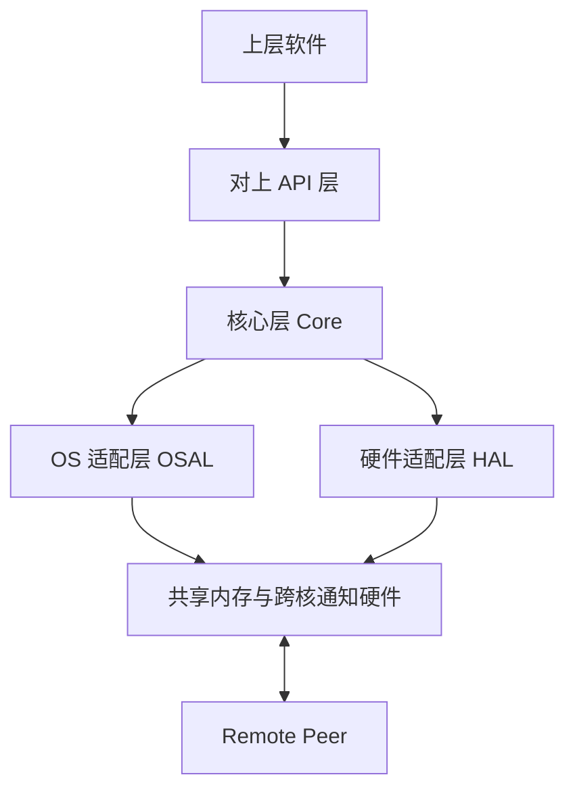

  

| 层次 | 职责摘要 |

|---|---|

| 对上 API 层 | 对外稳定符号与参数校验入口 |

| Core | 实例 / 通道 / 队列 / 受管与非受管语义、公平接收调度 |

| OSAL | 映射共享内存、登记中断或轮询推进、延迟执行上下文 |

| HAL | 跨核通知使能、触发、清除及与实例相关的硬件状态 |

  

### 5.2 核心模块划分与职责

  

| 模块能力 | 职责 |

|---|---|

| 实例管理 | 实例生命周期、与全局就绪状态协同 |

| 通道管理 | 受管 / 非受管分支、通道级元数据 |

| 缓冲与队列 | SPSC 环、BD 与缓冲池地址计算与完整性检查 |

| 发送路径 | acquire_buf / tx / unmanaged_tx 相关状态推进 |

| 接收路径 | 中断或轮询触发的预算化多通道处理、回调上层 |

| 诊断与错误 | 参数与状态错误返回、可扩展调试钩子（实现相关） |

  

### 5.3 统一核心与 OS 适配层边界

  

Core **不得** 直接调用具体 OS API 或直接访问硬件寄存器；必须通过 OSAL/HAL 服务。OSAL 负责：

  

- 获取本地 / 远程共享内存映射基址与范围（概念上对应 `ipc_os_get_local_shm` / `ipc_os_get_remote_shm`）；

- 在初始化阶段向 Core 注册可回调的接收推进函数（由 Core 实现，由 OSAL 在合适上下文调用）；

- 在部分 Linux 内核变体中完成中断控制器相关映射（概念上对应 `ipc_os_map_intc` / `ipc_os_unmap_intc`，用户态变体无此需求）。

  

### 5.4 变体管理策略（Linux / RTOS）

  

| 维度 | 策略 |

|---|---|

| 构建与链接 | 通过编译选项选择 OSAL/HAL 实现，Core 源码共用 |

| 执行模型 | Linux：内核态 tasklet/软中断路径或用户态线程阻塞读唤醒等；RTOS：ISR + 任务或等价延迟上下文 |

| 类型细节 | OSAL 接收推进回调在签名上允许 `int` / `uint32_t` 等细微差别，**语义一致**：返回值表示本轮已处理工作量，用于预算控制与是否继续调度 |

| 扩展中断占位 | RTOS 头文件可定义额外中断托管枚举（如 MU），架构上仍归类为“配置枚举扩展”，不改变 Core 语义 |

  

### 5.5 逻辑接口视图

  

**图 5-2：逻辑接口视图（主要协作关系）**

  

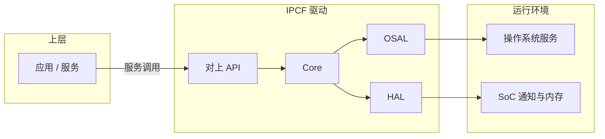

  

说明：该视图强调 **可评审边界**；物理部署上 Linux 用户态变体可能将部分 OSAL 能力与设备节点交互结合，仍归入 OSAL 职责。

  

### 5.6 数据流视图

  

#### 5.6.1 受管通道数据流

  

**图 5-3：受管通道数据流（概念）**

  

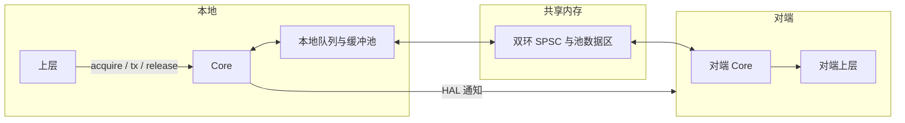

  

要点：发送侧将 BD 推入通道 Tx 环并触发通知；接收侧在延迟上下文中弹出 BD，计算缓冲地址后调用通道配置中的 **接收回调**。

  

#### 5.6.2 非受管通道数据流

  

**图 5-4：非受管通道数据流（概念）**

  

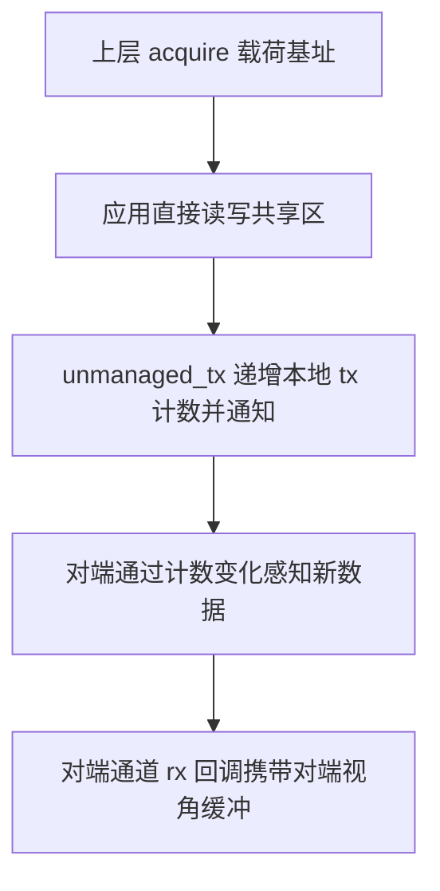

  

要点：非受管通道无 BD 环；依赖计数与完整性哨兵保障基本一致性，上层需自行定义载荷内同步策略。

  

---

  

## 6 接口架构设计

  

### 6.1 对上层软件接口（服务能力与契约）

  

以下接口在 Linux 与 RTOS 变体中 **名称与语义保持一致**（头文件对外：`ipc-shm.h`，类型与配置：`ipc-types.h` 或随产品合并的类型头）。表结构对齐公司模板字段。

  

#### 6.1.1 ipc_shm_init

  

| Field | Content |

|---|---|

| Service Name | ipc_shm_init |

| Syntax | int8_t ipc_shm_init(const struct ipc_shm_instances_cfg *cfg) |

| Service ID [hex] | N/A |

| Sync/Async | Synchronous |

| Reentrancy | Non Reentrant |

| Parameters (in) | cfg | 多实例配置集合指针 |

| Parameters (inout) | None | None |

| Parameters (out) | None | None |

| Return value | int8_t | 0 表示成功；非 0 为错误码（见 6.1.12） |

| Description | 按配置初始化全部实例，建立 Core/OSAL/HAL 协同所需资源。 |

| Available via | ipc-shm.h |

  

**关联**：图 7-1、图 7-8。

  

#### 6.1.2 ipc_shm_init_instance

  

| Field | Content |

|---|---|

| Service Name | ipc_shm_init_instance |

| Syntax | int8_t ipc_shm_init_instance(uint8_t instance, const struct ipc_shm_cfg *cfg) |

| Service ID [hex] | N/A |

| Sync/Async | Synchronous |

| Reentrancy | Non Reentrant |

| Parameters (in) | instance | 实例标识 |

| Parameters (in) | cfg | 单实例配置 |

| Parameters (inout) | None | None |

| Parameters (out) | None | None |

| Return value | int8_t | 0 成功；非 0 错误 |

| Description | 初始化指定实例并启用通知与接收路径。 |

| Available via | ipc-shm.h |

  

#### 6.1.3 ipc_shm_free

  

| Field | Content |

|---|---|

| Service Name | ipc_shm_free |

| Syntax | void ipc_shm_free(void) |

| Service ID [hex] | N/A |

| Sync/Async | Synchronous |

| Reentrancy | Non Reentrant |

| Parameters (in) | None | None |

| Parameters (inout) | None | None |

| Parameters (out) | None | None |

| Return value | None | None |

| Description | 释放全部实例资源，驱动回到未初始化状态。 |

| Available via | ipc-shm.h |

  

**关联**：图 7-2。

  

#### 6.1.4 ipc_shm_free_instance

  

| Field | Content |

|---|---|

| Service Name | ipc_shm_free_instance |

| Syntax | void ipc_shm_free_instance(const uint8_t instance) |

| Parameters (in) | instance | 实例标识 |

| Return value | None | None |

| Description | 释放指定实例资源。 |

| Available via | ipc-shm.h |

  

#### 6.1.5 ipc_shm_acquire_buf

  

| Field | Content |

|---|---|

| Service Name | ipc_shm_acquire_buf |

| Syntax | void *ipc_shm_acquire_buf(const uint8_t instance, uint8_t chan_id, uint32_t mem_size) |

| Reentrancy | 不同通道可并发；**同一通道** 不可重入 |

| Return value | void * | 成功返回缓冲指针；失败返回 NULL |

| Description | 为受管通道申请可写发送缓冲；**须在对端就绪后**再使用。 |

| Available via | ipc-shm.h |

  

#### 6.1.6 ipc_shm_release_buf

  

| Field | Content |

|---|---|

| Service Name | ipc_shm_release_buf |

| Syntax | int8_t ipc_shm_release_buf(const uint8_t instance, uint8_t chan_id, const void *buf) |

| Reentrancy | 不同通道可并发；**同一通道** 不可重入 |

| Return value | int8_t | 0 成功 |

| Description | 接收侧处理完成后释放受管缓冲，将其归还池并通过 BD 语义交还对端发送路径。 |

| Available via | ipc-shm.h |

  

#### 6.1.7 ipc_shm_tx

  

| Field | Content |

|---|---|

| Service Name | ipc_shm_tx |

| Syntax | int8_t ipc_shm_tx(const uint8_t instance, int chan_id, void *buf, uint32_t size) |

| Reentrancy | 不同通道可并发；**同一通道** 不可重入 |

| Return value | int8_t | 0 成功 |

| Description | 提交受管通道发送，推送 BD 并通过 HAL 通知对端。 |

| Available via | ipc-shm.h |

  

**关联**：图 7-3、图 5-3。

  

#### 6.1.8 ipc_shm_unmanaged_acquire

  

| Field | Content |

|---|---|

| Service Name | ipc_shm_unmanaged_acquire |

| Syntax | void *ipc_shm_unmanaged_acquire(const uint8_t instance, uint8_t chan_id) |

| Return value | void * | 通道本地载荷区指针或 NULL |

| Description | 获取非受管通道本地共享区；**建议在初始化后仅获取一次**。 |

| Available via | ipc-shm.h |

  

#### 6.1.9 ipc_shm_unmanaged_tx

  

| Field | Content |

|---|---|

| Service Name | ipc_shm_unmanaged_tx |

| Syntax | int8_t ipc_shm_unmanaged_tx(const uint8_t instance, uint8_t chan_id) |

| Return value | int8_t | 0 成功 |

| Description | 在应用写入完成后触发通知，使对端感知新数据。 |

| Available via | ipc-shm.h |

  

**关联**：图 7-6、图 5-4。

  

#### 6.1.10 ipc_shm_is_remote_ready

  

| Field | Content |

|---|---|

| Service Name | ipc_shm_is_remote_ready |

| Syntax | int8_t ipc_shm_is_remote_ready(const uint8_t instance) |

| Reentrancy | Reentrant |

| Return value | int8_t | 0 表示对端已就绪 |

| Description | 建议在首次发送前调用，避免对端未就绪导致发送失败或异常时序。 |

| Available via | ipc-shm.h |

  

#### 6.1.11 ipc_shm_poll_channels

  

| Field | Content |

|---|---|

| Service Name | ipc_shm_poll_channels |

| Syntax | int8_t ipc_shm_poll_channels(const uint8_t instance) |

| Reentrancy | 不同实例可并发；**同一实例** 不可重入 |

| Return value | int8_t | 非负表示本轮处理报文数；错误为负值或约定错误码 |

| Description | 在不依赖中断的情况下轮询所有通道并公平处理，算法与中断路径共享核心接收逻辑。 |

| Available via | ipc-shm.h |

  

**关联**：图 7-5。

  

#### 6.1.12 返回值与错误码策略

  

公开 API 普遍使用 `int8_t` 返回值：**0 表示成功，非 0 表示失败**。在 Linux 变体实现中，错误码常与 **负 errno 语义** 对齐（如无效参数、资源不可用等）；RTOS 变体在数值上可能不同，但架构要求 **在接口契约层将“失败原因类别”保持一致**（参数、状态、资源、环境），具体枚举与字符串化由项目测试与发布说明补充。

  

**核对结论**：`ipc-shm.h` 中列出的对外服务均已纳入上表；无额外未文档化的公开服务符号。

  

### 6.2 配置与回调契约（与上层的数据契约）

  

下列内容属于 **对上契约的一部分**，与 API 表共同构成集成接口基线。

  

**表 6-1：配置结构层级（摘要）**

  

| 结构 | 架构含义 |

|---|---|

| ipc_shm_instances_cfg | 实例个数与每实例 ipc_shm_cfg 指针数组 |

| ipc_shm_cfg | 本地/远端 SHM 物理基址与长度、通道数、通道数组、跨核 IRQ 编号、本地/远端核类型与索引等 |

| ipc_shm_channel_cfg | 通道类型（受管 / 非受管）与联合体成员 |

| ipc_shm_managed_cfg | 池个数、池参数数组、**rx_cb**、cb_arg |

| ipc_shm_unmanaged_cfg | 非受管区长度、**rx_cb**、cb_arg |

| ipc_shm_pool_cfg | 单池缓冲个数与单缓冲长度 |

  

**表 6-2：接收回调语义**

  

| 通道类型 | 回调触发条件（概念） | 参数语义 |

|---|---|---|

| 受管 | 延迟处理上下文中弹出 BD 且地址校验通过 | 载荷指针与长度 |

| 非受管 | 检测到对端 tx 计数相对本地副本变化且完整性检查通过 | 对端可见的存储区指针（由实现定义具体形参含义） |

  

**约束**：

  

- 回调在 **由 OSAL 调度的非硬中断或等价受限上下文** 中执行（具体是否可与部分 RTOS ISR 关联由变体实现决定，项目须评估上层回调可重入与锁策略）；

- 对称配置是对端正确解释 BD 与计数的前提；

- AUTOSAR 场景下配置中可包含 OsIsr 符号名等附加字段，属 **集成契约扩展**，不改变 Core 对通道与缓冲的抽象。

  

### 6.3 对 OS 抽象接口（统一语义）

  

OSAL 为 **驱动内部接口**，不对外暴露给应用。以下从架构角度归纳 **服务原语**（符号名以实现为准，Linux/RTOS 头文件中为 `ipc_os_*` 族）。

  

**表 6-3：OSAL 服务契约**

  

| 服务原语 | 语义 | 典型触发 |

|---|---|---|

| ipc_os_init | 映射共享内存、登记中断或轮询依赖、向 Core 注册接收推进回调 | 实例初始化 |

| ipc_os_free | 释放映射、注销中断、停止延迟处理 | 实例 / 驱动释放 |

| ipc_os_get_local_shm | 返回本地共享内存映射基址（概念） | Core 布局队列与池 |

| ipc_os_get_remote_shm | 返回对端共享内存映射基址（概念） | Core 计算远端缓冲地址 |

| ipc_os_poll_channels | 驱动轮询入口，内部调用 Core 注册的接收推进逻辑 | ipc_shm_poll_channels |

| ipc_os_map_intc / ipc_os_unmap_intc | 映射 / 取消映射中断控制器相关区域 | **仅部分 Linux 内核变体需要**；用户态 OSAL 无此对 |

  

**说明**：用户态与内核态 Linux 变体在“如何唤醒延迟处理线程”上不同，但 **对上 API 与 Core 状态机语义保持一致**。

  

### 6.4 对硬件抽象接口（中断 / 通知 / 状态）

  

HAL 为 **驱动内部接口**，封装跨核通知与实例相关硬件状态（`ipc_hw_*` 族）。

  

**表 6-4：HAL 服务契约**

  

| 服务原语 | 语义 |

|---|---|

| ipc_hw_init / ipc_hw_free | 建立 / 释放与实例绑定的硬件通知上下文 |

| ipc_hw_get_rx_irq | 查询 RX 侧 IRQ 配置（用于 OSAL 登记） |

| ipc_hw_irq_enable / ipc_hw_irq_disable | 使能 / 屏蔽来自对端的通知 |

| ipc_hw_irq_notify | 本地触发至对端的通知 |

| ipc_hw_irq_clear | 清除待处理通知状态 |

  

**说明**：部分平台或 Xen 等虚拟化变体可能存在 **占位实现或未完全实现** 的 HAL 行为，须在项目层作为 **部署约束与验证重点** 单独跟踪（不展开寄存器细节）。

  

### 6.5 接口一致性与兼容策略

  

| 主题 | 策略 |

|---|---|

| 对上 API | Linux / RTOS 必须保持符号与参数语义一致；并发契约一致 |

| OSAL/HAL | 允许实现差异，但必须满足第 6.3 / 6.4 章服务语义 |

| 配置 | 新增字段须版本化评审，避免破坏对称性与结构体对齐假设 |

| 错误码 | 失败路径分类一致；数值与 errno 映射可作为实现细节文档化 |

  

---

  

## 7 运行时行为设计

  

### 7.1 初始化与反初始化场景

  

**图 7-1：初始化实例（顺序图）**

  

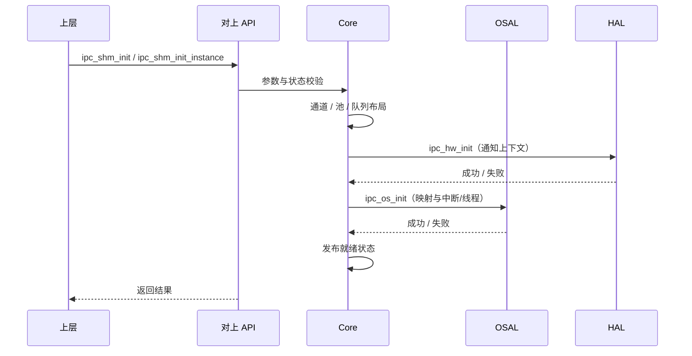

  

**图 7-2：反初始化 / 释放（流程图）**

  

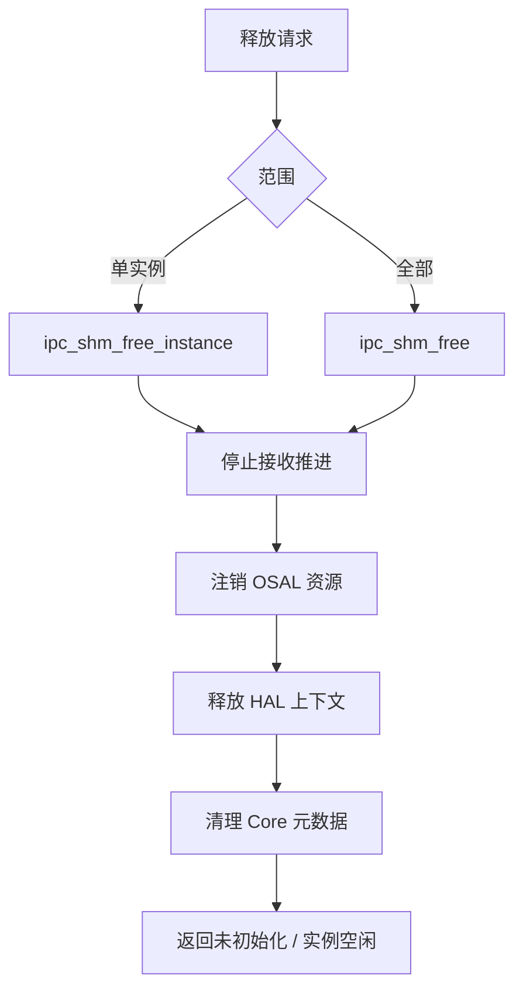

  

### 7.2 正常通信场景（发送 / 接收）

  

**图 7-3：受管通道发送与接收（顺序图）**

  

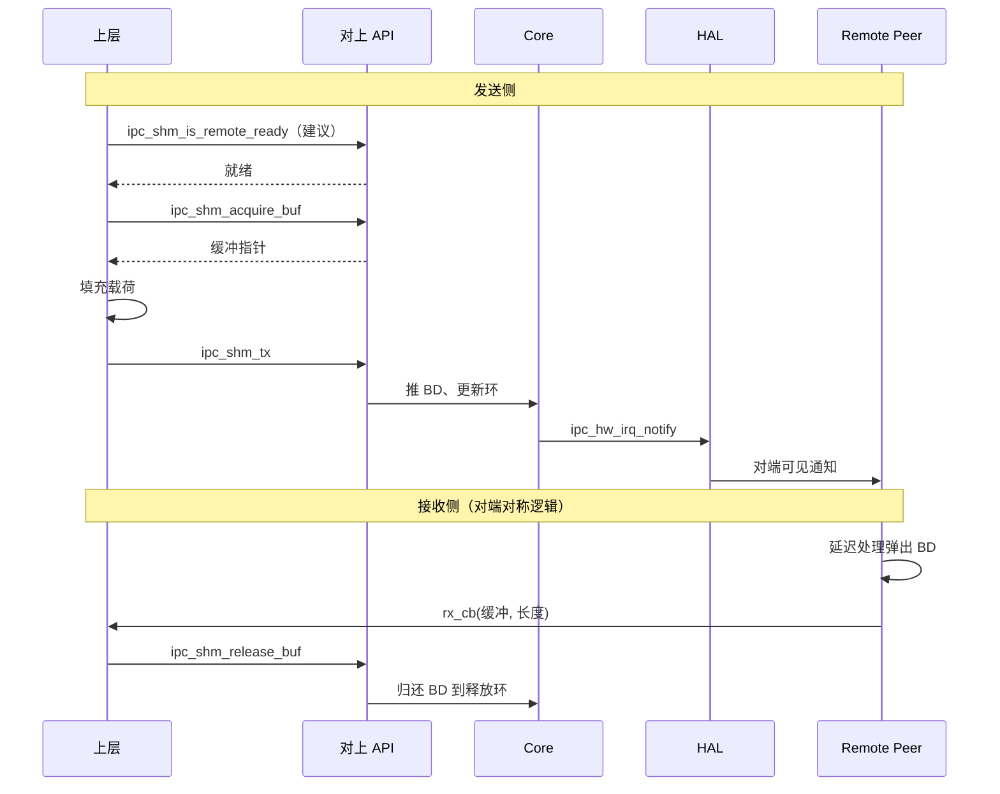

  

### 7.3 中断模式与轮询模式行为

  

**图 7-4：中断模式接收处理（流程图）**

  

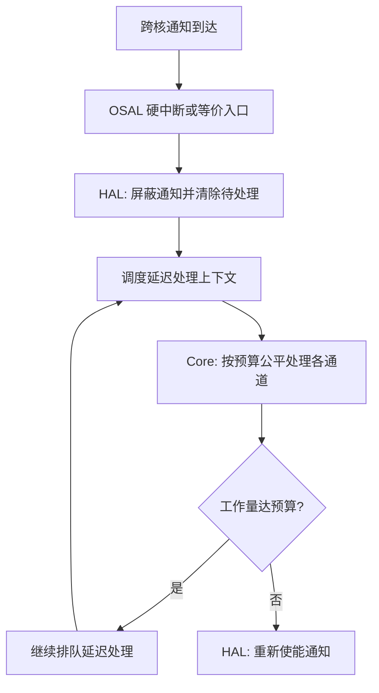

  

**图 7-5：轮询模式（流程图）**

  

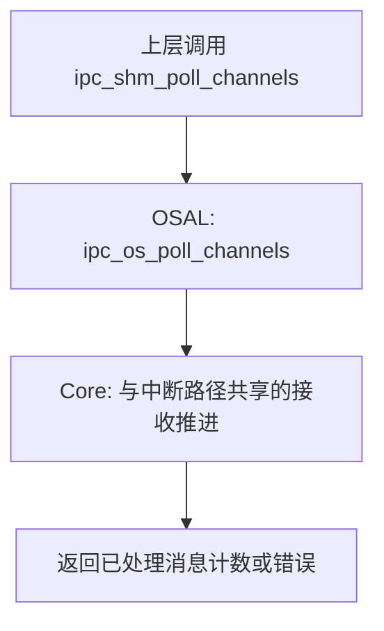

  

**配置要点**：当 RX IRQ 配置为“无中断 / 外设托管”等占位语义时，须依赖轮询或外部驱动协同，项目须在集成架构中明确责任归属。

  

### 7.4 异常与恢复场景

  

**图 7-6：非受管通道通知与接收（流程图）**

  

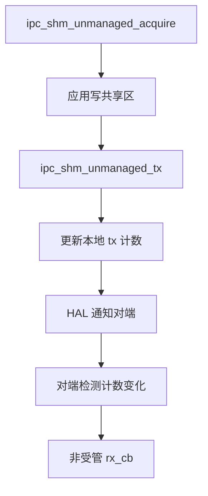

  

**图 7-7：异常分类与处理策略（流程图）**

  

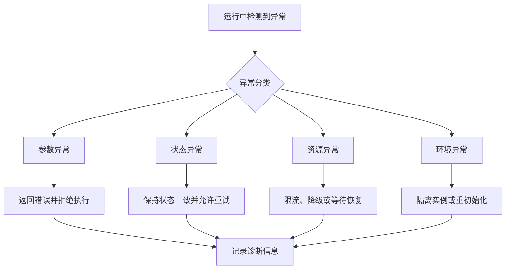

  

**图 7-8：实例状态机（逻辑）**

  

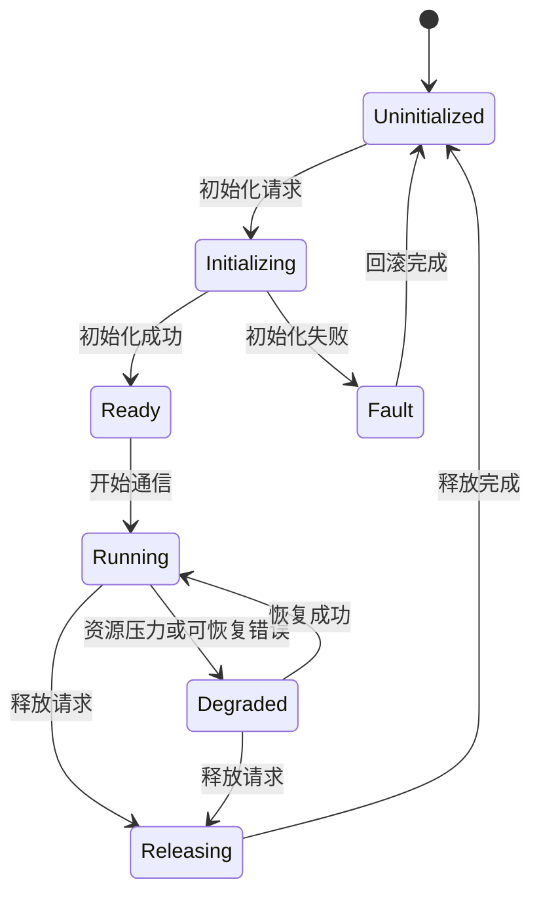

  

**表 7-1：实例状态说明**

  

| State | Description |

|---|---|

| Uninitialized | 实例未建立 |

| Initializing | 正在建立运行条件 |

| Ready | 具备通信前提 |

| Running | 正常通信中 |

| Degraded | 受限或降级运行 |

| Releasing | 正在释放资源 |

| Fault | 故障态，等待回滚或重建 |

  

---

  

## 8 资源与性能架构

  

### 8.1 内存架构与资源预算

  

**图 8-1：资源结构视图（概念）**

  

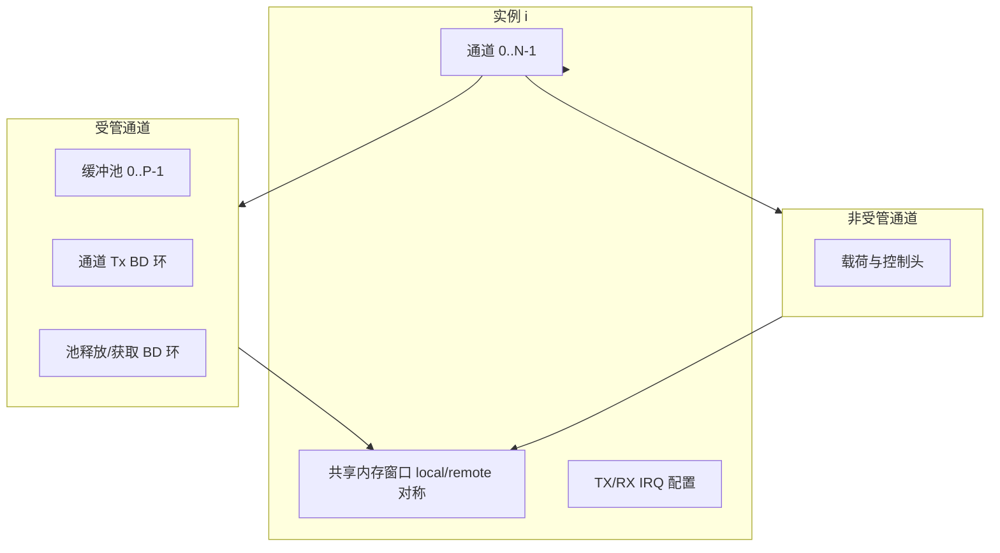

  

设计要求：

  

- 实例间资源隔离，避免配置交叉引用；

- 池与环元素数量在静态配置阶段可计算 SHM 占用；

- `IPC_SOFTIRQ_BUDGET` 类常量控制单次延迟处理工作量，平衡时延与 CPU 占用。

  

### 8.2 时间行为与调度策略

  

- 接收路径采用 **多通道公平预算**，避免单通道饿死；

- 中断模式下面向“通知风暴”依赖预算与重新调度；

- 对上发送/接收 API 在 **同通道** 上为非重入，降低锁需求。

  

### 8.3 性能目标与容量规划方法

  

性能数字由项目 SRS 与 SoC 场景定义。架构层要求：

  

- 给出可测试的负载模型：多实例、多通道、混合受管 / 非受管；

- 记录测量点：端到端时延、吞吐、CPU 占用、中断风暴下行为；

- 与 8.1 资源视图一致地推导缓冲池深度与环深度。

  

---

  

## 9 可靠性与诊断设计

  

### 9.1 错误分类与处理策略

  

| 类别 | 策略 |

|---|---|

| 参数错误 | 立即返回，不改变共享状态 |

| 状态错误 | 返回错误码，避免破坏队列哨兵与索引 |

| 资源错误 | 初始化失败路径释放已分配资源 |

| 环境错误 | 依赖 OSAL/HAL 恢复或实例级隔离 |

  

### 9.2 监控、日志与诊断信息

  

- 实现可提供调试与错误日志宏（变体相关），架构上要求 **关键失败路径可观测**；

- 正式产品可收敛日志级别，但须保留故障定位最小集。

  

### 9.3 降级与故障隔离策略

  

- 实例级故障不应隐式波及其他实例（除非共享 OS 资源失败）；

- Degraded 状态用于表达可恢复的运行受限，具体进入条件由项目定义。

  

---

  

## 10 安全与功能安全考虑

  

### 10.1 干扰隔离与边界保护

  

- 分层与通道实例边界构成主要 FOI 手段；

- 非受管通道载荷完整性依赖应用层协议，架构层须声明 **驱动不解析载荷**。

  

### 10.2 失效防护与检测机制

  

- 队列哨兵与共享结构魔数用于检测非法踩踏或初始化竞态（概念层）；

- 地址合法性检查防止越界回调。

  

### 10.3 与 ISO 26262 / AUTOSAR 的关系说明

  

本文档提供可追溯、可评审的架构结构，**不替代** 功能安全等级认定与硬件安全机制分析。若驱动纳入安全相关环境，须在系统层补全安全目标、ASIL 分解与验证深度。

  

---

  

## 11 可移植性与可扩展性设计

  

### 11.1 OS 与平台扩展点

  

- 新 OS：实现 OSAL 契约，复用 Core；

- 新 SoC：实现 HAL 契约，必要时扩展 `ipc_hw_init` 参数承载方式（须评审）；

- 新通知硬件：在 HAL 内吸收，不修改对上 API。

  

### 11.2 配置化与产品线适配策略

  

- 通过编译期宏限制最大实例、通道、池、缓冲数量；

- 通过 `ipc_shm_cfg` 实例化不同产品线内存布局与 IRQ 方案。

  

---

  

## 12 验证与确认策略（架构级）

  

### 12.1 架构评审要点

  

- 分层与接口视图是否覆盖第 5、6 章；

- 数据流与资源视图是否与 SHM 对称假设一致；

- 中断 / 轮询双路径是否映射测试；

- OS 变体行为一致性是否定义清晰。

  

### 12.2 测试策略映射（单元 / 集成 / 系统）

  

| 验证层级 | 关注点 |

|---|---|

| 单元 | 队列与地址计算、错误路径分类（在可实现前提下） |

| 集成 | Core + OSAL + HAL 协同、双变体对称配置 |

| 系统 | 多实例多通道负载、异常注入、长期稳定性 |

  

### 12.3 关键质量属性验证方法

  

| 属性 | 方法 |

|---|---|

| 可用性 | 初始化 / 运行 / 释放全路径 |

| 一致性 | Linux 与 RTOS 同场景对比 |

| 性能 | 时延、吞吐、预算行为 |

| 可靠性 | 故障注入与恢复 |

| 可诊断性 | 日志与错误码路径覆盖 |

  

---

  

## 13 需求可追踪性

  

### 13.1 架构决策与需求映射方法

  

建议维护矩阵：**需求 ID → 架构章节 / 接口编号 / 图解编号**。本文已用图示与接口小节提供锚点。

  

**表 13-1：需求类到架构承载（示例映射）**

  

| 需求类 | 架构承载 |

|---|---|

| 生命周期 | 第 7.1、7.2 章，图 7-1、7-2、7-8 |

| 数据通信 | 第 5.6 章，第 7.2、7.3、7.4 章 |

| OS 适配 | 第 5.3、5.4、6.3 章 |

| 硬件通知 | 第 5.1、6.4 章 |

| 资源与性能 | 第 8 章，图 8-1 |

| 可靠性 | 第 7.4、第 9 章 |

  

### 13.2 待补充追踪项

  

- 正式需求 ID 与测试用例 ID 的逐项链接；

- 安全相关需求（若适用）的独立追踪列。

  

---

  

## 14 合规性说明

  

### 14.1 ASPICE 相关过程工作产品对应关系

  

本文档支持 **SWE.2 软件架构设计** 活动产出物要求：结构、接口、动态行为、资源与验证考虑均已分章描述。

  

### 14.2 AUTOSAR 一致性说明（架构层）

  

驱动在分层与抽象上与 Classic AUTOSAR 的 **分层解耦思想** 对齐；是否作为 AUTOSAR 复杂驱动部署由项目集成方式决定，本文不强制具体 BSW 模块映射。

  

---

  

## 15 风险与开放问题

  

### 15.1 架构风险清单与缓解措施

  

| 风险 | 影响 | 缓解措施 |

|---|---|---|

| 非对称配置 | 通信失败或数据损坏 | 配置生成工具校验、集成测试必测对称性 |

| 回调中阻塞或持锁过久 | 延迟处理饿死或实时性下降 | 编码规范与静态检查、回调时限要求 |

| 特定平台 HAL 占位 | 功能不完整 | 发布说明标注支持矩阵与限制 |

| 共享内存一致性假设不满足 | 罕见竞态 | SoC 评审记录、必要时屏障策略下沉 HAL |

  

### 15.2 Open Issues / 待确认项

  

- 项目级性能指标与资源门限量化；

- 是否纳入功能安全范围及目标 ASIL；

- Xen / 特定虚拟化变体 HAL 完成度与交付策略；

- 若使用自动化工具将本文 Mermaid 图批量嵌入 Word，须按 **图号与顺序** 更新脚本映射（当前仓库脚本曾按固定数量抽取，增加图表后需同步维护）。

  

---

  

**文档结束**