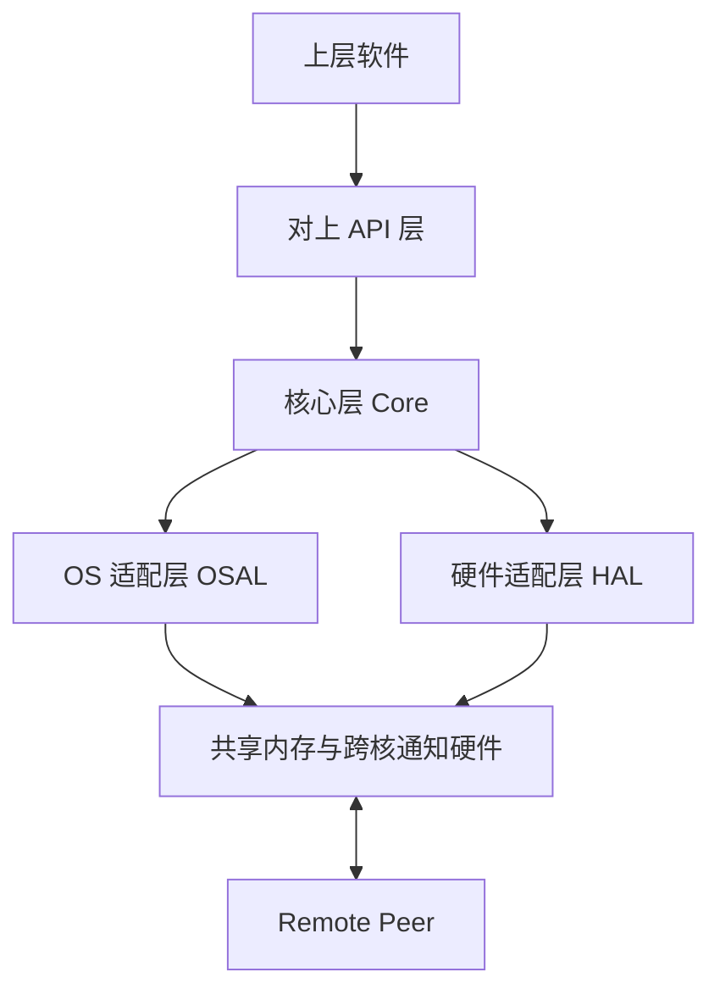
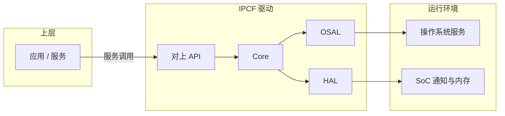
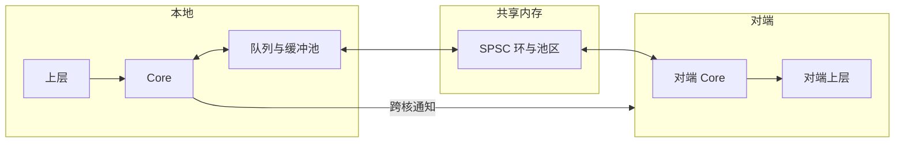
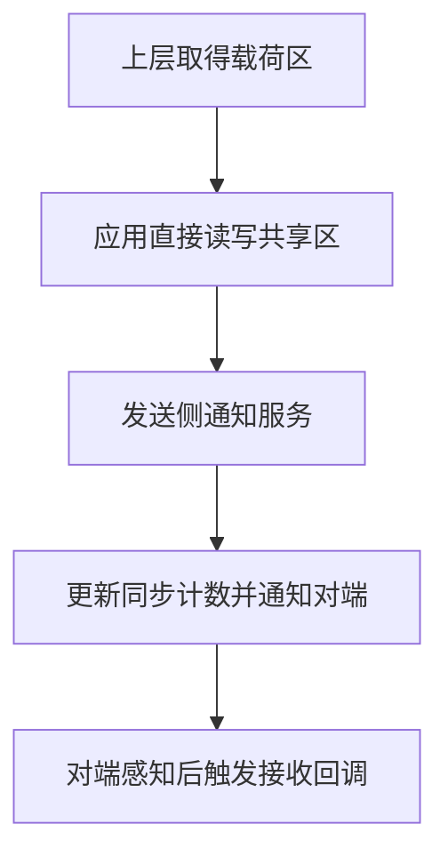
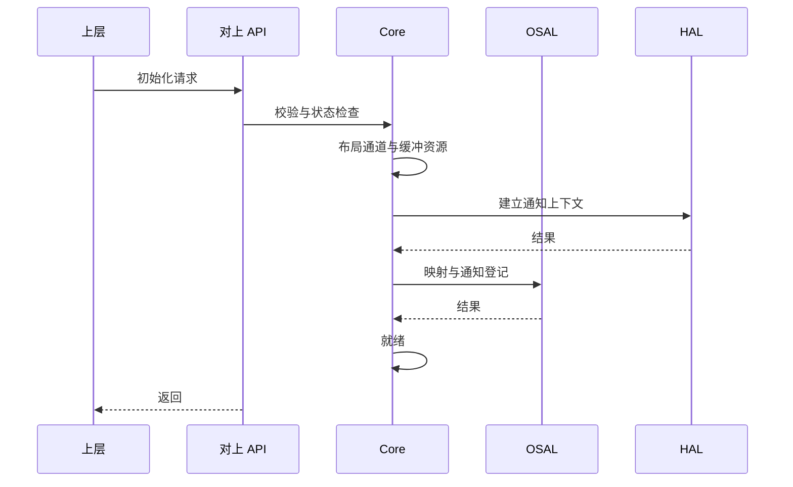
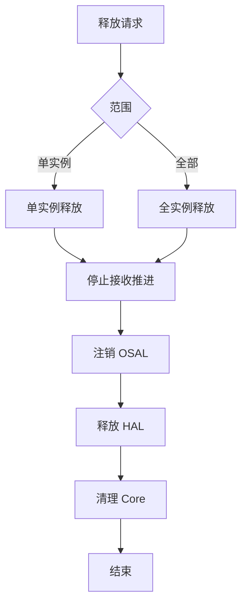
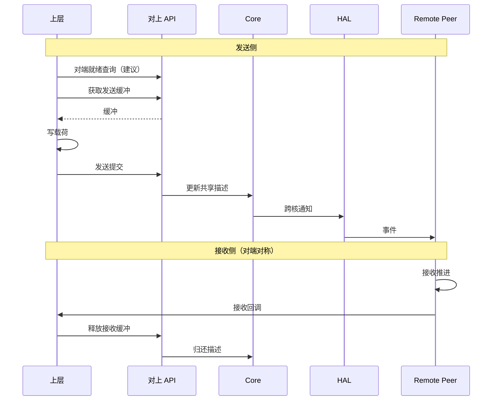
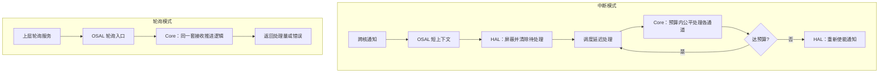
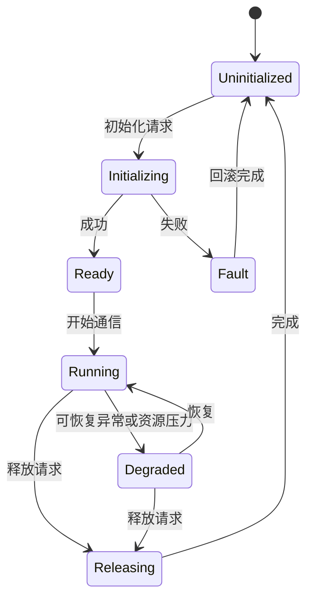

# IPCF Shared Memory Driver 软件架构设计说明

  

**文档类型**：驱动软件架构设计（产品级）  

**适用对象**：IPCF Shared Memory Driver（Linux / RTOS 统一架构，多交付变体）

  

---

  

## 文档控制

  

### 文档变更历史

  

| Version | Date | Author | Description |

|---|---|---|---|

| V0.1 | [待更新] | [待更新] | 基于公司模板的首版草稿 |

| V0.2 | [待更新] | [待更新] | 对外接口字段与公司模板对齐 |

| V1.0 | [待更新] | [待更新] | 架构评审基线 |

| V1.1 | [待更新] | [待更新] | 按 ASPICE 十五章结构重组；补充 OSAL/HAL 契约、配置与回调、运行时视图 |

| V1.2 | [待更新] | [待更新] | 边界收敛：删减侵入详细设计层的内容与重复图示；术语统一为托管/非托管通道；接口改为架构级汇总表 |

| V1.3 | [待更新] | [待更新] | 对齐 ASPICE SWE.2 对软件架构工作产品的期望；将设计输入 IPCS_* 需求项分配至各章并建立第 13 章追踪矩阵 |

  

### 保密性说明

  

本文件属项目内部软件架构设计资产，仅限参与开发、测试、集成、评审与管理的授权人员使用。对外提供须按项目保密流程与合同要求履行审批。

  

### 目录与交叉引用

  

正式版 Word 建议使用自动目录与题注；Markdown 稿不展开排版细则。

  

---

  

## 1 引言

  

### 1.1 目的

  

本文档描述 IPCF Shared Memory Driver 的软件架构设计，作为可纳入产品开发与 ASPICE 软件工程过程的工作产品，用于：

  

- 阐明驱动在系统中的定位、职责与架构边界；

- 给出分层分解、模块职责、关键接口关系与主要运行时场景；

- 规范对上服务能力与 OSAL/HAL 抽象边界（含配置与回调语义）；

- 支撑架构评审、验证策略与需求追踪，并作为**详细设计**与测试设计的输入之一。

  

### 1.2 范围

  

本文档适用于 IPCF 共享内存通信驱动的**架构层级**描述。驱动面向多核 SoC，在 **Linux** 与 **RTOS**（及裸机类环境）下提供统一 IPC 能力；实现为 **单一架构、多 OS 变体**，差异集中于 OSAL 的执行模型与中断/调度交互。

  

**文档覆盖**：架构原则与约束、分层与变体策略、对上服务与内部抽象边界（摘要）、主要动态场景、资源与质量属性考虑、验证与追踪要点、合规与风险。

  

**本文档不承担**（由详细设计、实现说明或其他工作产品承担）：

  

- 函数级算法、数据结构字段逐项说明、源码路径与构建细节；

- 寄存器级编程与硬件手册式描述；

- 应用层报文语义与网络协议；

- 经项目基线化的性能指标数值。

  

**结构说明**：第 2～15 章结构对齐 `prompt_for_architecture.md` 与 ASPICE SWE.2 对软件架构文档的常见期望；**各章只保留架构结论与契约边界**，不替代《软件详细设计说明》。

  

### 1.3 参考依据（标准、规范、相关文档）

  

| Ref No. | Document / Basis |

|---|---|

| REF-01 | ASPICE v3.1（SWE.2 软件架构设计等相关过程） |

| REF-02 | AUTOSAR Classic Platform 分层与抽象思想（架构层对齐） |

| REF-03 | ISO 26262 对软件架构可追溯性与安全相关设计的通用要求 |

| REF-04 | 项目《软件需求规格说明》 |

| REF-05 | 项目测试、配置与变更管理规范 |

| REF-06 | IPCF 驱动设计输入与 SoC 约束（摘要） |

| REF-07 | 公司软件架构文档模板（排版与对外接口表字段，详细字段可在详细设计或 Word 导出中展开） |

| REF-08 | Automotive SPICE® Process Assessment Model（PAM，如 VDA 范围）：过程 **SWE.2 Software Architectural Design** 及关联 SUP.1、SUP.8 等 |

| REF-09 | 项目需求规格说明中的 **IPCS_*** 需求标识（本文作为架构层分配与追踪载体） |

  

### 1.4 与其他工作产品关系

  

| 工作产品 | 关系说明 |

|---|---|

| 软件需求规格说明 | 需求追踪输入 |

| **软件详细设计说明** | 在本文边界之下展开接口字段、函数与数据结构设计 |

| 软件测试规格 / 测试用例 | 映射架构场景与质量属性 |

| 集成与系统测试计划 | 多实例、多通道、变体一致性 |

| 安全分析（若适用） | 本文提供边界与假设输入 |

  

### 1.5 与 Automotive SPICE SWE.2 的对应关系（架构工作产品定位）

  

依据 Automotive SPICE® PAM 对 **SWE.2 软件架构设计** 过程的目标，软件架构应：**与软件需求一致**、将软件要素**结构化分解**为可实现的部件、描述**接口**与**动态行为**、并**支持**后续软件详细设计与软件集成测试的验证。本文作为 SWE.2 层级的架构说明：

  

- 通过第 5～7 章描述静态分解与主要运行时行为；

- 通过第 6 章描述对上服务及内部 OSAL/HAL 抽象边界；

- 通过第 8～11 章覆盖资源、可靠性、安全、可移植性与扩展性等质量属性；

- 通过第 12～13 章将验证策略与 **IPCS_*** 需求可追溯地关联到上述架构元素。

  

**注**：SWE.2 的达成度由过程评估与项目证据链（评审记录、追踪矩阵、测试结果）共同体现；本文档为其中 **架构描述与追踪载体**，不单独构成评估结论。

  

---

  

## 2 术语、缩略语与定义

  

| 术语 / 缩略语 | 定义 |

|---|---|

| IPC / IPCF / IPCS | 核间通信；**IPCF** 为本共享内存驱动产品名；**IPCS** 为项目需求规格中对本子系统/产品的需求标识前缀（见第 13 章） |

| SHM | 共享内存区域，用于队列、缓冲池及非托管通道载荷 |

| Instance | 驱动逻辑实例，独立配置一组通道与一块共享内存窗口 |

| Channel | 实例内逻辑通信通道，分为**托管**与**非托管**两类 |

| Managed Channel（托管通道） | 由驱动负责缓冲池与缓冲描述（BD）环的通道 |

| Unmanaged Channel（非托管通道） | 应用独占载荷区；驱动仅维护轻量同步与跨核通知语义 |

| OSAL | OS 适配层，将统一语义映射到具体 OS 的映射、调度与延迟处理机制 |

| HAL | 硬件适配层，封装跨核通知的使能、触发、清除与状态相关原语 |

| SPSC | 单生产者单消费者无锁队列语义（用于 BD 与缓冲环，架构约束） |

| BD | Buffer Descriptor，描述托管通道中缓冲所属池、索引与有效载荷长度 |

| Deferred Processing | 硬中断之外的接收推进上下文（具体机制因 OS 变体而异） |

| Remote Peer | 对端核上与本地对称配置的通信实体 |

  

配置中的 **IRQ 占位取值**（如纯轮询、由其他驱动托管中断等）以产品发布的类型定义为准；RTOS 产品线可扩展额外枚举，不改变托管/非托管通道的架构语义。

  

---

  

## 3 驱动系统概述

  

### 3.1 业务 / 系统上下文

  

IPCF 部署于多核 SoC，为上层提供 **基于共享内存的核间数据传递**。依赖：

  

- 配置给定的本地/对端可访问共享内存窗口；

- 跨核通知（HAL 抽象）；

- OS 提供的映射、中断或调度能力（OSAL 抽象）。

  

**需求承接（示例）**：**IPCS_001**（同处理器或跨处理器、不同内核上应用之间的点对点双向通信）由实例/通道对称配置、双向共享内存与通知机制支撑；**IPCS_031**（多实例、多核对多核通信）由多实例架构与独立 SHM 窗口支撑；**IPCS_036**（低时延、小存储占用、可按需裁剪构建）作为质量目标，由分层裁剪与静态资源配置策略承接（见第 4、8、11 章）。

  

### 3.2 驱动职责与边界

  

**职责**：按配置建立/释放实例与通道；托管通道上完成发送缓冲获取、发送提交、接收侧缓冲回收；非托管通道上提供载荷区定位与发送侧通知；对端就绪查询；接收侧公平预算调度；中断模式与轮询模式下推进接收。

  

**上边界**：调用公开服务的上层模块。  

**下边界**：OSAL 所依赖的 OS 能力、HAL 所依赖的 SoC 通知原语。  

**协作边界**：Remote Peer 的对称配置与兼容行为。

  

**需求承接（示例）**：**IPCS_005**（在 AutosarOS 下作为复杂设备驱动 CDD 部署）与 **IPCS_024**（与 AUTOSAR Classic 4.4 或更高版本兼容）属集成与合规边界，架构上通过 OSAL 抽象与配置扩展承接，具体 BSW 映射在集成文档中基线化；**IPCS_006**（在 ThreadX 下作为驱动运行）由 **RTOS OSAL 变体**承接，与 Linux 变体共享 Core/HAL 语义。

  

### 3.3 非目标范围

  

- 不定义上层报文格式与业务状态机；

- 不承诺未经项目基线化的 ABI 兼容性；

- 不包含寄存器级实现说明。

  

### 3.4 设计输入（IPCS 需求）在本文中的位置

  

项目 **IPCS_*** 需求项在架构层的**主要承载章节**见 **第 13 章追踪矩阵**；各章正文在相关位置以需求标识简要标注，便于评审时双向核查。若某需求需在实现层进一步分解（如目录结构、模糊测试工具链），由详细设计或专项计划补充，本文仅给出架构级约束与验证入口。

  

---

  

## 4 架构设计原则与约束

  

### 4.1 设计原则

  

| 原则 | 说明 |

|---|---|

| 统一核心、变体外围 | Core 语义跨 OS 一致；OSAL/HAL 吸收差异 |

| 显式边界 | 对上能力与内部抽象以可评审方式陈述 |

| 可预测资源 | 实例/通道/池等可静态配置；接收侧预算化调度 |

| 可验证 | 初始化、运行、释放与失败路径可映射验证 |

| 低耦合 | Core 仅经 OSAL/HAL 访问环境与硬件 |

  

### 4.2 约束条件

  

- 托管通道配置（池数量、缓冲数量与长度等）本地与对端须**对称**；

- BD 环与缓冲池布局满足 SPSC 并发模型；

- TX/RX 通知路径配置须互斥且符合产品枚举定义；

- 实例数、通道数等受编译期上限约束。

  

### 4.3 关键假设与依赖

  

- 共享内存一致性模型满足无锁环与计数同步的设计假设（特殊 SoC 要求须在项目层记录）；

- Remote Peer 对称初始化；

- 上层在同一通道上遵守第 6 章并发契约。

  

**需求承接**：**IPCS_003**（与硬件平台及**字节序**无关）依赖 Core 对数据布局与配置的显式约定及 OSAL/HAL 对平台差异的吸收，字节序策略须在项目数据契约中基线化；**IPCS_029**（设备侧静态内存分配）与 **IPCS_036**（资源紧凑）由静态配置、编译期上限及避免非必要动态分配等架构策略承接（实现符合性在编码规范与审查中验证）。

  

---

  

## 5 软件架构分解

  

### 5.1 总体分层架构

  

**图 5-1：总体分层架构**

  

  

| 层次 | 职责摘要 |

|---|---|

| 对上 API 层 | 对外稳定服务入口与参数校验 |

| Core | 实例/通道/队列、托管与非托管语义、接收调度 |

| OSAL | 共享内存映射视图、中断或轮询注册、延迟处理上下文 |

| HAL | 跨核通知使能/触发/清除及实例相关硬件状态 |

  

### 5.2 核心模块划分与职责

  

| 模块能力 | 职责 |

|---|---|

| 实例管理 | 生命周期与就绪协同 |

| 通道管理 | 托管/非托管分支与通道元数据 |

| 缓冲与队列 | SPSC 语义下的环与地址合法性约束 |

| 发送与接收路径 | 发送提交、通知、接收推进与上层回调 |

| 错误与诊断 | 错误分类返回；诊断能力由实现与项目策略约束 |

  

### 5.3 统一核心与 OS 适配层边界

  

Core **不得**直接调用具体 OS API 或直接操作硬件寄存器，须经 OSAL/HAL。OSAL 在架构上负责：提供本地/远端共享内存映射视图、登记通知与延迟处理、以及在轮询场景下触发与中断路径一致的接收推进。抽象服务原语见 **第 6.3 节**。

  

### 5.4 变体管理策略（Linux / RTOS）

  

| 维度 | 策略 |

|---|---|

| 构建与链接 | 选择 OSAL/HAL 实现，Core 共用 |

| 执行模型 | 因变体而异（内核态延迟上下文、用户态阻塞唤醒、RTOS ISR/任务等），**对上语义一致** |

| 回调工作量 | OSAL 调用的 Core 接收推进返回值表示本轮处理工作量，用于预算与是否继续调度；具体 C 类型签名允许变体差异 |

| IRQ 配置枚举 | 可按产品线扩展，属配置域扩展 |

  

**需求承接**：**IPCS_009** 要求各逻辑层可独立裁剪——与本驱动 **API / Core / OSAL / HAL** 边界一致：移除或替换一层时，应通过替换对应实现并保持对上 API 与 Core 契约不变；**具体源码目录命名**（如 platform / os / phy / transport）与“单文件夹删除即移除支持”的落实在**软件详细设计与构建系统**中规定，本文规定**可替换的架构边界**而非文件路径。

  

### 5.5 逻辑接口视图

  

**图 5-2：逻辑接口视图**

  

  

### 5.6 数据流视图

  

#### 5.6.1 托管通道

  

**图 5-3：托管通道数据流（概念）**

  

  

要点：发送侧提交缓冲描述并通知对端；接收侧在延迟上下文中取出描述并调用配置的**接收回调**。

  

**需求承接**：**IPCS_014**（多通信通道/数据流）、**IPCS_015**（通道内消息顺序）、**IPCS_016**（每通道多缓冲池）、**IPCS_017**（多核上多传输/高利用率）分别由多通道实例模型、SPSC 环语义、每通道多池配置及多实例并行支撑；**IPCS_018**（零拷贝）由上层在共享缓冲上直接填充并通过描述符/指针交付的 API 形态承接（托管通道 acquire/tx/release 路径，非托管通道载荷区直接映射）。

  

#### 5.6.2 非托管通道

  

**图 5-4：非托管通道数据流（概念）**

  

  

要点：无 BD 环；载荷内同步由应用定义。与 **第 7.2 节** 发送/接收场景配合理解即可，不另绘重复流程图。

  

**需求承接**：**IPCS_021**（非托管通道、应用拥有整段通道内存、关闭缓冲管理）与本节及第 6、7 章中非托管服务一致。

  

---

  

## 6 接口架构设计

  

### 6.1 对上层软件接口（服务能力与契约）

  

以下接口在 Linux 与 RTOS 变体中 **名称与语义保持一致**（头文件对外：`ipc-shm.h`，类型与配置：`ipc-types.h` 或随产品合并的类型头）。表结构对齐公司模板字段。

  

**需求承接**：**IPCS_018**（零拷贝语义）体现在托管通道“获取共享缓冲—提交发送—对端接收回调交付指针”及非托管通道直接映射载荷区；**IPCS_019**（基于通知的异步接收）由跨核通知 + 延迟处理上下文调用接收回调承接，轮询模式（**IPCS_039**）为同等 Core 语义的同步推进入口；**IPCS_034**（校验公共 API 参数）、**IPCS_035**（校验通道类型与操作匹配）由对上入口与 Core 状态分支在架构上**必须**执行，具体检查项在详细设计中枚举并与测试用例对应。

  

#### 6.1.1 ipc_shm_init

  

| Field | Content |

|---|---|

| Service Name | ipc_shm_init |

| Syntax | int8_t ipc_shm_init(const struct ipc_shm_instances_cfg *cfg) |

| Service ID [hex] | N/A |

| Sync/Async | Synchronous |

| Reentrancy | Non Reentrant |

| Parameters (in) | cfg | 多实例配置集合指针 |

| Parameters (inout) | None | None |

| Parameters (out) | None | None |

| Return value | int8_t | 0 表示成功；非 0 为错误码（见 6.1.12） |

| Description | 按配置初始化全部实例，建立 Core/OSAL/HAL 协同所需资源。 |

| Available via | ipc-shm.h |

  

**关联**：图 7-1、图 7-5。

  

#### 6.1.2 ipc_shm_init_instance

  

| Field | Content |

|---|---|

| Service Name | ipc_shm_init_instance |

| Syntax | int8_t ipc_shm_init_instance(uint8_t instance, const struct ipc_shm_cfg *cfg) |

| Service ID [hex] | N/A |

| Sync/Async | Synchronous |

| Reentrancy | Non Reentrant |

| Parameters (in) | instance | 实例标识 |

| Parameters (in) | cfg | 单实例配置 |

| Parameters (inout) | None | None |

| Parameters (out) | None | None |

| Return value | int8_t | 0 成功；非 0 错误 |

| Description | 初始化指定实例并启用通知与接收路径。 |

| Available via | ipc-shm.h |

  

#### 6.1.3 ipc_shm_free

  

| Field | Content |

|---|---|

| Service Name | ipc_shm_free |

| Syntax | void ipc_shm_free(void) |

| Service ID [hex] | N/A |

| Sync/Async | Synchronous |

| Reentrancy | Non Reentrant |

| Parameters (in) | None | None |

| Parameters (inout) | None | None |

| Parameters (out) | None | None |

| Return value | None | None |

| Description | 释放全部实例资源，驱动回到未初始化状态。 |

| Available via | ipc-shm.h |

  

**关联**：图 7-2。

  

#### 6.1.4 ipc_shm_free_instance

  

| Field | Content |

|---|---|

| Service Name | ipc_shm_free_instance |

| Syntax | void ipc_shm_free_instance(const uint8_t instance) |

| Parameters (in) | instance | 实例标识 |

| Return value | None | None |

| Description | 释放指定实例资源。 |

| Available via | ipc-shm.h |

  

#### 6.1.5 ipc_shm_acquire_buf

  

| Field | Content |

|---|---|

| Service Name | ipc_shm_acquire_buf |

| Syntax | void *ipc_shm_acquire_buf(const uint8_t instance, uint8_t chan_id, uint32_t mem_size) |

| Reentrancy | 不同通道可并发；**同一通道** 不可重入 |

| Return value | void * | 成功返回缓冲指针；失败返回 NULL |

| Description | 为托管通道申请可写发送缓冲；**须在对端就绪后**再使用。 |

| Available via | ipc-shm.h |

  

#### 6.1.6 ipc_shm_release_buf

  

| Field | Content |

|---|---|

| Service Name | ipc_shm_release_buf |

| Syntax | int8_t ipc_shm_release_buf(const uint8_t instance, uint8_t chan_id, const void *buf) |

| Reentrancy | 不同通道可并发；**同一通道** 不可重入 |

| Return value | int8_t | 0 成功 |

| Description | 接收侧处理完成后释放托管通道缓冲，将其归还池并通过 BD 语义交还对端发送路径。 |

| Available via | ipc-shm.h |

  

#### 6.1.7 ipc_shm_tx

  

| Field | Content |

|---|---|

| Service Name | ipc_shm_tx |

| Syntax | int8_t ipc_shm_tx(const uint8_t instance, int chan_id, void *buf, uint32_t size) |

| Reentrancy | 不同通道可并发；**同一通道** 不可重入 |

| Return value | int8_t | 0 成功 |

| Description | 提交托管通道发送，推送 BD 并通过 HAL 通知对端。 |

| Available via | ipc-shm.h |

  

**关联**：图 7-3、图 5-3。

  

#### 6.1.8 ipc_shm_unmanaged_acquire

  

| Field | Content |

|---|---|

| Service Name | ipc_shm_unmanaged_acquire |

| Syntax | void *ipc_shm_unmanaged_acquire(const uint8_t instance, uint8_t chan_id) |

| Return value | void * | 通道本地载荷区指针或 NULL |

| Description | 获取非托管通道本地共享区；**建议在初始化后仅获取一次**。 |

| Available via | ipc-shm.h |

  

#### 6.1.9 ipc_shm_unmanaged_tx

  

| Field | Content |

|---|---|

| Service Name | ipc_shm_unmanaged_tx |

| Syntax | int8_t ipc_shm_unmanaged_tx(const uint8_t instance, uint8_t chan_id) |

| Return value | int8_t | 0 成功 |

| Description | 在应用写入完成后触发通知，使对端感知新数据。 |

| Available via | ipc-shm.h |

  

**关联**：图 5-4。

  

#### 6.1.10 ipc_shm_is_remote_ready

  

| Field | Content |

|---|---|

| Service Name | ipc_shm_is_remote_ready |

| Syntax | int8_t ipc_shm_is_remote_ready(const uint8_t instance) |

| Reentrancy | Reentrant |

| Return value | int8_t | 0 表示对端已就绪 |

| Description | 建议在首次发送前调用，避免对端未就绪导致发送失败或异常时序。 |

| Available via | ipc-shm.h |

  

#### 6.1.11 ipc_shm_poll_channels

  

| Field | Content |

|---|---|

| Service Name | ipc_shm_poll_channels |

| Syntax | int8_t ipc_shm_poll_channels(const uint8_t instance) |

| Reentrancy | 不同实例可并发；**同一实例** 不可重入 |

| Return value | int8_t | 非负表示本轮处理报文数；错误为负值或约定错误码 |

| Description | 在不依赖中断的情况下轮询所有通道并公平处理，算法与中断路径共享核心接收逻辑。 |

| Available via | ipc-shm.h |

  

**关联**：图 7-4。

  

#### 6.1.12 返回值与错误码策略

  

公开 API 普遍使用 `int8_t` 返回值：**0 表示成功，非 0 表示失败**。在 Linux 变体实现中，错误码常与 **负 errno 语义** 对齐（如无效参数、资源不可用等）；RTOS 变体在数值上可能不同，但架构要求 **在接口契约层将“失败原因类别”保持一致**（参数、状态、资源、环境），具体枚举与字符串化由项目测试与发布说明补充。

  

**核对结论**：`ipc-shm.h` 中列出的对外服务均已纳入上表；无额外未文档化的公开服务符号。

  

### 6.2 配置与回调契约（与上层的数据契约）

  

下列内容属于 **对上契约的一部分**，与 API 表共同构成集成接口基线。

  

**表 6-1：配置结构层级（摘要）**

  

| 结构 | 架构含义 |

|---|---|

| ipc_shm_instances_cfg | 实例个数与每实例 ipc_shm_cfg 指针数组 |

| ipc_shm_cfg | 本地/远端 SHM 物理基址与长度、通道数、通道数组、跨核 IRQ 编号、本地/远端核类型与索引等 |

| ipc_shm_channel_cfg | 通道类型（托管 / 非托管）与联合体成员 |

| ipc_shm_managed_cfg | 池个数、池参数数组、**rx_cb**、cb_arg |

| ipc_shm_unmanaged_cfg | 非托管区长度、**rx_cb**、cb_arg |

| ipc_shm_pool_cfg | 单池缓冲个数与单缓冲长度 |

  

**需求承接**：**IPCS_025**（缓冲池内缓冲区数量与大小可配置）由上述池配置与编译期上限宏共同约束。

  

**表 6-2：接收回调语义**

  

| 通道类型 | 回调触发条件（概念） | 参数语义 |

|---|---|---|

| 托管 | 延迟处理上下文中弹出 BD 且地址校验通过 | 载荷指针与长度 |

| 非托管 | 检测到对端 tx 计数相对本地副本变化且完整性检查通过 | 对端可见的存储区指针（由实现定义具体形参含义） |

  

**约束**：

  

- 回调在 **由 OSAL 调度的非硬中断或等价受限上下文** 中执行（具体是否可与部分 RTOS ISR 关联由变体实现决定，项目须评估上层回调可重入与锁策略）；

- 对称配置是对端正确解释 BD 与计数的前提；

- AUTOSAR 场景下配置中可包含 OsIsr 符号名等附加字段，属 **集成契约扩展**，不改变 Core 对通道与缓冲的抽象。

  

### 6.3 对 OS 抽象接口（统一语义）

  

OSAL 为 **驱动内部接口**，不对外暴露给应用。以下从架构角度归纳 **服务原语**（符号名以实现为准，Linux/RTOS 头文件中为 `ipc_os_*` 族）。

  

**表 6-3：OSAL 服务契约**

  

| 服务原语 | 语义 | 典型触发 |

|---|---|---|

| ipc_os_init | 映射共享内存、登记中断或轮询依赖、向 Core 注册接收推进回调 | 实例初始化 |

| ipc_os_free | 释放映射、注销中断、停止延迟处理 | 实例 / 驱动释放 |

| ipc_os_get_local_shm | 返回本地共享内存映射基址（概念） | Core 布局队列与池 |

| ipc_os_get_remote_shm | 返回对端共享内存映射基址（概念） | Core 计算远端缓冲地址 |

| ipc_os_poll_channels | 驱动轮询入口，内部调用 Core 注册的接收推进逻辑 | ipc_shm_poll_channels |

| ipc_os_map_intc / ipc_os_unmap_intc | 映射 / 取消映射中断控制器相关区域 | **仅部分 Linux 内核变体需要**；用户态 OSAL 无此对 |

  

**说明**：用户态与内核态 Linux 变体在“如何唤醒延迟处理线程”上不同，但 **对上 API 与 Core 状态机语义保持一致**。

  

### 6.4 对硬件抽象接口（中断 / 通知 / 状态）

  

HAL 为 **驱动内部接口**，封装跨核通知与实例相关硬件状态（`ipc_hw_*` 族）。

  

**表 6-4：HAL 服务契约**

  

| 服务原语 | 语义 |

|---|---|

| ipc_hw_init / ipc_hw_free | 建立 / 释放与实例绑定的硬件通知上下文 |

| ipc_hw_get_rx_irq | 查询 RX 侧 IRQ 配置（用于 OSAL 登记） |

| ipc_hw_irq_enable / ipc_hw_irq_disable | 使能 / 屏蔽来自对端的通知 |

| ipc_hw_irq_notify | 本地触发至对端的通知 |

| ipc_hw_irq_clear | 清除待处理通知状态 |

  

**说明**：部分平台或 Xen 等虚拟化变体可能存在 **占位实现或未完全实现** 的 HAL 行为，须在项目层作为 **部署约束与验证重点** 单独跟踪（不展开寄存器细节）。

  

**需求承接**：**IPCS_028**（采用 **MSCM 等核间中断**作为收发通知路径）由 HAL 封装通知使能/触发/清除并与 OSAL 登记的中断或轮询策略结合；具体 SoC 是否提供 MSCM 及向量分配由平台配置与 HAL 实现基线化。

  

### 6.5 接口一致性与兼容策略

  

| 主题 | 策略 |

|---|---|

| 对上 API | Linux / RTOS 必须保持符号与参数语义一致；并发契约一致 |

| OSAL/HAL | 允许实现差异，但必须满足第 6.3 / 6.4 章服务语义 |

| 配置 | 新增字段须版本化评审，避免破坏对称性与结构体对齐假设 |

| 错误码 | 失败路径分类一致；数值与 errno 映射可作为实现细节文档化 |

  

---

  

## 7 运行时行为设计

  

### 7.1 初始化与反初始化

  

**图 7-1：初始化（顺序图）**

  

  

**图 7-2：释放（流程图）**

  

  

### 7.2 正常通信（托管通道）

  

**图 7-3：托管通道发送与接收（顺序图）**

  

  

### 7.3 中断模式与轮询模式（接收推进）

  

**图 7-4：接收推进模式（中断与轮询）**

  

  

当 RX 配置为“无中断”或“由其他模块托管中断”等语义时，须依赖轮询或外部协同，**集成责任**在项目层划分。

  

**需求承接**：**IPCS_039**（支持 `IRQ_NONE` 等轮询配置）与上图轮询分支及配置枚举一致；**IPCS_019**（基于通知的异步接收）对应中断分支下“通知→延迟处理→回调”路径；**IPCS_022**（虚拟中断不应向上层递交**陈旧数据**）依赖在通知清除与接收推进顺序、BD/计数一致性及回调前校验上的架构约束，须在详细设计与测试中细化；**IPCS_023**（丢失中断不致数据丢失）依赖共享内存中仍保留待处理描述/数据、以及**轮询兜底**或与协议层重传策略协同，架构上要求接收路径在通知失效时仍可通过 `ipc_shm_poll_channels` 等机制推进（具体证明由场景测试覆盖）。

  

### 7.4 异常、状态与恢复（架构级）

  

**图 7-5：实例状态机（逻辑）**

  

  

**表 7-1：实例状态说明**

  

| 状态 | 含义 |

|---|---|

| Uninitialized | 未建立 |

| Initializing | 建立中 |

| Ready | 可通信前提满足 |

| Running | 正常通信 |

| Degraded | 降级或受限运行 |

| Releasing | 释放中 |

| Fault | 故障待回滚/重建 |

  

异常**分类与处理策略**见 **第 9.1 节**，不在此重复绘制与详细设计同粒度的分支流程图。

  

---

  

## 8 资源与性能架构

  

### 8.1 内存架构与资源预算

  

在架构上，资源由 **实例 → 通道 →（托管：池与环 / 非托管：载荷区）** 两级逻辑构成，并与对称的共享内存窗口及 IRQ 配置绑定。设计要求：实例隔离、静态可计算占用、接收侧单次处理**预算**以平衡时延与 CPU。资源拓扑的图示已在 **图 5-3、图 5-4** 表达，**不另绘与详细布局重复的框图**。

  

**需求承接**：**IPCS_029**（静态内存分配）要求运行期不在热路径引入非必要动态分配，资源表与环深度在配置/编译期确定；**IPCS_017** 与 **IPCS_014** 的资源维度已由多实例与多通道模型覆盖。

  

### 8.2 时间行为与调度策略

  

多通道**公平预算**；通知密集场景依赖预算与再次调度；同通道服务**非重入**以降低同步复杂度。

  

### 8.3 性能目标与容量规划方法

  

具体数值由项目 SRS 定义。架构要求：定义可测负载模型（多实例、多通道、托管/非托管混合）、明确测量维度（时延、吞吐、CPU、中断负载下行为），并据此推导池深与环深——推导过程属详细设计或分析记录。

  

**需求承接**：**IPCS_010**（传输层设计应支持基准测试与吞吐量估计）要求在架构上保留可观测的测量点（如轮询返回处理量、可配置的池深/环深与负载脚本接口），具体基准程序与指标在验证计划中规定；**IPCS_036** 中的低时延目标通过零拷贝路径、预算化调度和可选裁剪构建共同支撑。

  

---

  

## 9 可靠性与诊断设计

  

### 9.1 错误分类与处理策略

  

| 类别 | 策略 |

|---|---|

| 参数错误 | 立即返回，不破坏共享结构 |

| 状态错误 | 返回错误，保护哨兵与索引一致性 |

| 资源错误 | 初始化失败路径回滚已分配资源 |

| 环境错误 | OSAL/HAL 恢复或实例隔离 |

  

### 9.2 监控、日志与诊断信息

  

关键失败路径应具备可观测性；日志粒度由项目与变体策略定义。

  

### 9.3 降级与故障隔离策略

  

实例级故障默认不波及其他实例（除共享 OS 资源失效外）。Degraded 的进入条件由项目定义。

  

**需求承接**：**IPCS_022**、**IPCS_023** 的可靠性方面与第 7.3 节及本节错误/隔离策略衔接；异常与模糊场景验证见 **第 12 章**。

  

---

  

## 10 安全与功能安全考虑

  

### 10.1 干扰隔离与边界保护

  

分层与实例/通道边界为主要手段；**非托管通道载荷**的完整性由应用协议保障，驱动不解析载荷内容。

  

**需求承接**：**IPCS_020**（两通信端 SHM 驱动之间**不受干扰**，含内存保护相关目标）要求在架构上通过实例/通道资源边界、共享区布局约束及 MPU/MMU 等**由集成与平台落实**的机制协同实现；本文定义逻辑边界，**具体保护粒度与硬件配置**在安全分析与详细设计中论证。

  

### 10.2 失效防护与检测机制

  

通过哨兵、完整性检查与地址合法性约束降低非法踩踏与越界回调风险（机制存在即可，不展开位级说明）。

  

### 10.3 与 ISO 26262 / AUTOSAR 的关系说明

  

本文提供可评审架构结构；**不替代** ASIL 认定与系统级安全分析。若纳入安全相关上下文，须在系统层补全安全目标与验证深度。

  

**需求承接**：**IPCS_002**（在 AutosarOS 上部署时目标 **ASIL-D**）为**安全意图需求**：本文在架构层提供可追溯元素与不受干扰/失效检测的设计入口，**ASIL-D 达成度**须通过功能安全计划、危害分析、安全机制实现与确认措施在独立工作产品中闭环，本文不声明认证结论。

  

**信息安全**：**IPCS_013**（模糊测试等）属验证与网络安全活动，架构上要求在接口边界清晰的前提下定义**攻击面**（对上 API、配置注入、畸形通知场景），具体模糊测试策略与工具链见 **第 12.4 节**。

  

---

  

## 11 可移植性与可扩展性设计

  

### 11.1 OS 与平台扩展点

  

新 OS：实现 OSAL 语义；新 SoC：实现 HAL 语义；新通知硬件：吸收在 HAL 内，不改变对上服务集合。

  

### 11.2 配置化与产品线适配策略

  

通过编译期上限宏与实例配置适配产品线内存布局与 IRQ 方案。

  

**需求承接**：**IPCS_003**（平台与字节序无关）与 **IPCS_036**（客户仅构建所需硬件/OS/传输支持）由 OSAL/HAL 可替换性及构建配置裁剪承接；**IPCS_011**（Windows 主机上构建）属工程环境能力，不改变设备侧架构语义，须在构建系统与交叉编译策略中基线化；**IPCS_006**（ThreadX）见第 3.2 节 OSAL 变体。

  

---

  

## 12 验证与确认策略（架构级）

  

### 12.1 架构评审要点

  

分层与接口视图、数据流与对称假设、中断/轮询双路径、变体语义一致性。

  

### 12.2 测试策略映射（单元 / 集成 / 系统）

  

| 验证层级 | 关注点 |

|---|---|

| 单元 | 在策略允许下验证模块内约束与关键错误路径 |

| 集成 | Core、OSAL、HAL 协同与对称配置 |

| 系统 | 多实例多通道、异常与长期运行 |

  

### 12.3 关键质量属性验证方法

  

| 属性 | 方法 |

|---|---|

| 可用性 | 初始化 / 运行 / 释放全路径 |

| 一致性 | 变体对照场景 |

| 性能 | 时延、吞吐、预算行为 |

| 可靠性 | 故障注入与恢复 |

| 可诊断性 | 错误路径与日志策略 |

  

### 12.4 与 IPCS 验证需求的衔接

  

| 需求 ID | 架构层验证要点 |

|---|---|

| **IPCS_010** | 定义标准负载与可重复基准场景，采集吞吐与时延；与第 8.3 节测量维度一致 |

| **IPCS_011** | 主机侧构建与目标侧二进制一致性检查（构建验证，不改变运行时架构） |

| **IPCS_012** | 主机单元测试与 **OSAL/HAL 桩替换** 策略：通过窄接口注入替身，验证 Core 状态机与错误路径 |

| **IPCS_013** | 对上 API 与配置边界、异常通知序列的模糊与鲁棒性测试；与安全分析攻击面一致 |

  

---

  

## 13 需求可追踪性

  

### 13.1 追踪方法

  

建议维护双向矩阵：**IPCS_xxx ↔ 软件架构元素（章节/图/接口组）**，并与软件需求管理工具及测试用例 ID 链接。下表给出**架构层主分配**，实现与测试的次级分解在详细设计与测试规格中展开。

  

### 13.2 IPCS 需求项与架构章节映射表

  

| 需求 ID | 需求摘要（摘录） | 主要架构承载（章节 / 图） |

|---|---|---|

| IPCS_001 | 同/跨处理器多核应用间点对点双向通信 | §3.1，§5.6，图 5-3～5-4，§7 |

| IPCS_002 | AutosarOS 上目标 ASIL-D | §10.3，§14；安全闭环见专项工作产品 |

| IPCS_003 | 与硬件平台、字节序无关 | §4.3，§11.2 |

| IPCS_005 | AutosarOS 下复杂驱动 CDD | §3.2，§6.2，§14.2 |

| IPCS_006 | ThreadX 下作为驱动运行 | §3.2，§5.4，§11.2 |

| IPCS_009 | 各逻辑层可独立文件夹裁剪 | §5.4（可替换边界）；目录映射见详细设计 |

| IPCS_010 | 支持基准测试与吞吐量估计 | §8.3，§12.4 |

| IPCS_011 | Windows 主机构建 | §11.2，§12.4 |

| IPCS_012 | 主机单元测试、易替换模型/桩 | §5.3，§12.4 |

| IPCS_013 | 模糊测试（信息安全/功能安全验证） | §10.3，§12.4 |

| IPCS_014 | 多通信通道（数据流） | §5.6，§8.1，图 5-3 |

| IPCS_015 | 通道内消息顺序保持 | §5.6（SPSC 语义），§7.2 |

| IPCS_016 | 每通道多缓冲池 | §5.6，§6.2，表 6-1 |

| IPCS_017 | 多核多传输、高利用率 | §3.1，§5.6，§8 |

| IPCS_018 | 零拷贝 API 与实现 | §5.6，§6.1 |

| IPCS_019 | 异步（基于通知）接收 | §6.1，§7.3 |

| IPCS_020 | 实例间不受干扰（内存保护） | §10.1 |

| IPCS_021 | 非托管通道 | §5.6.2，§6.1～6.2，图 5-4 |

| IPCS_022 | 虚拟中断不递交旧数据 | §7.3，§9.3 |

| IPCS_023 | 丢失中断不丢数据 | §7.3，§9 |

| IPCS_024 | AUTOSAR 4.4+ 兼容 | §3.2，§14.2 |

| IPCS_025 | 池缓冲大小与数量可配置 | §6.2，§8.1 |

| IPCS_028 | MSCM 核间中断作通知 | §6.4 |

| IPCS_029 | 静态内存分配 | §4.3，§8.1 |

| IPCS_030 | 符合编码指南 | §14.3（过程/规范承接） |

| IPCS_031 | 多实例多核对多核 | §3.1，§5，§8 |

| IPCS_034 | 校验公共 API 参数 | §6.1，§9.1 |

| IPCS_035 | 校验通道类型与操作有效性 | §6.1，§9.1 |

| IPCS_036 | 低时延、小尺寸、可裁剪构建 | §3.1，§4.3，§8.3，§11 |

| IPCS_038 | 按辰至汽车质量流程生产级开发 | §14.3 |

| IPCS_039 | 支持轮询（IRQ_NONE） | §2，§6.2（配置），§7.3 |

  

---

  

## 14 合规性说明

  

### 14.1 ASPICE 相关过程工作产品对应关系

  

本文对应 **SWE.2 软件架构设计** 产出物层级要求：结构化分解、接口与动态行为、与需求可追溯（见第 13 章）、支撑 SWE.3/SWE.5 等下游活动。与 **SUP.1**（质量保证）、**SUP.8**（配置管理）等过程的衔接通过项目规程与版本控制的证据链体现。

  

### 14.2 AUTOSAR 一致性说明（架构层）

  

与 Classic AUTOSAR 分层解耦思想对齐；**IPCS_024** 要求与 **AUTOSAR Classic 4.4 或更高版本**兼容，具体 BSW 模块映射、CDD（**IPCS_005**）集成与 RTE 接口在集成架构与详细设计中基线化。

  

### 14.3 组织质量流程与编码规范

  

**IPCS_038**（按辰至汽车质量流程开发汽车生产级软件）由组织级过程定义与项目裁剪记录承接，本文作为该流程下的架构工作产品之一。**IPCS_030**（源代码符合编码指南）由 **SUP.1 / SWE.3** 相关规范与静态检查承接，架构文档仅要求实现与接口契约可追溯、可审查。

  

---

  

## 15 风险与开放问题

  

### 15.1 架构风险清单与缓解措施

  

| 风险 | 影响 | 缓解措施 |

|---|---|---|

| 配置非对称 | 通信失败 | 配置校验与集成必测 |

| 回调耗时过长 | 实时性恶化 | 规范与审查 |

| HAL 能力裁剪 | 功能受限 | 支持矩阵与发布说明 |

| 一致性假设不满足 | 竞态 | SoC 评审与必要时屏障策略下沉 HAL |

  

### 15.2 待确认项

  

- 项目性能与资源门限基线；

- **IPCS_002** 与目标 ASIL-D 的系统级安全目标、证据范围及与本文架构元素的覆盖评审；

- 虚拟化/特定平台 HAL 交付策略；

- **IPCS_009** 与源码目录结构的逐项映射及构建裁剪验证；

- 若将 Mermaid 批量嵌入 Word，脚本须与**当前图号与顺序**同步。

  

---

  

**文档结束**