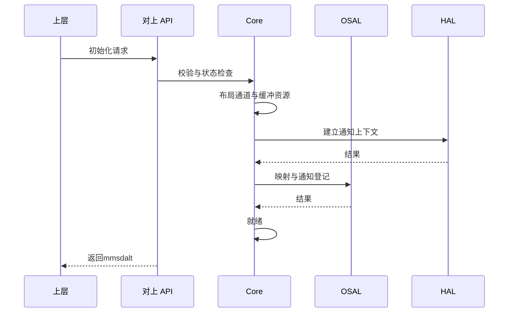

```mermaid
---

config:

  theme: base

---

sequenceDiagram

  

    participant U as 上层

  

    participant API as 对上 API

  

    participant CORE as Core

  

    participant OSAL as OSAL

  

    participant HAL as HAL

  
  

    U->>API: 初始化请求

  

    API->>CORE: 校验与状态检查

  
  

    CORE->>CORE: 布局通道与缓冲资源

    CORE->>HAL: 建立通知上下文

  

    HAL-->>CORE: 结果

  

    CORE->>OSAL: 映射与通知登记

  

    OSAL-->>CORE: 结果

  

    CORE->>CORE: 就绪

  

    API-->>U: 返回mmsdalt
```