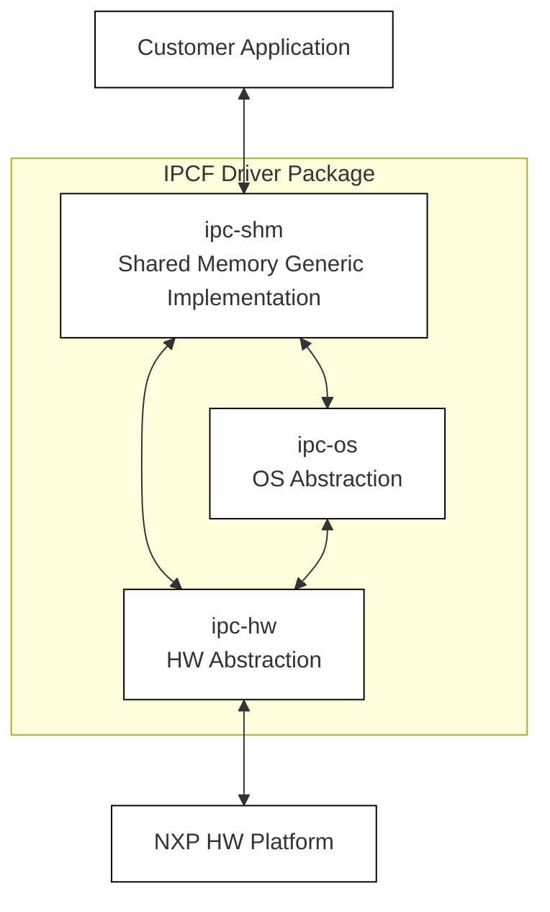
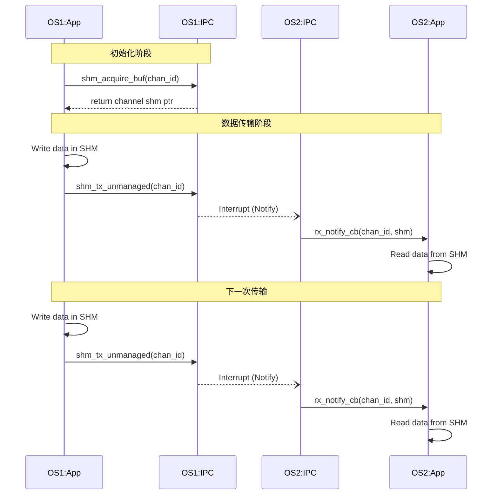
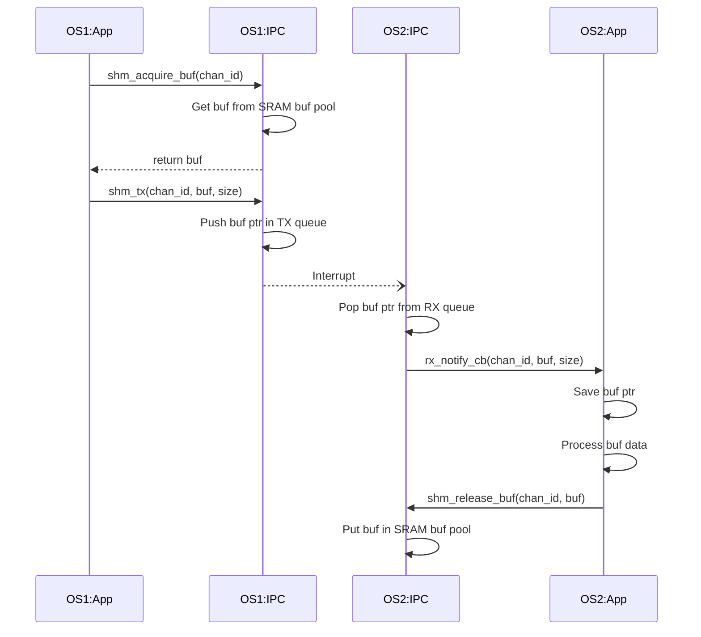
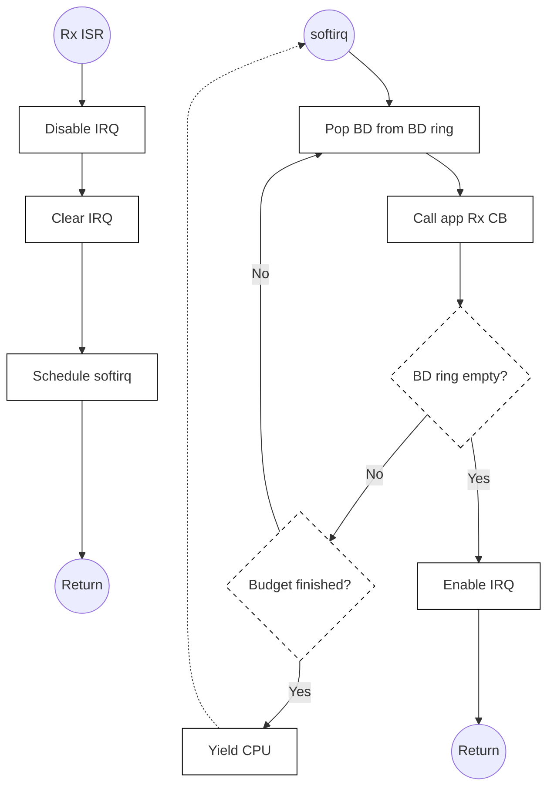
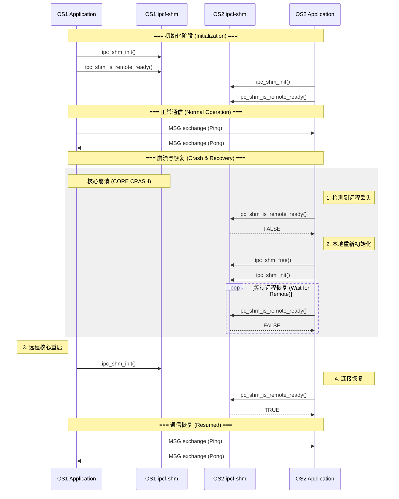

根据您的要求，我基于《IPCF User Manual》第一章中的插图内容，为您生成了对应的 Mermaid 代码。这些代码可以在支持 Mermaid 的编辑器中渲染为图表，并导出为 SVG 格式插入 Word 文档。

为了确保 Word 兼容性，我使用了标准的流程图和时序图语法，未添加复杂的交互脚本。

### 1. IPCF 系统架构图 (对应 1.4 Architecture)

此图展示了 IPCF 驱动程序的层级结构，从顶层的客户应用到底层的硬件平台。

### 2. 非托管通道数据流 (对应 1.5 Unmanaged Channel Data Flow)

此时序图展示了禁用缓冲区管理时（类似 POSIX 共享内存），应用程序直接拥有通道内存的通信流程。

### 3. 托管通道数据流 (对应 1.5 Managed Channel Data Flow)

此时序图展示了启用缓冲区管理时，驱动程序控制缓冲池和队列的通信流程（零拷贝机制）。

### 4. 接收中断缓解技术 (对应 1.5 Mitigation Techniques)

此流程图展示了 IPCF 如何通过禁用中断并使用 SoftIRQ/Task 批处理描述符来避免中断风暴。

### 5. 示例应用程序逻辑 (对应 1.6 Sample Application)

展示了 Ping-Pong 通信及核心崩溃恢复（Core Crash）的处理逻辑。

