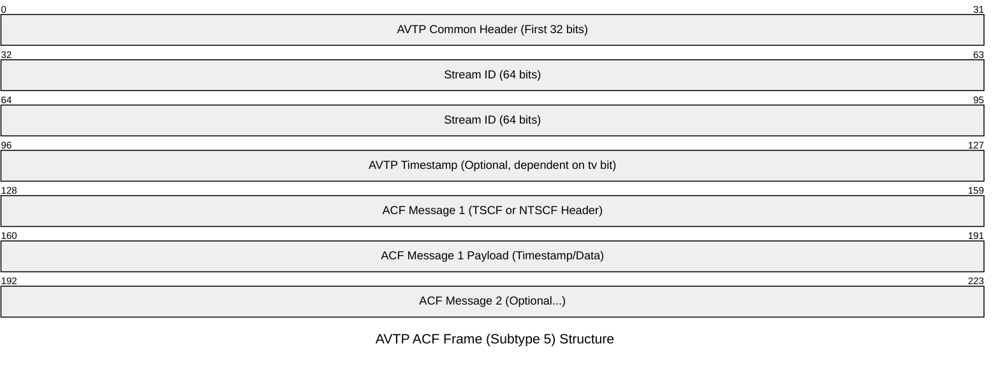
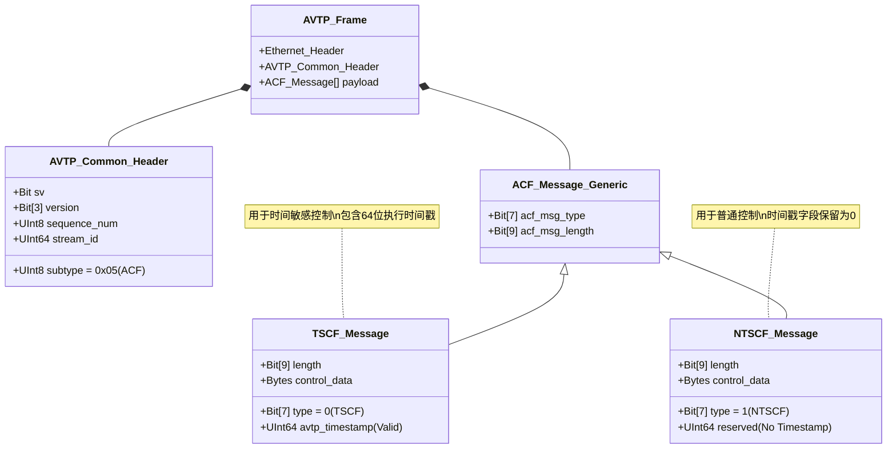
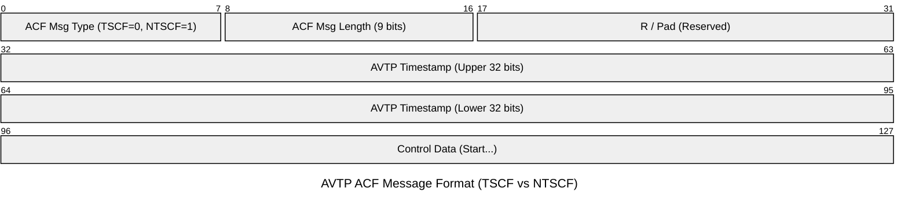
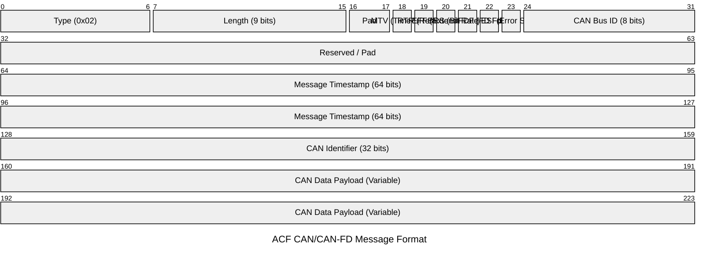
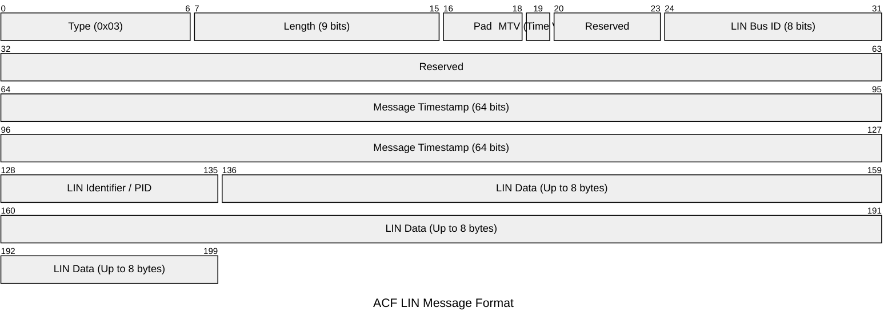
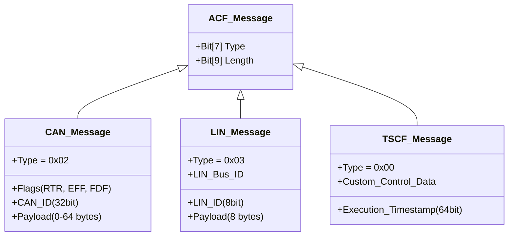

# 1. HIF寄存器地址（特别是HIF3）

经过对源代码中定义的基地址、模块偏移和寄存器偏移的详细核对，**上个回答中的地址计算是正确的**。

以下是经过验证的详细地址表，包含了 **Standard HIF (HIF0-HIF3)** 和 **HIF_NOCPY** 的关键寄存器地址。为了确保准确性，表格中明确列出了用于 64 位寻址的 **High/Low** 寄存器对（这也是“高低位”核对的重点）。

### 1. 地址计算基础 (Base Calculation)

所有地址基于以下宏定义计算：

- **PFE CPU 物理基地址**: `0x46000000` (`PFE_CFG_CBUS_PHYS_BASE_ADDR_CPU`)
- **HIF 模块偏移**: `+ 0x98000` (`CBUS_HIF_BASE_ADDR`) -> HIF 基地址: **`0x46098000`**
- **HIF_NOCPY 模块偏移**: `+ 0xD0000` (`CBUS_HIF_NOCPY_BASE_ADDR`) -> NOCPY 基地址: **`0x460D0000`**
- **HIF 通道间距**: `0x100` (每个通道占用 256 字节)

---

### 2. 标准 HIF 通道寄存器地址表 (HIF0 - HIF3)

这些寄存器用于常规的网络数据包收发。 **注意**：寄存器名称中的 `TX` 通常指 PFE 发送（Host 接收），`RX` 指 PFE 接收（Host 发送），但也存在如 `HIF_TX_PKT_CNT` 对应 Host->PFE 的情况，需结合驱动代码注释理解。

|寄存器功能|寄存器名称 (Register Name)|HIF0 (CH0) Address|HIF1 (CH1) Address|HIF2 (CH2) Address|HIF3 (CH3) Address|源码引用|
|:--|:--|:--|:--|:--|:--|:--|
|**通道控制**|`HIF_CTRL_CHn`|`0x46098100`|`0x46098200`|`0x46098300`|`0x46098400`||
|**中断状态**|`HIF_CHn_INT_SRC`|`0x46098160`|`0x46098260`|`0x46098360`|`0x46098460`||
|**中断使能**|`HIF_CHn_INT_EN`|`0x46098164`|`0x46098264`|`0x46098364`|`0x46098464`||
|**Host接收计数**(PFE -> Host)|`HIF_RX_PKT_CNT1_CHn`|`0x460981E0`|`0x460982E0`|`0x460983E0`|**`0x460984E0`**||
|**Host发送计数**(Host -> PFE)|`HIF_TX_PKT_CNT2_CHn`|`0x460981A8`|`0x460982A8`|`0x460983A8`|**`0x460984A8`**||
|**RX 描述符写指针 (低位)**|`HIF_RX_BDP_WR_LOW_ADDR`|`0x46098104`|`0x46098204`|`0x46098304`|`0x46098404`||
|**RX 描述符写指针 (高位)**|`HIF_RX_BDP_WR_HIGH_ADDR`|`0x46098108`|`0x46098208`|`0x46098308`|`0x46098408`||
|**TX 描述符读指针 (低位)**|`HIF_TX_BDP_RD_LOW_ADDR`|`0x4609811C`|`0x4609821C`|`0x4609831C`|`0x4609841C`||
|**TX 描述符读指针 (高位)**|`HIF_TX_BDP_RD_HIGH_ADDR`|`0x46098120`|`0x46098220`|`0x46098320`|`0x46098420`||

---

### 3. HIF_NOCPY 寄存器地址表 (Zero Copy)

用于高性能路径（如 MiniHIF），基地址 **`0x460D0000`**。此类接口通常不区分多通道，仅有一组寄存器。

|寄存器功能|寄存器名称|偏移量|物理地址|源码引用|
|:--|:--|:--|:--|:--|
|**版本信息**|`HIF_NOCPY_VERSION`|`0x00`|`0x460D0000`||
|**TX 控制**|`HIF_NOCPY_TX_CTRL`|`0x04`|`0x460D0004`||
|**TX 当前描述符地址**|`HIF_NOCPY_TX_CURR_BD_ADDR`|`0x08`|`0x460D0008`||
|**TX 描述符环基址**|`HIF_NOCPY_TX_BDP_ADDR`|`0x10`|`0x460D0010`||
|**TX 状态**|`HIF_NOCPY_TX_STATUS`|`0x14`|`0x460D0014`||
|**RX 控制**|`HIF_NOCPY_RX_CTRL`|`0x20`|`0x460D0020`||
|**RX 描述符环基址**|`HIF_NOCPY_RX_BDP_ADDR`|`0x24`|`0x460D0024`||
|**RX 状态**|`HIF_NOCPY_RX_STATUS`|`0x30`|`0x460D0030`||
|**中断状态**|`HIF_NOCPY_INT_SRC`|`0x34`|`0x460D0034`||
|**中断使能**|`HIF_NOCPY_INT_EN`|`0x38`|`0x460D0038`||
|**RX 当前描述符地址**|`HIF_NOCPY_RX_CURR_BD_ADDR`|`0x40`|`0x460D0040`||

### 4. 关键验证点 (Verification Checks)

1. **高低位寄存器 (High/Low Registers)**: 在 Standard HIF 中，描述符指针（BDP）分为 `LOW_ADDR` 和 `HIGH_ADDR`。
    
    - 例如 HIF0 RX 写指针：
        - `LOW`: `0x104` (Offset) -> `0x46098104`
        - `HIGH`: `0x108` (Offset) -> `0x46098108` 这确认了 PFE 支持 64 位地址描述符，且寄存器是连续排列的（低位在前，高位在后，符合 Little Endian 布局）。
2. **计数器方向确认**:
    
    - `pfe_hif_chnl_get_rx_cnt` 函数读取的是 `HIF_TX_PKT_CNT2_CHn`。
        - 解释：HIF 驱动的 RX（接收）对应 PFE 硬件的 TX（发送给 Host）。
    - `pfe_hif_chnl_get_tx_cnt` 函数读取的是 `HIF_RX_PKT_CNT1_CHn`。
        - 解释：HIF 驱动的 TX（发送）对应 PFE 硬件的 RX（从 Host 接收）。
3. **HIF_NOCPY 计数器缺失**:
    
    - 在 `src\pfe_hif_nocpy_csr.c` 中，获取计数器的函数 `pfe_hif_nocpy_cfg_get_tx_cnt` 和 `rx_cnt` 均返回 `0xffffffff` 并打印警告 "HIF NOCPY does not provide ... packet counter"。
    - 因此，**HIF_NOCPY 模块没有对应的硬件计数寄存器**。

# 2. HIF registers 

这是一份基于来源文件《Technical Specification and Architectural Analysis of the S32G Packet Forwarding Engine Host Interface Register Mapping and Bitfield Definitions》整理的技术笔记。

---

### S32G PFE 主机接口 (HIF) 寄存器映射与位域定义技术规格笔记

**概述** S32G 系列处理器中的数据包转发引擎 (PFE) 是一个多端口硬件加速器，旨在通过硬件分类和转发以太网流量，减少 CPU 干预。主机接口 (HIF) 是 PFE 内部处理管道与主机 CPU（如 Cortex-A53 和 Cortex-M7）之间的关键网关，通常被视为面向内部系统总线的“第四个端口”。

#### 1. 内存映射与基地址原则

- **全局基地址**: PFE 采用统一的内存映射架构，其寄存器空间的全局基地址通常定义为 **0x46000000**。
- **HIF 偏移**: HIF 模块在此空间内拥有特定的偏移量（源码中常称为 `HIF_BASE_ADDR`），用于访问 DMA、中断管理和通道状态寄存器。
- **32位地址限制**: PFE 内部 DMA 引擎使用 32 位指针，因此所有与 PFE 相关的缓冲区（包括通过 HIF 管理的 BD 环）必须分配在系统物理地址空间的低 4GB 范围内。
- **虚拟化支持**: 在使用 QNX 或 Xen 等管理程序时，必须将 PFE 寄存器范围 (0x46000000 - 0x47000000) 透传给客户机 OS，以便 Slave 驱动程序能直接管理其分配的 HIF 通道。

#### 2. HIF 寄存器详表 (Comprehensive HIF Register Map)

以下是 HIF 模块的主要控制与状态寄存器，基地址为 HIF 模块基地址 (`HIF_BASE_ADDR`)。

|寄存器名称 (Register Name)|地址偏移 (Offset)|读/写 (R/W)|功能描述 (Functional Description)|
|:--|:--|:--|:--|
|**HIF_VERSION**|`0x00`|R|返回 HIF 模块的硬件版本，用于驱动程序的版本兼容处理。|
|**HIF_TX_CTRL**|`0x04`|R/W|发送 (TX) 路径的主控制寄存器；用于使能 DMA 和轮询机制。|
|**HIF_TX_CURR_BD_ADDR**|`0x08`|R|指示 TX 引擎当前正在处理的缓冲区描述符 (BD) 的内存地址。|
|**HIF_TX_ALLOC**|`0x0C`|R/W|软件通过此寄存器通知硬件，环中已准备好新的 TX 描述符。|
|**HIF_TX_BDP_ADDR**|`0x10`|R/W|设置系统内存中发送缓冲区描述符环 (Transmit BD Ring) 的物理基地址。|
|**HIF_TX_STATUS**|`0x14`|R|提供发送路径的实时状态，包括错误标志和队列状态。|
|**HIF_RX_CTRL**|`0x20`|R/W|接收 (RX) 路径的主控制寄存器；功能类似于 HIF_TX_CTRL。|
|**HIF_RX_BDP_ADDR**|`0x24`|R/W|设置系统内存中接收缓冲区描述符环 (Receive BD Ring) 的物理基地址。|
|**HIF_RX_STATUS**|`0x30`|R|提供接收路径和 DMA 引擎活动的实时状态。|
|**HIF_INT_SRC**|`0x34`|R/W1C|中断源寄存器；位状态指示触发中断的具体事件（写 1 清除）。|
|**HIF_INT_ENABLE**|`0x38`|R/W|中断屏蔽寄存器；决定允许哪些源触发系统级中断。|
|**HIF_POLL_CTRL**|`0x3C`|R/W|配置硬件内部定时器，用于周期性轮询 BD 环。|
|**HIF_RX_CURR_BD_ADDR**|`0x40`|R|指示 RX 引擎当前正在处理的缓冲区描述符的内存地址。|
|**HIF_RX_ALLOC**|`0x44`|R/W|软件通过此寄存器通知硬件，已分配新的 RX 缓冲区并准备好接收数据。|
|**HIF_TX_DMA_STATUS**|`0x48`|R|发送 DMA 状态机的详细状态信息。|
|**HIF_RX_DMA_STATUS**|`0x4C`|R|接收 DMA 状态机的详细状态信息。|
|**HIF_INT_COAL**|`0x50`|R/W|控制中断合并 (Coalescing) 逻辑，以减少高流量下的 CPU 开销。|
|**HIF_AXI_CTRL**|`0x54`|R/W|配置 HIF DMA 主接口的 AXI 总线参数，例如突发长度 (burst lengths)。|

#### 3. 关键位域定义 (Bitfield Definitions)

**3.1 中断源位域 (Interrupt Source Bitfields)** 位于 `HIF_INT_SRC` 和 `HIF_INT_ENABLE` 寄存器中。

|位域名|位索引|描述|
|:--|:--|:--|
|**HIF_INT / HIF_INT_EN**|Bit 0|汇总位，表示存在任何活动的且未屏蔽的 HIF 中断。|
|**HIF_RXBD_INT**|Bit 1|当接收 BD 被成功处理并更新到内存时触发。|
|**HIF_RXPKT_INT**|Bit 2|当一个完整的数据包成功传输到接收缓冲区时触发。|
|**HIF_TXBD_INT**|Bit 3|当发送 BD 被硬件释放（表示缓冲区可重用）时触发。|
|**HIF_TXPKT_INT**|Bit 4|当一个完整的数据包成功从内存读取并送入 PFE 管道时触发。|

**3.2 BD 控制位域 (Buffer Descriptor Control Bitfields)** 位于 BD 的第一个字中，定义描述符状态和硬件动作。

|位名|位置|功能解释|
|:--|:--|:--|
|**BD_CTRL_DESC_EN**|Bit 31|所有权位。1 = 硬件拥有 BD；0 = 软件拥有。这是主要的同步原语。|
|**BD_CTRL_PKT_XFER**|Bit 24|信号标志，表示此 BD 包含用于传输的有效数据包指针。|
|**BD_CTRL_LMEM_CPY**|Bit 21|专用于 HIF_NOCPY 通道，触发基于硬件的内存拷贝，无需 CPU 参与。|
|**BD_CTRL_DIR**|Bit 20|方向标志；用于在共享内部结构中区分入站和出站描述符。|
|**BD_CTRL_LAST_BD**|Bit 19|环回绕 (Wrap) 位。指示这是循环缓冲区中的最后一个描述符，硬件处理后需返回基地址。|
|**BD_CTRL_LIFM**|Bit 18|逻辑接口模式标志；PFE 分类器用它将数据包与特定逻辑网络接口关联。|
|**BD_CTRL_PKT_INT_EN**|Bit 17|完成此描述符处理后启用逐包中断 (Per-packet interrupt)。|
|**BD_CTRL_BUFLEN_MASK**|0x3FFF|定义数据缓冲区的大小（字节），位于 Bit 0-13。|

**3.3 BD 状态位域 (Buffer Descriptor Status Bitfields)** 硬件处理完描述符后写回的状态信息。

|位名|位置|功能解释|
|:--|:--|:--|
|**BD_STATUS_CHKSUM_EN**|Bit 22|指示硬件校验和卸载 (Checksum Offload) 已成功应用于数据包 (IPv4, TCP, UDP)。|
|**BD_STATUS_LE_DATA**|Bit 21|指示数据以小端 (Little-Endian) 格式存储，ARM 主机解析需要此标志。|
|**BD_STATUS_CONN_ID_EN**|Bit 17|连接 ID 使能；结合 PFE 内部路由表用于跟踪特定流。|
|**BD_STATUS_CONN_ID**|0xFFFF|状态字的低 16 位，可存储网络连接或流的唯一标识符。|

#### 4. 设备树绑定与配置 (Device Tree Bindings)

`pfe.txt` 文件定义了硬件与驱动程序的集成规范。

- **reg 属性**: 第一个条目必须是 CBUS 基地址 (`0x46000000`)，这是所有 HIF 寄存器偏移的锚点。
- **interrupts 属性**: 定义 GIC 中断线。HIF 通常有专用的中断（例如配置中的 GIC 224），用于向 CPU 发送数据包到达和完成信号。
- **ethernet@X 子节点**: 代表物理 MAC 端口 (EMAC0-2)。
    - `fsl,pfe-gemac-if-name`: 分配接口名称（如 `eth0`）。
    - `local-mac-address`: 存储 48 位 MAC 地址，驱动程序会在初始化时将其写入 PFE 内部过滤表。

#### 5. 操作机制与多实例管理

- **Master 实例**: 负责硬件初始化（时钟、复位）、加载 PFE 固件、以及分配 HIF 通道和中断给 Slave 实例。
- **Slave 实例**: 在虚拟化环境中，Slave 驱动程序（如在 Guest OS 中）通过透传的寄存器空间直接管理其分配的 HIF 通道，无需与 Host OS 冲突。
- **资源隔离**: 这种架构支持不同软件域之间的隔离，符合 ISO 26262 功能安全要求。

# 3. AVTP 协议
---

AVTP (Audio Video Transport Protocol, IEEE 1722) 是一种在以太网上传输时间敏感数据的协议。

**TSCF** (Time Synchronous Control Format) 和 **NTSCF** (Non-Time Synchronous Control Format) 均属于 IEEE 1722 标准中 **Subtype 5 (AVTP Control Format, ACF)** 下定义的两种主要消息类型。

- **TSCF**: 用于需要精确时间控制的控制信号（如工业控制、汽车ECU指令），包含时间戳。
    
- **NTSCF**: 用于不需要精确同步的通用控制信号（如简单的开关指令、状态查询），不包含有效时间戳。
    

以下是详细的帧格式整理及 Mermaid 图表展示。

---

### 1. 协议层级结构

在以太网帧中，AVTP 位于链路层（Ethernet II）之上。

- **EtherType**: `0x22F0` (AVTP)
    
- **AVTP Subtype**: `0x05` (ACF - AVTP Control Format)
    

一个 AVTP ACF PDU 可以包含一个或多个 ACF 消息（TSCF 或 NTSCF）。

### 2. AVTP 通用头部 (针对 ACF Subtype 5)

无论后面接的是 TSCF 还是 NTSCF，头部的前 12 字节（如果不包含 AVTP Timestamp）或 更多字节都是通用的 AVTP Header。

|**字段 (Field)**|**长度 (Bits)**|**说明 (Description)**|
|---|---|---|
|**Subtype**|8|固定为 `0x05` (ACF)|
|**sv** (Stream ID Valid)|1|1 表示 Stream ID 有效|
|**ver** (Version)|3|固定为 0|
|**mr** (Media Restart)|1|媒体重启标志|
|**r** (Reserved)|1|保留|
|**gv** (Gateway Valid)|1|网关信息有效标志|
|**tv** (Timestamp Valid)|1|1 表示头部包含 AVTP Timestamp|
|**Sequence Num**|8|序列号|
|**Reserved**|7|保留|
|**tu** (Timestamp Uncertain)|1|时间戳不确定标志|
|**Stream ID**|64|唯一的流标识符|

---

### 3. TSCF 帧格式详解 (Time Synchronous)

**特点**：包含一个 64 位的 `avtp_timestamp`，接收端必须在指定时刻执行控制指令。

#### TSCF 消息结构 (位于 AVTP Payload 中)

TSCF 消息紧随 AVTP Common Header 之后。

| **字段**             | **位宽** | **描述**              |
| ------------------ | ------ | ------------------- |
| **ACF Msg Type**   | 7      | **0** (代表 TSCF)     |
| **ACF Msg Length** | 9      | 消息长度 (以4字节为单位)      |
| **Pad**            | 2      | 填充                  |
| **Reserved**       | 2      | 保留                  |
| **AVTP Timestamp** | 64     | **核心字段**：纳秒级执行时间戳   |
| **Control Data**   | Var    | 实际控制数据 (TLV 或自定义格式) |

---

### 4. NTSCF 帧格式详解 (Non-Time Synchronous)

**特点**：**不包含**有效的时间戳字段（该位置通常被填充或保留），指令被接收后尽快处理（Best Effort）。

#### NTSCF 消息结构

|**字段**|**位宽**|**描述**|
|---|---|---|
|**ACF Msg Type**|7|**1** (代表 NTSCF)|
|**ACF Msg Length**|9|消息长度|
|**Pad**|2|填充|
|**Reserved**|2|保留|
|**Zero / Reserved**|64|**核心区别**：此处全为0或保留，无时间戳|
|**Control Data**|Var|实际控制数据|

---

### 5. Mermaid 格式展示

以下使用 Mermaid 的 `packet-beta` 图表格式来直观展示这两种帧结构。

#### 5.1 整体 AVTP (ACF) 帧结构图

代码段

#### 5.2 TSCF 与 NTSCF 详细对比图

这里展示的是 **ACF Message** 部分的内部结构（即去掉 AVTP Common Header 后的部分）。

代码段

#### 5.3 详细比特位布局 (Packet Diagram)

由于 Mermaid 的 `packet-beta` 在部分渲染器中可能显示不全，以下是标准的比特位布局图代码，你可以直接复制到支持 Mermaid 的编辑器中查看。

代码段

**差异点说明图：**

- **对于 TSCF (Type 0):** 第 32-95 位 (64 bits) 是有效的 **Presentation Time** (执行时间)。
    
- **对于 NTSCF (Type 1):** 第 32-95 位通常被填充为 **0** 或被标记为 **Reserved**，接收端忽略此字段。
    

### 总结比较

| **特性**             | **TSCF (Time Synchronous)** | **NTSCF (Non-Time Synchronous)** |
| ------------------ | --------------------------- | -------------------------------- |
| **ACF Msg Type**   | `0`                         | `1`                              |
| **时间敏感性**          | 高 (Hard Real-time)          | 低 (Soft Real-time / Background)  |
| **AVTP Timestamp** | **必须包含且有效**                 | 全零 / 无效                          |
| **典型应用**           | 气囊触发、电机点火、制动控制              | 调节音量、车窗升降、指示灯开关                  |
| **处理逻辑**           | 等待直到系统时间 >= 时间戳             | 收到即刻处理                           |

# 4. ACF 中常见数据帧类型及格式

在 IEEE 1722 标准中，**ACF (AVTP Control Format, Subtype 5)** 被设计为一个灵活的容器，用于封装各种控制消息。它的核心思想是：**在一个以太网帧中，可以打包多个不同类型的控制消息（ACF Messages）。**

ACF 的消息类型（ACF Msg Type）主要分为两大类：**通用控制类** 和 **车载总线封装类 (Automotive Profile)**。

以下是常见的 ACF 类型列表及其帧格式详细解析。

---

### 1. ACF 消息类型列表 (ACF Message Types)

根据 `ACF Msg Type` (7 bits) 字段的值，常见的定义如下（基于 IEEE 1722-2016 及常用车载实现）：

| **Type 值 (Hex)** | **名称**                            | **说明**                      |
| ---------------- | --------------------------------- | --------------------------- |
| **0x00**         | **TSCF** (Time Synchronous)       | 时间同步控制格式（通用），带有效时间戳。        |
| **0x01**         | **NTSCF** (Non-Time Synchronous)  | 非时间同步控制格式（通用），无有效时间戳。       |
| **0x02**         | **CAN / CAN FD**                  | 封装 CAN 或 CAN-FD 帧。          |
| ==**0x03**==     | ==**LIN**==                       | ==封装 LIN 总线帧（您之前的截图即为此类）。== |
| **0x04**         | **FlexRay**                       | 封装 FlexRay 消息。              |
| **0x05**         | **MOST**                          | 封装 MOST 总线控制消息。             |
| **0x06**         | **GPC** (General Purpose Control) | 通用用途控制（如 GPIO 状态）。          |
| **0x07**         | **Serial**                        | 封装串行数据 (UART/RS232)。        |
| **0x08**         | **Parallel**                      | 封装并行总线数据。                   |
| **0x09**         | **Sensor**                        | 封装传感器原始数据。                  |
| ...              | Reserved                          | 保留                          |

---

### 2. 重点类型帧格式详解

所有的 ACF 消息都遵循 TL (Type-Length) + Header + Payload 的结构。

注：以下格式位于 AVTP Common Header (12字节) 之后。

#### 2.1 CAN / CAN-FD 封装格式 (Type = 0x02)

这是车载以太网网关最常用的格式，用于将传统的 CAN 报文透传到以太网。

- **特点**: 支持标准帧/扩展帧(EFF)、远程帧(RTR)、CAN-FD加速位(BRS)等标志。
    

**结构图 (Mermaid):**

代码段

**关键字段说明：**

- **CAN Bus ID**: 标识该消息来自哪个 CAN 接口（例如 ID=1 代表 CAN1）。
    
- **FDF**: 1 表示 CAN-FD 帧，0 表示标准 CAN 帧。
    
- **CAN Identifier**: 32位区域存放 CAN ID (11位或29位)。
    
- **Message Timestamp**: 原始 CAN 帧在总线上被捕获的时间。
    

#### 2.2 LIN 封装格式 (Type = 0x03)

您之前的 Wireshark 截图就是这种格式。

- **特点**: 结构较简单，包含 LIN 的保护 ID (PID)。
    

**结构图 (Mermaid):**

代码段

**关键字段说明：**

- **LIN Bus ID**: 标识 LIN 通道。
    
- **LIN Identifier**: LIN 帧的 ID (0x00 - 0x3F)。
    
- **Data**: LIN 的数据部分，不足部分通常补零或由 Length 字段控制。
    

#### 2.3 FlexRay 封装格式 (Type = 0x04)

FlexRay 较为复杂，需要包含槽位号（Slot ID）、周期计数（Cycle Count）和通道信息。

**关键字段布局：**

1. **Header**: 包含 Channel (A/B), Cycle Count, Frame Id。
    
2. **Timestamp**: 接收时间戳。
    
3. **Data**: FlexRay 的 Payload（最大可达 254 字节，通常为偶数）。
    

---

### 3. 通用控制类回顾 (Type 0x00 & 0x01)

这两类通常用于设备间的**直接指令控制**（如：“打开 LED”、“设置音量”），而不是封装传统总线数据。

- **TSCF (Type 0x00)**:
    
    - **核心**: 包含 64-bit `AVTP Timestamp`。
        
    - **用途**: 要求接收方在**指定时间点**执行动作（硬实时）。
        
- **NTSCF (Type 0x01)**:
    
    - **核心**: 时间戳字段保留或全零。
        
    - **用途**: 接收方**尽快**执行动作（软实时）。
        

---

### 总结对比图

为了方便记忆，这几种格式的主要区别在于**Header 里的特定协议字段**。

代码段

工程应用提示：

在实际抓包分析（如 Wireshark）时，如果看到 Payload 里全是类似 02 00 ... 的数据，那就是封装了 CAN 报文；如果是 03 00 ... 则是 LIN。解析这些数据时，必须参考车辆的通信矩阵（DBC/LDF 文件）才能知道 Payload 具体代表什么物理信号。

