# IPCS 驱动软件架构设计说明

  

## 1. 文档目的

  

本文档用于给出 IPCS 驱动的统一化软件架构设计，作为 Linux 与 RTOS 两套实现的上层架构设计基线，用于支持设计评审、开发对齐、变更分析和 Automotive SPICE 软件架构工作产品补充。

  

本文档遵循以下原则：

  

- 以需求目标和系统约束驱动架构设计，而不是以代码结构直接替代架构设计

- 采用正常的软件架构设计逻辑描述系统分层、组件职责、接口、交互与变体

- 现有代码实现仅作为架构一致性校核依据，不作为架构叙述主线

- 对外给出统一架构，对内保留 Linux/RTOS 变体边界

  

## 2. 适用范围

  

本文档适用于当前 IPCS 驱动工程的统一软件架构设计，覆盖以下两个部署形态：

  

- Linux 平台驱动实现

- RTOS 平台驱动实现

  

本文档关注的软件对象包括：

  

- 共享内存通信核心

- 队列与缓冲区管理机制

- OS 适配层

- HW 适配层

- 配置模型

- Linux UIO、cdev 与全内核模块部署路径

  

本文档不覆盖：

  

- 对端应用的软件设计

- SoC 之外的系统级分区设计

- 安全分析、性能测试报告、验证报告

- 非驱动功能的软件业务逻辑

  

## 3. 架构设计输入

  

### 3.1 设计目标

  

IPCS 驱动的架构设计目标如下：

  

- 为同一芯片内部不同处理核心之间提供统一的共享内存通信机制

- 在 Linux 与 RTOS 两种运行环境下提供一致的外部通信能力与配置模型

- 支持多个通信实例与多个通信通道

- 支持由驱动管理缓冲区的通信模式，以及由应用管理通道内存的通信模式

- 隔离协议核心与 OS/HW 依赖，降低平台迁移与维护成本

- 支持中断驱动接收；在适用场景下支持 polling 接收

- 支持后续平台、OS 和集成方式的扩展

  

### 3.2 外部可见需求归纳

  

本架构的需求输入以项目 **SWE.1 软件需求** 为权威基线。当前已导入的 IPCS 功能与非功能需求标识包括：IPCS_001、IPCS_002、IPCS_003、IPCS_005、IPCS_006、IPCS_009～IPCS_013、IPCS_014～IPCS_019、IPCS_020～IPCS_023、IPCS_024、IPCS_025、IPCS_028～IPCS_031、IPCS_034～IPCS_036、IPCS_038、IPCS_039 等（完整条文以需求管理库为准）。

  

从接口契约与工程目标归纳，本架构需对外满足的能力包括但不限于：

  

- 驱动提供统一的初始化、释放、发送、接收与状态检查接口

- 支持多个逻辑通信实例与多通道；通道支持 managed 与 unmanaged

- 支持本地核与对端核之间基于共享内存的数据交换

- 通过核间中断（如 MSCM）或 polling（IRQ_NONE）通知对端并处理接收

- 配置由集成层提供，描述共享内存、核 ID、中断与 channel / pool 结构

  

上述需求与架构组件之间的 **正式分配** 见 **第 3.4 节（SWE.2 需求分配）**。

  

### 3.3 约束条件

  

本架构设计受到以下约束：

  

- Linux 与 RTOS 运行环境不同，但底层硬件通信模型一致

- 驱动必须基于共享内存与核间中断控制器工作

- 本地与对端的共享内存布局和 channel 配置必须对称

- 共享内存区域按低层平台约束使用，要求尽量对齐访问

- 资源受限环境下，架构需尽量保持核心逻辑简洁和可复用

  

### 3.4 需求分配（SWE.2）

  

本章落实 **Automotive SPICE SWE.2（软件架构设计）** 中对软件需求与架构元素之间 **可追溯分配（allocation）** 的要求：将已基线化的软件需求映射到本架构中的组件与工程属性，作为 **SWE.1 → SWE.2** 追溯的一环，并支撑 **SWE.3（软件详细设计与单元实现）**、**SWE.4（软件集成与集成测试）** 及 **SWE.5（软件合格性测试）** 的范围界定。

  

**工作产品关系说明：**

  

- **输入**：本文档第 3.2 节与下表共同构成架构设计的需求依据；正式需求 ID 以项目需求管理工具中的 **SWE.1 软件需求** 为准。

- **输出**：下表为 **需求分配矩阵** 的架构视图；详细设计与测试用例应能反向追溯至对应需求 ID 与架构组件。

- **多组件需求**：若一条需求由多个组件协同满足，表中 **主责组件** 为实现与验证的首要归属；**协同/备注** 说明其它组件或过程类活动（如流程、构建、V&V）的职责。

  

**组件代号**：与本文档第 7 章一致（C1～C6）。**过程类** 表示主要由流程、质量体系或构建/测试基础设施承担，而非单一运行时组件。

  

| 需求 ID | 需求简述 | 主责组件 / 归属 | 协同 / 备注 |

| --- | --- | --- | --- |

| IPCS_001 | 同核或异核上应用间点对点双向通信 | C1，C2，C3，C4，C5 | 端到端路径：C5 配置对称布局；C1 实例/通道；C2 队列与 BD；C3/C4 地址与通知 |

| IPCS_002 | 部署于 AutoSAR OS 时满足 ASIL-D | 过程类 + C3 | 安全目标分解、安全机制与证据在独立安全工作中产品化；架构上 C3 承担 AutoSAR 集成与 OS 交互边界 |

| IPCS_003 | 内核与硬件平台、字节序无关 | C1，C2，C4 | 可移植逻辑在 C1/C2；平台相关集中在 C4；字节序通过可移植类型与显式转换策略在 C1/C2 收敛 |

| IPCS_005 | 作为复杂驱动在 AutoSAR OS 下运行 | C3 | 与 AutoSAR CDD/OS 接口封装、调度与错误钩子对齐；C5 配置由集成方提供 |

| IPCS_006 | 作为驱动在 ThreadX 下运行 | C3 | ThreadX 变体 OSAL：任务/中断/同步原语映射 |

| IPCS_009 | platform / os / phy / transport 各层独立目录，可整体移除 | 过程类 + 全组件边界 | 目录与依赖方向约束架构分层；删除一层仅当上层不依赖该抽象时成立，需在集成配置中关闭对应特性 |

| IPCS_010 | 传输层设计支持基准与吞吐量估计 | C1，C2，（传输层实现） | 在传输路径保留可观测计数/时间戳或钩子，供基准测试构建使用；不与生产最小集强制绑定 |

| IPCS_011 | 可在 Windows 主机上构建 | 过程类 | 构建系统、工具链与主机桩实现；不属 C1～C6 运行时职责 |

| IPCS_012 | 主机单元测试、组件易于模型替换 | C1，C2，C3，C4 + 过程类 | 通过 OSAL/HWAL 接口注入替身；测试工程与 mock 属 SWE.3/SWE.5 支持 |

| IPCS_013 | 信息安全与功能安全验证需模糊测试 | 过程类 | SWE.5 /安全验证计划中的测试手段；架构上保持接口边界清晰以便 fuzz 目标收敛 |

| IPCS_014 | SHM 驱动支持多通信通道（数据流） | C1，C2，C5 | 多 channel 模型与共享内存布局 |

| IPCS_015 | 通道/流内消息顺序保持 | C1，C2 | 单通道队列语义与发送/接收顺序约定 |

| IPCS_016 | 每通道支持多个缓冲池 | C1，C2，C5 | pool 配置与 C2 多队列管理 |

| IPCS_017 | 全核多传输并行、高效核利用 | C1，C3，C5 | 多 instance；C3 每核执行模型与中断亲和 |

| IPCS_018 | 零拷贝 API 与实现 | C1，C2 | 指针/BD 描述已有缓冲区，避免驱动内额外拷贝 |

| IPCS_019 | 异步（基于通知）接收 API | C1，C3 | 回调由 C3 异步上下文触发；C1 分发 |

| IPCS_020 | 两通信端间不受干扰（内存保护） | C1，C5 + 集成环境 | 共享内存分区与访问权限由布局（C5）与 SoC/OS 内存保护共同保证；C1 遵守边界 |

| IPCS_021 | 非托管通道，应用独占通道内存 | C1，C5 | unmanaged 模型与 `ipcsShmUnmanaged*` 路径 |

| IPCS_022 | 虚拟中断不投递陈旧数据 | C1，C2，C3，C4 | 序列号/队列状态与通知路径协调，避免在无效状态下回调 |

| IPCS_023 | 丢失中断不导致数据丢失 | C1，C2 | 依赖共享内存中的提交顺序与对端可见性；接收方可通过轮询或计数补偿（与 IPCS_039 协同） |

| IPCS_024 | 与 AUTOSAR 4.4 或更高版本兼容 | C3，C5 | 接口与配置模型对齐 R4.4+ 集成约定 |

| IPCS_025 | 池中缓冲区数量与大小可配置 | C5 | 集成配置数据；C1/C2 消费 |

| IPCS_028 | 支持 MSCM 核间中断作为收发通知 | C4，C3 | C4 MSCM 平台实现；C3 挂接 Linux/RTOS 中断模型 |

| IPCS_029 | 软件组件使用静态内存分配 | C1，C2，C3 | 实现约束：无堆或受限堆；池与队列静态维度由 C5 定义 |

| IPCS_030 | 设备端源码符合编码规范 | 过程类 | 编码标准与静态分析门禁 |

| IPCS_031 | 多对内核（多实例）通信 | C1，C5 | 多 instance 与独立 SHM/IRQ 配置 |

| IPCS_034 | 校验应用传入的公共 API 参数 | C1 | 各公共 API 入口参数与范围检查 |

| IPCS_035 | 校验通道类型与所请求操作是否匹配 | C1 | managed/unmanaged API 与 channel 类型一致性 |

| IPCS_036 | 低延迟、小体积、可按需裁剪 HW/OS/传输 | C1～C6，C5 | 可选编译与目录级特性开关；Linux 路径 C6 按需链接 |

| IPCS_038 | 按辰至汽车质量流程开发为生产级软件 | 过程类 |项目管理、配置管理、问题解决与发布流程；架构文档为 SWE.2 工作产品之一 |

| IPCS_039 | 支持轮询方式（IRQ_NONE） | C3，C4 | C3 `ipcsShmPollChannels` / 轮询桥接；C4 在无硬件 IRQ 路径下的空操作或最小支持 |

  

**维护约定**：需求变更时，应同步更新本表及需求管理工具中的 **分配（allocated to）** 链接；架构重大变更（组件拆分或合并）应执行影响分析并更新 **SWE.2** 基线。

  

## 4. 架构设计原则

  

为满足上述目标与约束，软件架构采用以下原则：

  

- 分层设计：协议核心、OS 适配、HW 适配、Linux 部署适配彼此分离

- 核心复用：Linux 与 RTOS 共享同一套核心通信模型

- 配置驱动：实例、通道、缓冲区与中断关系由配置定义

- 接口稳定：上层使用统一驱动接口，不感知底层 OS/HW 差异

- 变体受控：平台差异和 OS 差异仅在明确的变体层内展开

- 一致性可校核：架构设计应能映射到现有实现并支持后续变更审查

  

## 5. 系统上下文

  

IPCS 驱动处于本地应用与底层核间通信资源之间，对上为应用或集成层提供统一通信接口，对下依赖共享内存和核间中断控制器，并与对端核上的对应通信实体配合完成数据交换。

  

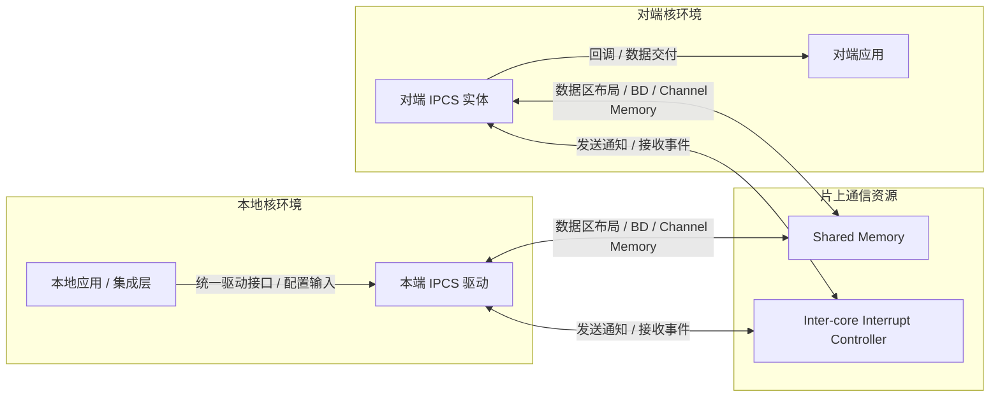

  

## 6. 总体架构

  

### 6.1 分层视图

  

IPCS 驱动采用四层主体架构，并在 Linux 侧引入一个按部署形态启用的适配组件，用于承载 UIO、cdev 与全内核模块装配差异：

  

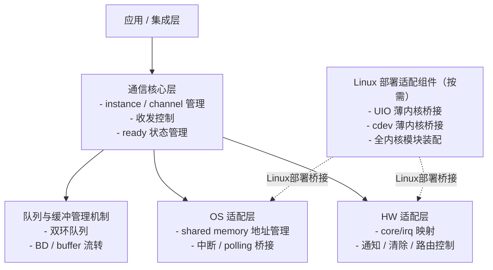

  

- 应用/集成层

- 通信核心层

- OS 适配层

- HW 适配层

- Linux 部署适配组件（按 Linux 部署形态启用）

  

### 6.2 架构分层说明

  

#### 6.2.1 应用/集成层

  

应用/集成层负责：

  

- 提供驱动配置

- 调用驱动公共接口

- 注册接收回调

- 对于 RTOS 变体，完成中断与驱动入口的集成连接

  

#### 6.2.2 通信核心层

  

通信核心层是统一架构的中心，负责：

  

- instance 和 channel 生命周期管理

- managed/unmanaged 两类通道模型管理

- 缓冲区获取、发送、释放

- 接收分发与公平调度

- 对端 ready 状态检查

- 共享内存布局管理

  

该层不直接依赖具体 OS API 或 SoC 寄存器访问方式。

  

#### 6.2.3 OS 适配层

  

OS 适配层负责：

  

- 管理本地与远端共享内存地址的获取/保存/映射

- 管理 OS 相关的中断注册、延后处理或 polling 桥接

- 向通信核心层提供统一 OS 侧服务接口

  

#### 6.2.4 HW 适配层

  

HW 适配层负责：

  

- 将逻辑上的核 ID、IRQ 配置转换为平台寄存器级操作

- 使能/关闭接收中断路由

- 触发发送通知

- 清除接收中断状态

  

#### 6.2.5 Linux 部署适配组件

  

Linux 部署适配组件用于承载不属于统一通信核心算法、但决定核心位于内核态还是用户态的装配与桥接逻辑。在 Linux 环境下，该组件覆盖全内核模块装配，以及 UIO、cdev 两种用户态访问路径的薄内核桥接能力。

  

## 7. 软件组件设计

  

本章对应 **Automotive SPICE SWE.2 软件架构设计** 中对软件组件识别、组件边界定义和需求到组件承载关系的进一步展开。第 6 章给出的是分层架构视图；本章进一步说明在该分层之下，软件被分解为哪些组件、各组件为何独立存在、组件之间如何保持高内聚低耦合，以及这些组件如何支撑后续详细设计、实现和测试。

  

### 7.1 组件设计说明

  

为满足 SWE.2 对“软件被定义为若干具有明确职责和接口的软件组件”的要求，IPCS 组件划分遵循以下准则：

  

- **单一职责与高内聚**：每个组件承担一类稳定职责，避免在同一组件中混合协议核心、OS 细节和平台寄存器访问逻辑。

- **变化隔离**：将更可能随 OS、SoC 平台或 Linux 部署方式变化的内容隔离到独立组件中，降低对统一核心的影响范围。

- **接口清晰**：组件之间仅通过明确的服务边界协作，避免跨层直接访问内部状态。

- **可验证与可替换**：组件划分应支持主机侧单元测试、桩替换和平台变体验证，便于满足 IPCS_011、IPCS_012、IPCS_013 等需求。

- **可裁剪与可扩展**：组件边界应支持按 OS、平台和部署路径裁剪构建，满足 IPCS_009、IPCS_036 的工程目标。

- **安全与干扰控制**：共享内存访问、中断通知和配置边界应分别收敛在受控组件内，以便进行边界检查、内存布局约束和影响分析，支撑 IPCS_020、IPCS_034、IPCS_035。

  

基于上述准则，本架构不按源码文件逐个定义组件，而是按 **职责稳定性、变化来源和接口边界** 定义组件。这样可以保证组件设计不被当前实现细节绑死，同时仍可向具体代码目录和模块进行追溯。

  

### 7.2 组件分解原则

  

IPCS 软件组件的识别与分解采用以下原则：

  

- **C1 通信核心组件** 承担对外可见的驱动行为，是需求分配中的主要功能承载体。

- **C2 队列与缓冲管理组件** 从 C1 中独立出来，用于保证共享内存队列算法、buffer 生命周期和描述符流转机制可复用、可验证。

- **C3 OS 适配组件** 独立承载中断模型、线程/任务、共享内存映射和 polling 桥接，避免 C1 直接依赖 Linux、AutosarOS、ThreadX 等 OS 机制。

- **C4 HW 适配组件** 独立承载平台相关核 ID、MSCM/平台 IRQ 路由和寄存器访问，使平台差异不进入核心算法。

- **C5 配置组件** 作为静态架构输入单独定义，确保实例、通道、pool、共享内存和 IRQ 拓扑不被散落到运行时逻辑中。

- **C6 Linux 部署适配组件** 用于承载 Linux 特有的部署装配差异（全内核、UIO、cdev），防止这些装配逻辑污染统一的 OS/HW 抽象。

  

组件间的边界约束如下：

  

- C1 可以依赖 C2、C3、C4、C5，但不得直接访问具体 Linux/RTOS API 和平台寄存器。

- C2 仅处理共享内存队列与 buffer 流转，不承担 OS、中断和平台路由职责。

- C3 与 C4 仅提供适配服务，不承载 channel 业务语义和 buffer 策略。

- C5 作为配置输入，不承担运行时控制流程。

- C6 仅在 Linux 变体中启用，且不得反向改变 C1～C5 的统一接口定义。

  

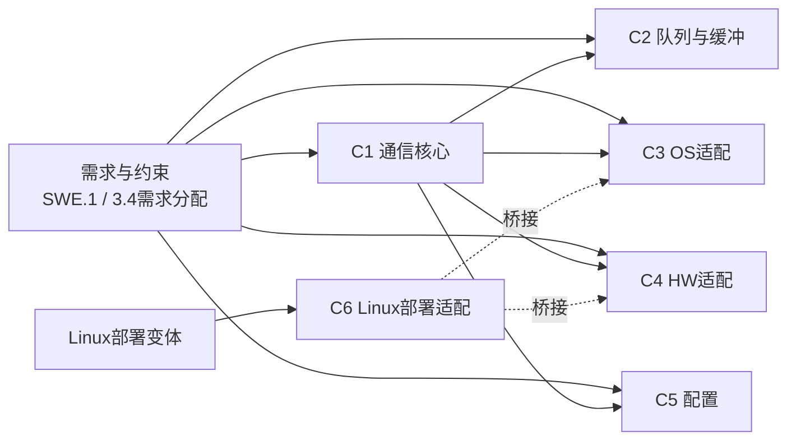

  

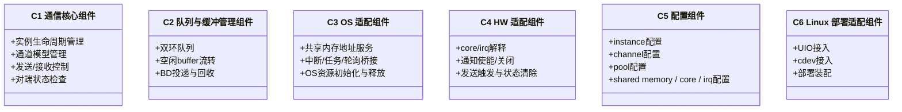

  

### 7.3 组件清单

  

**Automotive SPICE SWE.2** 要求软件架构能说明软件元素的结构与关系。本节在 **组件清单表** 之外给出 **组件结构图**：描述 C1～C6 之间及与上层应用之间的**依赖与协作**（结构视图）；各组件**对内职责要点**见上文类图及第 7.4 节。

  

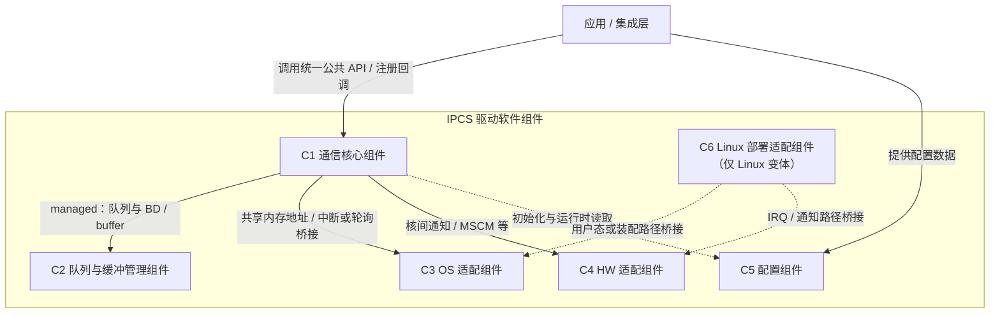

  

| 组件 ID | 组件名称 | 主要职责 |

| --- | --- | --- |

| C1 | 通信核心组件 | 提供 IPCS 驱动统一功能入口，负责实例管理、通道管理、共享内存布局、数据收发与接收分发 |

| C2 | 队列与缓冲管理组件 | 提供基于共享内存的双环队列机制，支撑 BD 与 buffer 流转 |

| C3 | OS 适配组件 | 提供与操作系统相关的中断处理、共享内存地址管理与 polling 桥接 |

| C4 | HW 适配组件 | 提供与具体硬件平台相关的核间中断路由与通知能力 |

| C5 | 配置组件 | 描述实例、通道、pool、共享内存区域、中断和核 ID 等配置数据 |

| C6 | Linux 部署适配组件 | 提供 Linux 全内核模块、UIO 和 cdev 三种部署装配与用户态接入桥接 |

  

### 7.4 组件职责定义

  

#### 7.4.1 C1 通信核心组件

  

C1 是本架构的核心控制组件，其职责如下：

  

- 管理多个通信实例

- 管理每个实例下的多个通道

- 根据通道类型选择 managed 或 unmanaged 处理策略

- 管理 shared memory 中的通道布局

- 负责发送路径与接收路径的统一处理

- 调度接收预算，避免单个通道长期独占处理机会

- 对接应用侧回调

- 屏蔽 OS/HW 差异，向上提供统一接口

  

#### 7.4.2 C2 队列与缓冲管理组件

  

C2 为 managed channel 提供通用的缓冲与描述符流转机制，其职责如下：

  

- 提供共享内存双环队列

- 支持空闲 buffer 的获取与归还

- 支持已发送数据的 BD 投递

- 保证队列机制可在 Linux 与 RTOS 之间复用

  

#### 7.4.3 C3 OS 适配组件

  

C3 负责把不同 OS 的执行与中断模型适配为统一驱动服务，其职责如下：

  

- 提供本地/远端 shared memory 地址服务

- 把中断事件转换为核心接收处理触发

- 在支持 polling 的场景下提供轮询桥接

- 负责 OS 相关资源的初始化与释放

  

#### 7.4.4 C4 HW 适配组件

  

C4 负责底层中断控制器与核间通知相关职责：

  

- 解释核 ID 与 IRQ 配置

- 执行接收中断使能与关闭

- 执行发送通知触发

- 执行接收中断状态清除

- 为不同平台提供统一的硬件服务抽象

  

#### 7.4.5 C5 配置组件

  

C5 是架构中的静态设计输入，其职责如下：

  

- 描述 instance 数量与属性

- 描述 channel 数量、类型与参数

- 描述 pool 配置

- 描述共享内存区域

- 描述本地核、对端核和中断配置

- 描述回调入口

  

#### 7.4.6 C6 Linux 部署适配组件

  

C6 用于承载 Linux 部署形态下不属于统一通信核心算法、但决定核心位于内核态还是用户态的装配与桥接逻辑。其职责如下：

  

- 组织 Linux 全内核模块、UIO 和 cdev 三种部署形态

- 为用户态接入提供内核薄桥接能力

- 对接 Linux UIO 框架和字符设备机制

- 在不影响统一核心设计的前提下隔离 Linux 特定部署差异

  

## 8. 组件关系设计

  

本节对应 **Automotive SPICE SWE.2（软件架构设计）** 工作产品中对软件结构的可视化要求：采用 **UML 2.x 组件图** 惯用元素与关系类型，便于与需求分配（第 3.4 节）及后续详细设计（SWE.3）建立一致的可追溯表述。

  

**本节范围（RTOS）**：以下组件关系图仅描述 **RTOS 侧装配视图**——通信核心、队列、OS/HW 适配与配置组件在同一执行域内集成（与 `ipcf_rtos` 交付形态一致）。**不含 C6（Linux 部署适配）**；Linux 路径中的 UIO/cdev/全内核装配见第 7.4.6 节及 `linux_adaption.md`。

  

**图例约定（与 OMG UML 组件图一致）：**

  

- **组件**（`<<component>>`）：可独立标识、具明确边界的软件结构单元；本图中为 C1～C5 及集成侧 `应用/集成层`。

- **执行环境**（`<<execution environment>>`）：运行平台或硬件资源容器，用于承载与 OS/HW 的外部交互边界（非 IPCS 交付物本体，但在架构图中显式标出以便界定职责）。

- **接口**（`<<interface>>`）：组件之间或组件与环境之间交换能力的契约；**提供接口**用 **实现**（`..|>`）从组件指向接口，**需要接口**用 **依赖**（`..>`）从需方指向接口。

  

以下组件图不展开源码符号、文件路径或部署构件细节；逻辑依赖关系与第 7 章组件划分一致（限定 RTOS 范围）。

  

### 8.1 UML 组件图（包分组 + 提供 / 需要接口，RTOS）

  

**分组与渲染说明：** 在 UML 工具中，下列分组对应 **Package（包）** 轮廓；为兼容 Cursor / VS Code 等环境对 Mermaid 的渲染能力，图中用 **`flowchart` 的 `subgraph`** 表达包边界（与 `classDiagram` 的 `namespace` 相比，预览器支持更稳定）。**提供 / 需要** 关系不单独绘制「棒棒糖」接口符号，而在连线上标注 **端口 P1～P5、P7、P8** 及 **IF_*** 名称（**P6 / IF_LinuxBr 仅 Linux**，本图不出现）；完整契约仍以下表与第 9 章为准。

  

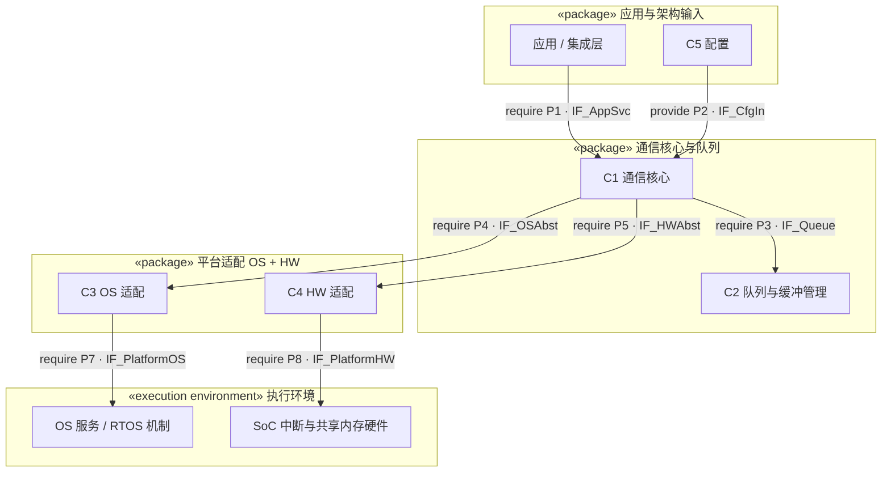

  

在上一张 RTOS 图**不改动**的前提下，Linux 部署形态在相同分层上**增补 C6（Linux 部署适配）**：应用/集成层在需走用户态装配或内核薄桥接时 **require P6 · IF_LinuxBr**；C6 **不替代** C1～C5 的职责边界，而是 **require · 复用**已由 C3、C4 **提供** 的 **P4 · IF_OSAbst**、**P5 · IF_HWAbst**（与第 6.1 节 Linux 部署适配对 OS/HW 适配的桥接关系一致）。全内核模块形态下 C6 仍承担装配组织职责，应用层对 C1 的 P1 及 C1对 C2/C3/C4 的依赖与 RTOS 图相同。

  

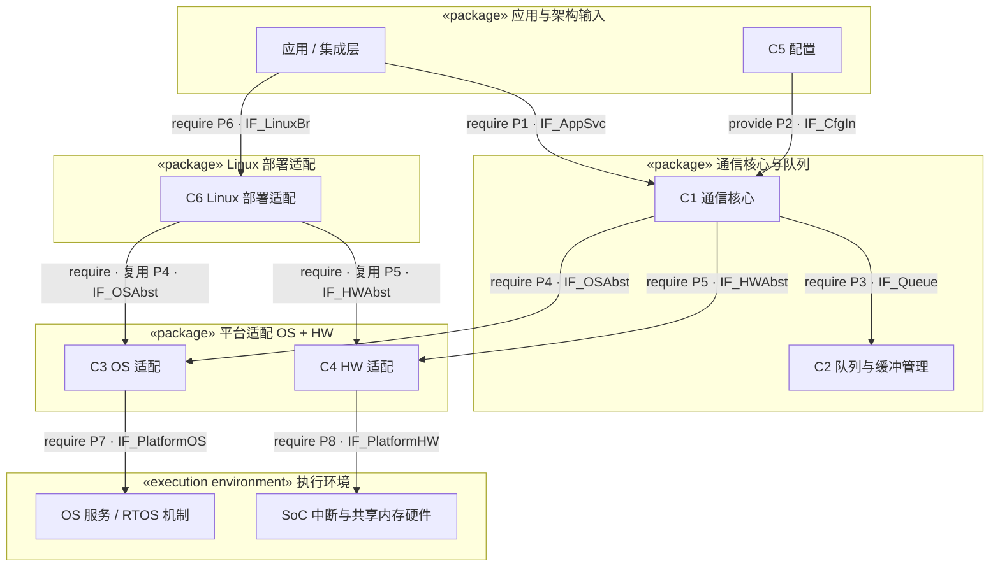

  

**包（subgraph）与第 6 章分层对应关系：**

  

| 图中包 | 架构含义（对齐第 6.1～6.2、第 7 章，RTOS） |

| --- | --- |

| 应用与架构输入 | 应用/集成层 + C5 静态架构输入 |

| 通信核心与队列 | 通信核心层（C1）+ 队列与缓冲管理机制（C2） |

| 平台适配 OS + HW | OS 适配层（C3）+ HW 适配层（C4） |

| 执行环境 | OS/HW 执行环境（非 IPCS 软件组件交付单元） |

  

**端口标识与 UML 接口对应关系（RTOS 视图；P6 仅 Linux，见第 7.4.6 节）**（正式接口规约见第 9 章）：

  

| 端口 | UML 接口 | 提供方 | 需要方 | 说明 |

| --- | --- | --- | --- | --- |

| P1 | IF_AppSvc | C1 | 应用/集成层 | 初始化、发送、接收、状态管理等对上能力 |

| P2 | IF_CfgIn | C5 | C1 | 实例/通道/pool/共享内存/中断/回调等静态配置 |

| P3 | IF_Queue | C2 | C1 | 共享内存队列与缓冲/BD 流转 |

| P4 | IF_OSAbst | C3 | C1 | 地址映射、IRQ 桥接、轮询或调度等 OS 抽象 |

| P5 | IF_HWAbst | C4 | C1 | 通知、清除、使能等平台 HW 抽象 |

| P7 | IF_PlatformOS | OS 执行环境 | C3 | 任务、中断、映射、同步等底层 OS 能力 |

| P8 | IF_PlatformHW | HW 执行环境 | C4 | 核间中断、寄存器、共享内存物理资源 |

  

**文字归纳（与上图同构）：**

  

- **包间依赖**：依赖边可跨越不同 **包（subgraph）**，与第 6.1 节 RTOS 形态下「核心—队列—OS/HW 适配」在同一交付域内集成一致；边上的 **P / IF_*** 标注与下表及第 9 章接口说明一致，不表示额外运行时模块。

- 应用/集成层 **需要** IF_AppSvc（由 C1 **提供**）。静态配置由集成过程进入 **C5**，并由 C5 向 C1 **提供** IF_CfgIn（应用/集成层与 C1、C5 的协同关系见第 3.4 节分配表，本图不单独画出至 IF_CfgIn 的边）。

- C1 **需要** IF_Queue、IF_OSAbst、IF_HWAbst；分别由 C2、C3、C4 **提供**。

- C3、C4 分别 **需要** 执行环境 **提供** 的 IF_PlatformOS、IF_PlatformHW。

- C1 另依赖应用注册的接收回调，该契约归入 IF_AppSvc 使用语义，不在此图单列接口。

  

### 8.2 关系约束

  

架构中约束以下关系：

  

- C1 不直接包含 OS 或平台相关实现细节

- C2 只承担共享内存队列职责，不感知业务语义

- C3 与 C4 仅作为适配层，不承载协议核心逻辑

  

## 9. 接口架构设计

  

本章落实 **Automotive SPICE SWE.2（软件架构设计）** 中对 **软件架构接口** 的约定：在架构层识别 **外部接口**（对应用/集成层可见）与 **内部接口**（组件之间、组件与执行环境之间），并与 **第 8 章端口（P1～P8、IF_\*）**、**第 3.4 节需求分配** 建立可追溯关系。正式需求条文与状态以需求管理库中的 **SWE.1** 为准；下表为架构工作产品内的 **分配摘要**，用于评审与 **SWE.3（详细设计）**、**SWE.4（集成）** 的范围衔接。

  

**架构层应写清、留给 SWE.3 细化的内容边界：**

  

- 架构层：接口职责、调用方向、与组件及需求 ID 的对应关系；变体（Linux/RTOS）上 **对上契约** 不变。

- SWE.3：函数原型、返回值/错误码全集、线程与可重入约束、资源生命周期与竞态条件的完整说明（需可追溯到本章接口项）。

  

### 9.1 对应用/集成层提供的公共接口

  

**定位**：**外部接口**，对应第 8 章 **P1 / IF_AppSvc**，由 **C1** 实现；配置数据经 **P2 / IF_CfgIn** 由 **C5** 进入 **C1**（对上不强制暴露为独立 API，见第 10 章配置模型）。

  

IPCS 驱动对上提供统一公共接口，用于满足初始化、发送、接收和状态管理需求。与本文档第 11 章动态场景一致的 **架构级 API 名称**（实现映射为 `ipc_shm_*` / `ipcsShm*`，以工程约定为准）如下：

  

| 能力 | 架构 API（追溯名） | 主要 SWE.1 追溯（摘要） | 备注 |

| --- | --- | --- | --- |

| 初始化 | `ipcsShmInit()` | IPCS_001、IPCS_014～IPCS_017、IPCS_031、IPCS_034 | 消费 C5 配置；参数校验见 IPCS_034 |

| 释放 | `ipcsShmFree()` | IPCS_001、IPCS_029 | 与实例/资源释放顺序一致 |

| managed获取 buffer | `ipcsShmAcquireBuf()` | IPCS_014～IPCS_016、IPCS_018、IPCS_035 | 仅 managed 通道；与 IPCS_035 类型一致 |

| managed 释放 buffer | `ipcsShmReleaseBuf()` | IPCS_014～IPCS_016、IPCS_035 | |

| managed 发送 | `ipcsShmTx()` | IPCS_001、IPCS_015、IPCS_018、IPCS_035 | 零拷贝语义见 IPCS_018 |

| unmanaged 获取通道内存 | `ipcsShmUnmanagedAcquire()` | IPCS_021、IPCS_035 | 与 IPCS_021 独占通道内存模型一致 |

| unmanaged 通知对端 | `ipcsShmUnmanagedTx()` | IPCS_021、IPCS_035 | |

| 对端 ready 检查 | `ipcsShmIsRemoteReady()` | IPCS_001 | 首包发送前约束 |

| polling 接收处理 | `ipcsShmPollChannels()` | IPCS_039、IPCS_023 | 与 IRQ_NONE 及补偿接收一致 |

  

**接口设计原则（SWE.2）：**

  

- 上层接口统一，不因 Linux/RTOS 变体改变使用方式（**对上稳定契约**，支撑 IPCS_003、IPCS_036 等目标）。

- managed / unmanaged 能力分离，避免交叉误用（**IPCS_035**）。

- polling 为补充路径，不替代中断驱动主路径（**IPCS_039**）。

- 各入口须做架构级约定的参数与范围校验（**IPCS_034**）；通道类型与 API 一致性（**IPCS_035**）。

  

### 9.2 回调接口

  

**定位**：**外部接口契约的组成部分**（由应用在初始化或配置中注册，由驱动在接收路径调用）；逻辑归属 **C1** 分发，**C3** 提供与 **OS 调度/中断上下文**相关的触发语义（**IPCS_019**）。

  

驱动允许应用注册接收回调。架构要求如下：

  

- managed channel：回调携带数据 buffer 与长度（与 **IPCS_018** 零拷贝交付一致）。

- unmanaged channel：回调携带通道内存入口（**IPCS_021**）。

- 回调在接收路径上由驱动触发；具体上下文（任务/中断/延后处理）由 OS 变体决定，应用须按 **异步、可重入安全** 假设设计（详细规则在 SWE.3 展开）。

- 回调与通知路径须协调，避免在无效状态下交付陈旧数据（**IPCS_022**）。

  

### 9.3 OS 适配接口

  

**定位**：**内部接口**，对应 **P4 / IF_OSAbst**；由 **C3** 向 **C1** 提供（Linux 部署下 **C6** 可 **复用** 同一契约，见第 8 章第二张图）。**P7 / IF_PlatformOS** 由执行环境向 **C3** 提供，不在本章展开为具体 OS API。

  

下表自 **`ipcf_rtos/os/ipc-os.h`**、**`ipcf_linux/os_kernel/ipc-os.h`**（及同契约的 `os_uio` / `os_cdev` 用户态适配）归纳 **OS 抽象 API**：**架构文档统一采用 `ipcs` 前缀 + 驼峰命名**；**实现源码当前多为 `ipc_os_*` snake_case**，对照关系一并列出。配置类型在代码中为 `struct ipc_shm_cfg`，与第 10 章配置模型一致；接收回调类型在 Linux 与 RTOS 实现中返回类型不同（`uint32_t` / `int`），SWE.3 以具体编译单元为准。

  

| 架构接口（ipcs 驼峰） | 实现侧符号（代码） | 原型（与代码一致，仅函数名替换为架构名示意） | 适用变体 | 主要 SWE.1 追溯（摘要） |

| --- | --- | --- | --- | --- |

| `ipcsOsInit` | `ipc_os_init` | `int8_t ipcsOsInit(uint8_t instance, const struct ipc_shm_cfg *cfg, uint32_t (*rxCb)(uint8_t instance, int chanId))`；RTOS 头文件中第三参数为 `int (*rxCb)(...)` | Linux内核 / RTOS / 用户态 OS 适配 | IPCS_028、IPCS_019、IPCS_029 |

| `ipcsOsFree` | `ipc_os_free` | `void ipcsOsFree(uint8_t instance)` | 同上 | IPCS_029 |

| `ipcsOsGetLocalShm` | `ipc_os_get_local_shm` | `uintptr_t ipcsOsGetLocalShm(uint8_t instance)` | 同上 | IPCS_001、IPCS_020 |

| `ipcsOsGetRemoteShm` | `ipc_os_get_remote_shm` | `uintptr_t ipcsOsGetRemoteShm(uint8_t instance)` | 同上 | IPCS_001、IPCS_020 |

| `ipcsOsMapIntc` | `ipc_os_map_intc` | `void *ipcsOsMapIntc(void)` | **仅 Linux** `os_kernel`（及需 INTC 映射的同类实现） | IPCS_028 |

| `ipcsOsUnmapIntc` | `ipc_os_unmap_intc` | `void ipcsOsUnmapIntc(void *addr)` | **仅 Linux** 同上 | IPCS_028 |

| `ipcsOsPollChannels` | `ipc_os_poll_channels` | `int8_t ipcsOsPollChannels(uint8_t instance)`；RTOS 为 `int ipc_os_poll_channels(...)` | 同上 | IPCS_039、IPCS_023 |

  

**Linux 变体（SWE.2 架构说明）：** 在 **不改变 IF_AppSvc** 的前提下，**C3**（及内核薄桥接路径上的 **C6**）可在上述契约之上增补 **UIO 事件**、**字符设备 read/ioctl/wait queue**、**模块装载与设备节点** 等机制；该类能力属于 **P4/P6 实现细化**，须在 SWE.3 中与具体源文件及构建变体对应。

  

### 9.4 HW 适配接口

  

**定位**：**内部接口**，对应 **P5 / IF_HWAbst**；由 **C4** 向 **C1** 提供（Linux 下 **C6** 可 **复用**）。**P8 / IF_PlatformHW** 由硬件/SoC 抽象向 **C4** 提供。

  

下表自 **`ipcf_linux/hw/ipc-hw.h`**、**`ipcf_rtos/hw/ipc-hw.h`** 归纳 **HW 抽象 API**：**架构文档统一采用 `ipcs` 前缀 + 驼峰命名**；**实现源码当前为 `ipc_hw_*`**。部分符号仅存在于单一变体头文件，已在表中注明。

  

| 架构接口（ipcs 驼峰） | 实现侧符号（代码） | 原型（与代码一致，仅函数名替换为架构名示意） | 适用变体 | 主要 SWE.1 追溯（摘要） |

| --- | --- | --- | --- | --- |

| `ipcsHwInit` | `ipc_hw_init` | `int8_t ipcsHwInit(uint8_t instance, const struct ipc_shm_cfg *cfg)`；RTOS 部分平台为 `int ipcsHwInit(...)` | Linux / RTOS | IPCS_028、IPCS_029 |

| `ipcsHwFree` | `ipc_hw_free` | `void ipcsHwFree(uint8_t instance)` | 同上 | IPCS_029 |

| `ipcsHwGetRxIrq` | `ipc_hw_get_rx_irq` | `int ipcsHwGetRxIrq(uint8_t instance)` | **仅 Linux** `ipcf_linux/hw/ipc-hw.h` | IPCS_028 |

| `ipcsHwIrqEnable` | `ipc_hw_irq_enable` | `void ipcsHwIrqEnable(uint8_t instance)` | Linux / RTOS | IPCS_028、IPCS_022 |

| `ipcsHwIrqDisable` | `ipc_hw_irq_disable` | `void ipcsHwIrqDisable(uint8_t instance)` | 同上 | IPCS_028、IPCS_022 |

| `ipcsHwIrqNotify` | `ipc_hw_irq_notify` | `void ipcsHwIrqNotify(uint8_t instance)` | 同上 | IPCS_001、IPCS_028 |

| `ipcsHwIrqClear` | `ipc_hw_irq_clear` | `void ipcsHwIrqClear(uint8_t instance)` | 同上 | IPCS_022、IPCS_023 |

| `ipcsHwIrqStatus` | `ipc_hw_irq_status` | `uint32_t ipcsHwIrqStatus(uint8_t instance)` | **仅 RTOS** `ipcf_rtos/hw/ipc-hw.h`（Linux 头文件无此符号） | IPCS_028 |

| `ipcsHwInitInternal` | `_ipc_hw_init` | `int8_t ipcsHwInitInternal(uint8_t instance, int txIrq, int rxIrq, const struct ipc_shm_remote_core *remoteCore, const struct ipc_shm_local_core *localCore, void *mscmAddr)` | **平台内部**（SoC 源文件调用，**非 C1 直接 API**） | IPCS_028、IPCS_003 |

  

平台专用逻辑 **仅允许** 留在 **C4** 实现内部，不得穿透为新的对上公共 API（**IPCS_009**、**IPCS_036**）。无硬件 IRQ 时 **C4** 提供最小实现或与 **IPCS_039** 协调。

  

### 9.5 架构接口与端口、需求追溯总表

  

下表汇总本章与 **第 8 章** 一致的架构接口边界，便于 SWE.2 评审与需求管理工具中的 **allocated to / implements** 链接维护。

  

| 端口 | 接口标识 | 类别 | 提供方 | 需要方 | 说明 | 典型 SWE.1 追溯 |

| --- | --- | --- | --- | --- | --- | --- |

| P1 | IF_AppSvc | 外部 | C1 | 应用/集成层 | 第 9.1 节 API | IPCS_001、IPCS_014～IPCS_018、IPCS_021、IPCS_034～IPCS_035、IPCS_039 等 |

| P2 | IF_CfgIn | 外部输入数据 | C5 | C1 | 静态配置，见第 10 章 | IPCS_014～IPCS_017、IPCS_025、IPCS_031 等 |

| P3 | IF_Queue | 内部 | C2 | C1 | 队列与缓冲/BD | IPCS_014～IPCS_016、IPCS_015、IPCS_018、IPCS_023 等 |

| P4 | IF_OSAbst | 内部 | C3 | C1、（C6） | 第 9.3 节 | IPCS_019、IPCS_028、IPCS_039、IPCS_012 等 |

| P5 | IF_HWAbst | 内部 | C4 | C1、（C6） | 第 9.4 节 | IPCS_028、IPCS_022、IPCS_039 等 |

| P6 | IF_LinuxBr | 外部（Linux 按需） | C6 | 应用/集成层 | Linux 部署桥接，见第 7.4.6 节 | IPCS_036 等 |

| P7 | IF_PlatformOS | 环境 | OS | C3 | 平台 OS 能力 | IPCS_005、IPCS_006、IPCS_024 等 |

| P8 | IF_PlatformHW | 环境 | HW | C4 | 平台硬件资源 | IPCS_028、IPCS_003 等 |

  

**维护约定**：需求或接口变更时，应同步更新 **第 3.4 节**、本章及需求管理工具中的追溯链接，并评估对 **SWE.3/SWE.4** 的影响。

  

## 10. 数据架构设计

  

### 10.1 配置数据模型

  

配置数据模型按层次组织：

  

- 驱动级配置

  - instance 级配置

    - shared memory 配置

    - 中断配置

    - core 配置

    - channel 配置

      - channel 类型

      - managed/unmanaged 参数

      - 回调参数

  

该设计满足以下目的：

  

- 用统一模型覆盖 Linux 与 RTOS

- 支持多实例

- 支持多通道

- 支持不同通道资源管理方式

  

### 10.2 共享内存布局设计

  

每个 instance 的共享内存应采用一致、可对称推导的布局方式，原则如下：

  

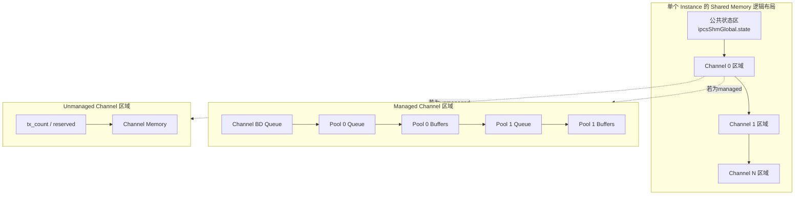

  

- instance 起始区域保留公共状态信息

- 后续区域按 channel 顺序排布

- managed channel 区域包含 channel queue、pool queue 与实际 buffers

- unmanaged channel 区域包含控制字段与 channel memory

  

该设计满足：

  

- 布局可由配置推导

- 本地和对端可按相同规则解释内存

- 便于初始化、收发与状态同步

  

### 10.3 状态模型

  

驱动需要维护的核心状态包括：

  

- instance 初始化状态

- 对端 ready 状态

- managed channel 中的 buffer/descriptor 流转状态

- unmanaged channel 中的数据更新计数状态

  

## 11. 动态架构设计

  

本章按对外公共接口和关键内部动态场景组织时序图，确保动态设计覆盖驱动对应用/集成层提供的全部外部接口，并补充接收分发相关的关键内部序列。

  

对外接口覆盖范围如下：

  

- `ipcsShmInit()`

- `ipcsShmFree()`

- `ipcsShmAcquireBuf()`

- `ipcsShmReleaseBuf()`

- `ipcsShmTx()`

- `ipcsShmUnmanagedAcquire()`

- `ipcsShmUnmanagedTx()`

- `ipcsShmIsRemoteReady()`

- `ipcsShmPollChannels()`

  

补充的关键内部动态场景如下：

  

- managed channel 接收分发时序

- unmanaged channel 更新检测与回调时序

  

### 11.1 初始化接口时序

  

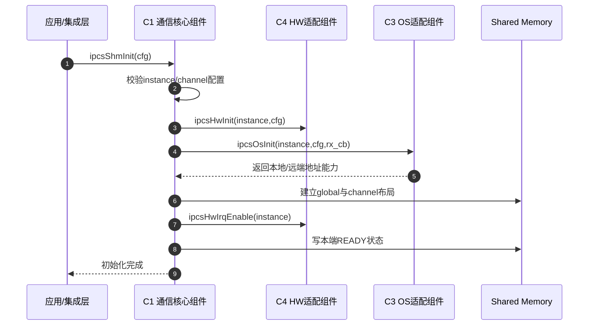

  

设计说明：

  

- 初始化按“参数校验 -> HW 初始化 -> OS 初始化 -> shared memory 布局 -> 中断使能 -> ready 置位”的顺序进行

- 该顺序与当前实现一致，用于避免内部资源未就绪时提前接收对端通知

  

### 11.2 释放接口时序

  

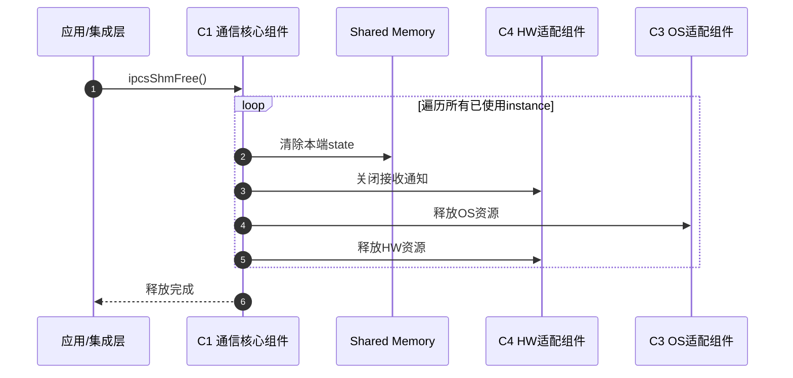

  

设计说明：

  

- 释放动作面向所有已使用 instance 执行

- 释放顺序体现先撤销对端可见状态，再关闭通知，再释放 OS/HW 资源

  

### 11.3 managed buffer 获取接口时序

  

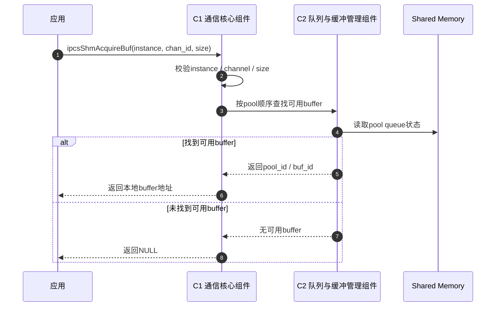

  

设计说明：

  

- 该接口仅适用于 managed channel

- buffer 的选择遵循“满足大小要求的最小合适 pool”原则

  

### 11.4 managed 发送接口时序

  

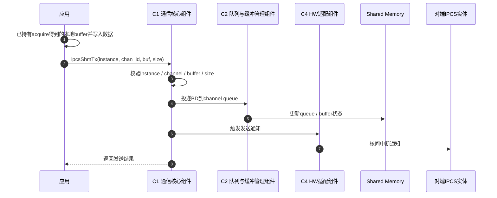

  

设计说明：

  

- `ipcsShmTx()` 只负责本端 descriptor 投递与对端通知，不在该接口内完成接收分发

- 接收分发由对端收到通知后的接收路径承担

  

### 11.5 managed buffer 释放接口时序

  

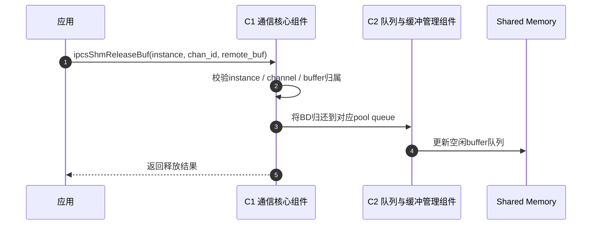

  

设计说明：

  

- 该接口面向 managed channel 接收完成后的 buffer 归还场景

- 归还目标必须是 buffer 所属 pool

  

### 11.6 unmanaged memory 获取接口时序

  

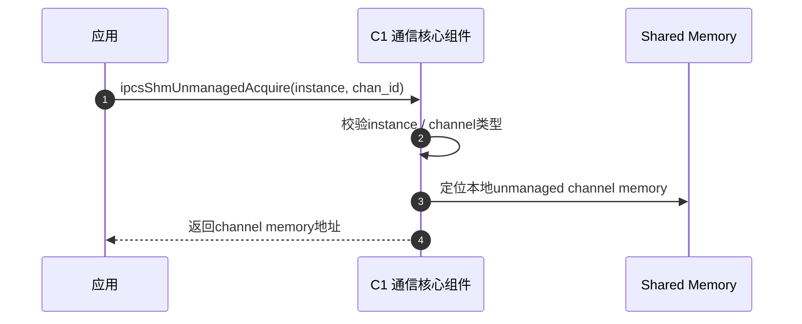

  

设计说明：

  

- 该接口只适用于 unmanaged channel

- 按设计应在通道初始化完成后获取一次并持续复用

  

### 11.7 unmanaged 发送通知接口时序

  

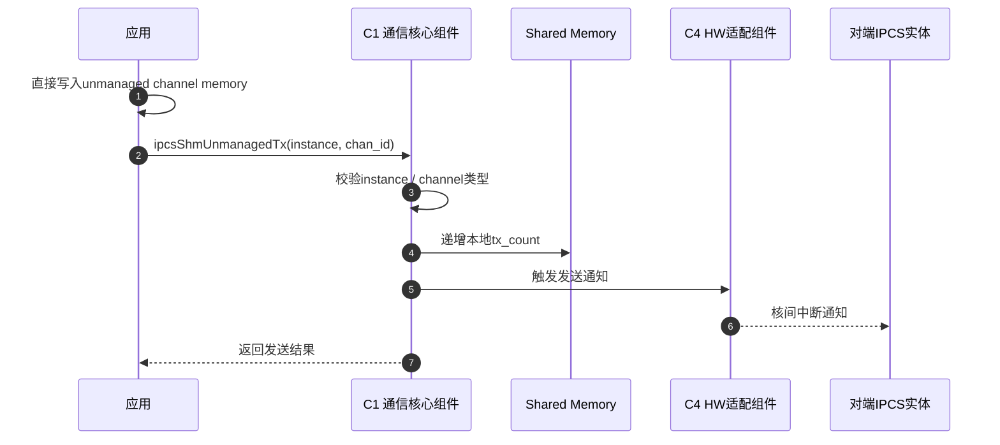

  

设计说明：

  

- 该接口不管理 buffer pool

- 数据有效性的通知通过 `tx_count` 变化和中断通知共同完成

  

### 11.8 对端 ready 检查接口时序

  

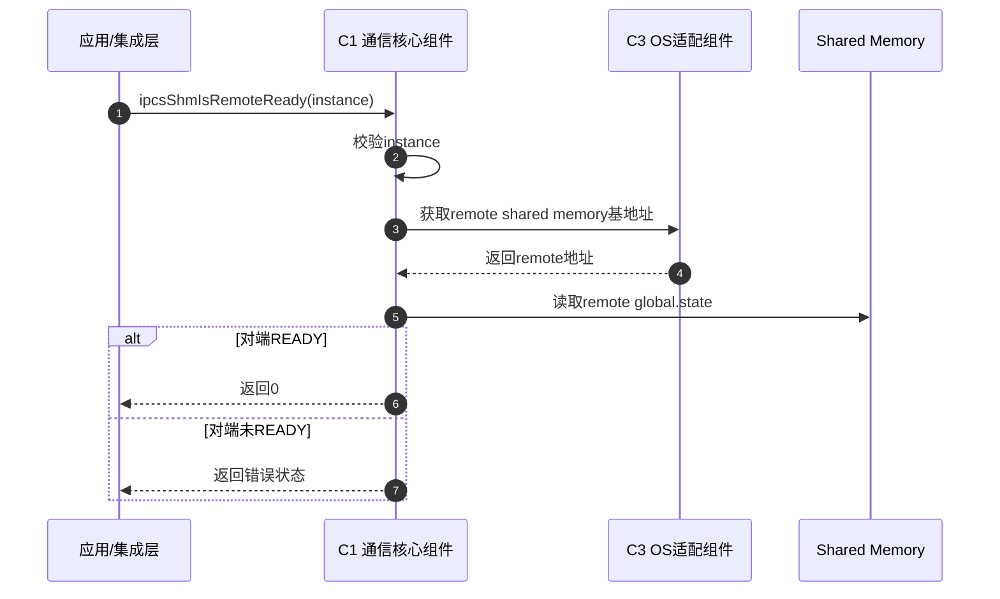

  

设计说明：

  

- 该接口用于发送前或系统联调时检查对端初始化状态

- 对端状态判断基于对端 shared memory 起始区的公共状态字段

  

### 11.9 polling 接收接口时序

  

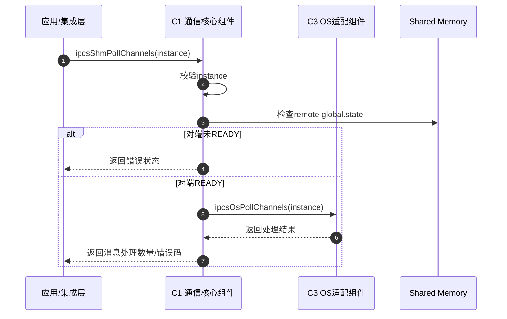

  

设计说明：

  

- polling 接口属于补充入口

- 在当前实现中，Linux OS 层不将 polling 作为有效主路径，RTOS 变体可在适用场景下支持该路径

  

### 11.10 managed channel 接收分发内部时序

  

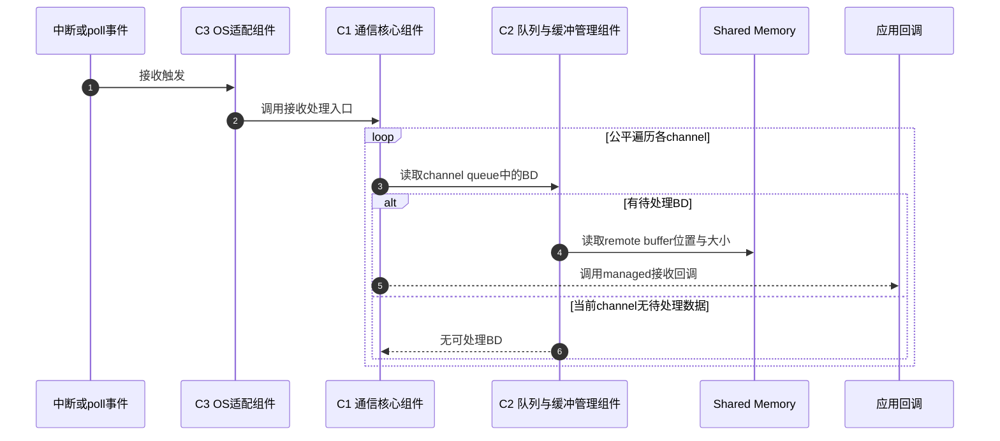

  

设计说明：

  

- 该时序体现接收公平性设计

- managed 接收阶段只负责数据交付，buffer 归还通过 `ipcsShmReleaseBuf()` 独立完成

  

### 11.11 unmanaged channel 接收分发内部时序

  

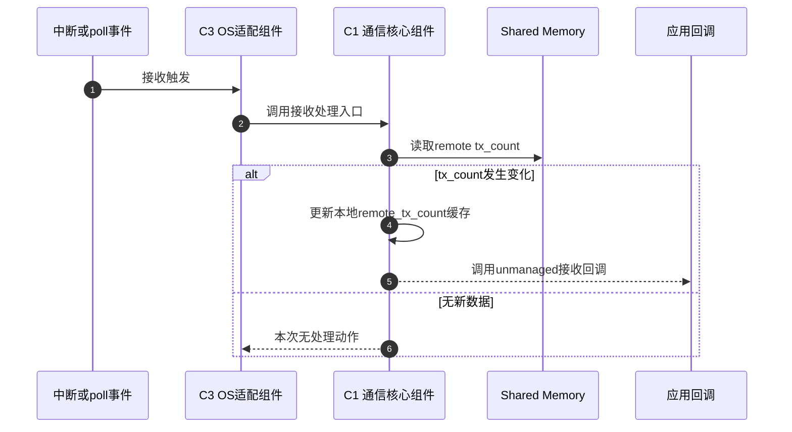

  

设计说明：

  

- unmanaged 接收不经过 pool 和 BD 归还流程

- 是否触发应用回调由远端 `tx_count` 变化决定

  

### 11.12 动态设计约束

  

动态交互必须满足以下约束：

  

- 初始化完成前不得对外声明 ready

- managed/unmanaged 两类通道不得混用其资源管理接口

- polling 仅作为补充接收入口，不替代标准中断驱动主流程

- managed buffer 的生命周期必须遵循“获取 -> 发送/接收 -> 释放”的闭环

- 接收分发必须满足多 channel 公平处理原则

  

该组时序与当前驱动对外接口设计和实现约束保持一致，可作为接口级动态设计基线。

  

## 12. 变体架构设计

  

### 12.1 统一部分

  

以下内容属于统一架构基线：

  

- 通信核心层

- 队列与缓冲管理机制

- 配置模型

- managed/unmanaged 通道模型

- 共享内存布局原则

  

### 12.2 Linux 变体

  

Linux 变体的设计特点如下：

  

- Linux 侧存在三种部署形态：全内核模块、UIO、cdev

- 全内核模块形态下，`ipc-shm-dev` 将通信核心、队列机制、`os_kernel` 与平台 HW 适配共同装配在内核态

- UIO 形态下，内核侧 `ipc-shm-uio` 负责平台驱动、UIO 设备与中断桥接，用户态 `libipc-shm.a` 装配通信核心、队列机制和 `os_uio`

- cdev 形态下，内核侧 `ipc-shm-cdev` 负责字符设备、等待队列与 IRQ 桥接，用户态 `libipc-shm.a` 装配通信核心、队列机制和 `os_cdev`

- 三种形态共享同一套通信核心、队列机制与 HW 抽象，只在 OS 适配与 Linux 接入桥接方式上展开差异

- 全内核模块接收路径采用“硬中断 + 内核延后处理”模型；UIO/cdev 接收路径采用“内核硬中断唤醒 + 用户态 softirq 线程预算处理”模型

  

### 12.3 RTOS 变体

  

RTOS 变体的设计特点如下：

  

- 驱动以可集成的软件模块形式部署

- OS 适配层根据 RTOS 类型选择具体中断/任务集成方式

- 接收路径可采用中断驱动，也可在适用场景下采用 polling

- 系统集成层需负责中断入口与驱动处理函数的连接

  

### 12.4 变体控制原则

  

架构上规定：

  

- 不得因 Linux/RTOS 差异破坏统一公共接口

- 平台差异应限制在 HW 适配层内

- OS 差异应限制在 OS 适配层内

- 部署扩展能力不得反向侵入通信核心层

  

## 13. 架构约束

  

为保证架构成立，系统集成与后续实现应满足以下约束：

  

- 本地与对端配置必须保持对称

- channel 数量、pool 数量和 instance 数量必须处于设计允许范围内

- managed pool 应按 buffer 大小升序组织

- 共享内存访问应满足平台对齐要求

- 同一 channel 内的资源访问应遵循驱动约定的并发限制

- polling 仅用于适用场景，不应与正常中断路径混用失控

  

## 14. 架构设计决策

  

### 14.1 采用共享内存 + 核间中断作为通信基础

  

决策原因：

  

- 满足同芯片多核之间低开销通信需求

- 能够在 Linux 与 RTOS 之间建立统一通信模型

  

### 14.2 采用统一核心 + 适配层分离的架构

  

决策原因：

  

- 保持跨平台行为一致性

- 降低重复实现成本

- 便于后续平台扩展与问题定位

  

### 14.3 同时支持 managed 与 unmanaged 两类通道

  

决策原因：

  

- 满足不同业务对资源控制粒度的需求

- 兼顾驱动托管模式与应用直控模式

  

### 14.4 采用双环无锁队列机制

  

决策原因：

  

- 适合共享内存场景

- 便于在不同 OS 环境下复用

- 有利于降低同步开销

  

## 15. 实现一致性校核说明

  

本章不作为架构叙述主线，而是用于说明：本文档所定义的统一架构已参考当前实现进行了反向校核，以保证补充文档不会与现有工程冲突。

  

### 15.1 一致性校核结论

  

已完成的校核结论如下：

  

- Linux 与 RTOS 的通信核心实现可归并为一套统一核心

- Linux 与 RTOS 的队列机制实现可归并为一套统一机制

- OS 差异主要体现在中断注册、延后处理和 polling 桥接方式上

- HW 差异主要体现在 SoC 中断控制器访问与 core/irq 映射方式上

- Linux 在实现上分为全内核模块、UIO 和 cdev 三种部署形态

- Linux 的 UIO 与 cdev 路径应视为部署适配，而非统一核心的一部分

- Linux 全内核模块与 RTOS 一样，将通信核心、OS 适配和 HW 适配装配在同一执行域内

  

### 15.2 与实现相关的边界说明

  

为避免架构文档脱离现有工程，需明确以下边界：

  

- Linux 当前实现不将 polling 接收作为有效主路径

- RTOS 变体中，中断入口需由系统集成层连接

- 当前工作区中仅对已有源码实现的 OS/HW 变体进行架构映射

- 对仅在接口中预留、但当前工作区未见对应实现的能力，不在本文档中写成已实现架构能力

- 文档正文统一使用 `IPCS`、`ipcsShmXxx()`、`ipcsOsXxx()`、`ipcsHwXxx()` 作为架构级命名；实现追溯中保留 `ipcf_linux`、`ipcf_rtos` 目录名以及 `ipc_shm_*`、`ipc_os_*`、`ipc_hw_*` 源码符号

  

## 16. 架构到实现的追溯说明

  

为支持文档补齐后的落地审查，架构组件与实现可建立如下追溯关系：

  

| 架构组件 | 实现映射 |

| --- | --- |

| C1 通信核心组件 | `ipcf_linux/ipc-shm.c`、`ipcf_linux/ipc-shm.h`、`ipcf_rtos/common/ipc-shm.c`、`ipcf_rtos/common/ipc-shm.h` |

| C2 队列与缓冲管理组件 | `ipcf_linux/ipc-queue.c`、`ipcf_linux/ipc-queue.h`、`ipcf_rtos/common/ipc-queue.c`、`ipcf_rtos/common/ipc-queue.h` |

| C3 OS 适配组件 | `ipcf_linux/os_kernel/ipc-os.c`、`ipcf_linux/os_kernel/ipc-os.h`、`ipcf_linux/os_uio/ipc-os.c`、`ipcf_linux/os_uio/ipc-os.h`、`ipcf_linux/os_cdev/ipc-os.c`、`ipcf_linux/os_cdev/ipc-os.h`、`ipcf_rtos/os/ipc-os.h`、`ipcf_rtos/os/freertos/ipc-os-freertos.c`、`ipcf_rtos/os/autosar/ipc-os-autosar.c`、`ipcf_rtos/os/baremetal/ipc-os-baremetal.c` |

| C4 HW 适配组件 | `ipcf_linux/hw/ipc-hw.h`、`ipcf_linux/hw/s32gen1/ipc-hw-s32gen1.c`、`ipcf_linux/hw/s32g3xx/ipc-hw-s32g3xx.c`、`ipcf_linux/hw/s32v234/ipc-hw-s32v234.c`、`ipcf_rtos/hw/ipc-hw.h`、`ipcf_rtos/hw/s32gen1/ipc-hw-s32gen1.c`、`ipcf_rtos/hw/s32g3xx/ipc-hw-s32g3xx.c` |

| C5 配置组件 | `ipcf_linux/ipc-shm.h`、`ipcf_rtos/common/ipc-shm.h`、`ipcf_linux/sample_multi_instance/ipcf_Ip_Cfg.h`、`ipcf_linux/sample_multi_instance/ipcf_Ip_Cfg_s32g3.c` |

| C6 Linux 部署适配组件 | `ipcf_linux/Makefile`、`ipcf_linux/README.rst`、`ipcf_linux/os_kernel/ipc-uio.c`、`ipcf_linux/os_kernel/ipc-uio.h`、`ipcf_linux/os_kernel/ipc-cdev.c`、`ipcf_linux/os_kernel/ipc-cdev.h`、`ipcf_linux/os_uio/Makefile`、`ipcf_linux/os_cdev/Makefile` |

  

## 17. 结论

  

本文档从需求目标、设计原则、组件划分、接口设计、数据架构、动态交互和变体控制的角度，给出了 IPCS 驱动的统一软件架构设计。

  

该架构设计的核心结论如下：

  

- IPCS 驱动应采用统一通信核心 + OS/HW 适配层的分层架构

- Linux 与 RTOS 两套实现共享统一的通信模型和配置模型

- 平台和 OS 差异应被限制在适配层内

- 扩展集成路径应与统一核心隔离

- 文档主线以架构设计表达为主，实现代码仅用于后置一致性校核与追溯

  

因此，本文档可作为当前 IPCS 驱动工程的正式软件架构设计说明，用于补充架构文档并支撑后续评审与维护。